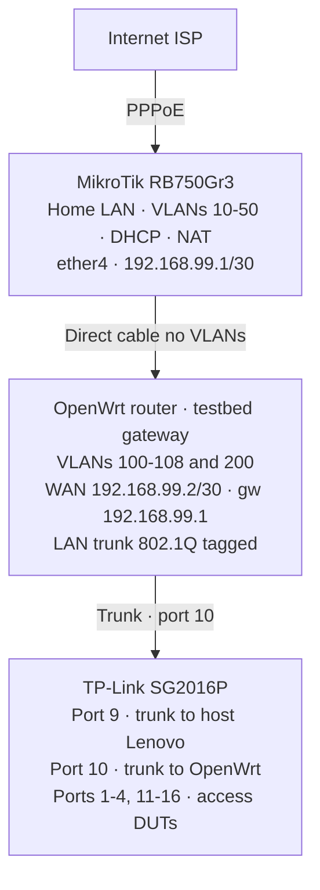

# Gateway / ingress router

* OpenWrt router (currently TL-WDR3500) on trunk to switch.
* VLANs 100-108 and 200, gateway `.254` per subnet.
* MikroTik (personal network) uplink to OpenWrt (192.168.99.0/30); temporary setup.

## 1. Context {: #1-context }

openwrt-tests needs serial, SSH, and TFTP access to each DUT in an **isolated** way.

Each DUT on its own VLAN:

| Requirement | Effect |
|---------------|--------|
| **Determinism** | Traffic stays on the VLAN; no cross-talk between DUTs in concurrent tests. |
| **Security** | No L2 between DUTs; lower risk of one misconfigured router affecting another. |
| **Addressing convention** | OpenWrt defaults to `192.168.1.1` on LAN; with one VLAN per DUT, the same IP can repeat per subnet without conflict (different broadcast domains). |
| **Coordinator** | The Labgrid exporter has an interface on each VLAN; SSH to `192.168.1.1` with binding to that VLAN interface. |

**Gateway role:** L3 (subnets, per-VLAN gateway), optional internet (opkg), firewall. The switch connects on a trunk port (802.1Q).

**DHCP:** The gateway router (OpenWrt) does not run DHCP on test VLANs. The orchestration host runs dnsmasq as DHCP and TFTP on each VLAN; see [tftp-server.md](./tftp-server.md).

---

## 2. Requirements

- **Trunk** - Port carrying tagged VLANs (802.1Q).
- **VLAN interfaces** - One per DUT for OpenWrt (VLANs 100-108, subnets 192.168.100.0/24, etc.). Plus VLAN 200 for LibreMesh (all DUTs on shared 192.168.200.0/24).
- **Firewall** - Allow traffic from test VLANs to the router (SSH, LuCI) and to the internet.
- **NAT** (optional) - For DUT internet access.

### Current implementation: TP-Link TL-WDR3500 v1

- **OpenWrt** installed (tested with 25.12.1, ath79).
- Dedicated WAN port for uplink to the MikroTik.
- At least one LAN port for 802.1Q trunk to the switch.
- VLAN support on the internal switch (swconfig or DSA).

| Field | Value |
|-------|-------|
| SoC | AR9344 (ath79/generic) |
| Internal switch | AR934x, swconfig, 5 ports (CPU + 4 LAN) |
| WAN | eth1 (separate interface, not through switch) |
| LAN | eth0 through internal switch (ports 1-4) |
| Trunk | Switch port 1 (physically LAN4 on rear panel) |

---

## 3. Network layout

### 3.1 Topology



The MikroTik only provides internet to the OpenWrt router over a point-to-point link (192.168.99.0/30). The OpenWrt router NATs toward the MikroTik without the MikroTik knowing testbed subnets.

### 3.2 VLAN modes

FCEFyN lab mapping (8 DUTs). VLAN→gateway table: [duts-config.md](./duts-config.md#internet-access-opkg). Align IDs and subnets with `exporter.yaml` and host VLANs.

| Mode      | VLANs           | Use |
|-----------|-----------------|-----|
| OpenWrt   | 100-108 (isolated) | Isolated tests, one VLAN per DUT |
| LibreMesh | 200 (shared)       | Multi-node L2 mesh tests |

### 3.3 Two IPs per VLAN on the host

The server uses two IPs per VLAN (see [host-config 2.4](./host-config.md#24-addressing-two-ips-per-vlan)):

- `192.168.X.1/24` - Provisioning phase: host as DHCP/TFTP server; DUT gets 192.168.X.x at boot.
- `192.168.1.X/24` - SSH phase: host on same subnet as OpenWrt (192.168.1.1); socket binding to reach the DUT.

### 3.4 Physical cabling

Two Ethernet cables:

| Cable | From | To |
|-------|------|-----|
| **WAN** | OpenWrt router → WAN port | MikroTik → ether4 |
| **Trunk** | OpenWrt router → one LAN port | SG2016P switch → port 10 |

!!! note "TL-WDR3500: physical LAN port for trunk"
    The LAN port used as trunk maps to internal switch port 1. On the rear panel it is labeled LAN4 (reverse numbering: LAN1=port4, LAN2=port3, LAN3=port2, LAN4=port1).

---

## 4. Labgrid and host on this network {: #4-labgrid-and-host }

**OpenWrt router (from §5 onward):** VLANs 100-108 and 200, gateway `.254` per subnet, firewall, and trunk to the switch. Defines the testbed network environment.

**Orchestration host + Labgrid:** Not configured on the router. Each DUT in `exporter.yaml` declares a `NetworkService` with `%vlanXXX` suffix so SSH exits on the correct **host** VLAN; many DUTs share `192.168.1.1` on different broadcast domains.

```yaml
NetworkService:
  address: "192.168.1.1%vlan100"
  username: "root"
```

`%vlan100` forces traffic via the host `vlan100` interface. Labgrid uses `labgrid-bound-connect` (e.g. `socat` with `so-bindtodevice`) for TCP/SSH. Without binding, the kernel would use the default route and could not distinguish DUTs at the same IP.

**Flow summary (VLAN 100):**

1. The exporter publishes `address: "192.168.1.1%vlan100"` for the DUT place.
2. When opening SSH, Labgrid runs e.g. `labgrid-bound-connect vlan100 192.168.1.1 22`.
3. Traffic leaves on host `vlan100` (e.g. source `192.168.1.100`).
4. The switch delivers VLAN 100 to the DUT; in the SSH phase, host and DUT share `192.168.1.0/24` on that VLAN (same L2 domain): the session need not go through the gateway.

Netplan, host VLANs, and SSH detail: [host-config §1](host-config.md#1-context), [§2 Netplan](host-config.md#2-network-configuration-netplan-with-networkmanager), [§3 SSH to DUTs](host-config.md#3-ssh-to-duts).

---

## 5. OpenWrt configuration - current implementation

Apply over SSH or serial on a freshly installed OpenWrt router (`ssh root@192.168.1.1`).

### 5.1 `/etc/config/network`

Replace the entire file. Adapt commented sections if hardware differs from TL-WDR3500.

```
config interface 'loopback'
	option device 'lo'
	option proto 'static'
	list ipaddr '127.0.0.1/8'

config globals 'globals'
	option ula_prefix 'fdf5:5b96:8798::/48'

# --- Internal switch (only if router uses swconfig) ---
# On DSA routers, skip this section and use bridge VLANs.
# Check with: swconfig list

config switch
	option name 'switch0'
	option reset '1'
	option enable_vlan '1'

# VLAN 1: unused LAN ports (local management)
config switch_vlan
	option device 'switch0'
	option vlan '1'
	option vid '1'
	option ports '2 3 4 0t'

# Testbed VLANs: trunk on port 1 (tagged) + CPU (tagged)
# Port 1 = LAN port wired to SG2016P switch.

config switch_vlan
	option device 'switch0'
	option vlan '2'
	option vid '100'
	option ports '1t 0t'

config switch_vlan
	option device 'switch0'
	option vlan '3'
	option vid '101'
	option ports '1t 0t'

config switch_vlan
	option device 'switch0'
	option vlan '4'
	option vid '102'
	option ports '1t 0t'

config switch_vlan
	option device 'switch0'
	option vlan '5'
	option vid '103'
	option ports '1t 0t'

config switch_vlan
	option device 'switch0'
	option vlan '6'
	option vid '104'
	option ports '1t 0t'

config switch_vlan
	option device 'switch0'
	option vlan '7'
	option vid '105'
	option ports '1t 0t'

config switch_vlan
	option device 'switch0'
	option vlan '8'
	option vid '106'
	option ports '1t 0t'

config switch_vlan
	option device 'switch0'
	option vlan '9'
	option vid '107'
	option ports '1t 0t'

config switch_vlan
	option device 'switch0'
	option vlan '10'
	option vid '108'
	option ports '1t 0t'

config switch_vlan
	option device 'switch0'
	option vlan '11'
	option vid '200'
	option ports '1t 0t'

# --- WAN ---
# Uplink to MikroTik over point-to-point link.
# On TL-WDR3500, WAN is eth1 (outside the switch).

config interface 'wan'
	option device 'eth1'
	option proto 'static'
	option ipaddr '192.168.99.2'
	option netmask '255.255.255.252'
	option gateway '192.168.99.1'
	list dns '8.8.8.8'
	list dns '1.1.1.1'

# --- LAN (local management, unused ports) ---

config device
	option name 'br-lan'
	option type 'bridge'
	list ports 'eth0.1'

config interface 'lan'
	option device 'br-lan'
	option proto 'static'
	list ipaddr '192.168.1.1/24'

# --- Testbed VLAN interfaces ---
# One interface per VLAN. Gateway at .254 per subnet.
# Orchestration host is .1 and runs dnsmasq (DHCP/TFTP).

config interface 'vlan100'
	option device 'eth0.100'
	option proto 'static'
	option ipaddr '192.168.100.254'
	option netmask '255.255.255.0'

config interface 'vlan101'
	option device 'eth0.101'
	option proto 'static'
	option ipaddr '192.168.101.254'
	option netmask '255.255.255.0'

config interface 'vlan102'
	option device 'eth0.102'
	option proto 'static'
	option ipaddr '192.168.102.254'
	option netmask '255.255.255.0'

config interface 'vlan103'
	option device 'eth0.103'
	option proto 'static'
	option ipaddr '192.168.103.254'
	option netmask '255.255.255.0'

config interface 'vlan104'
	option device 'eth0.104'
	option proto 'static'
	option ipaddr '192.168.104.254'
	option netmask '255.255.255.0'

config interface 'vlan105'
	option device 'eth0.105'
	option proto 'static'
	option ipaddr '192.168.105.254'
	option netmask '255.255.255.0'

config interface 'vlan106'
	option device 'eth0.106'
	option proto 'static'
	option ipaddr '192.168.106.254'
	option netmask '255.255.255.0'

config interface 'vlan107'
	option device 'eth0.107'
	option proto 'static'
	option ipaddr '192.168.107.254'
	option netmask '255.255.255.0'

config interface 'vlan108'
	option device 'eth0.108'
	option proto 'static'
	option ipaddr '192.168.108.254'
	option netmask '255.255.255.0'

config interface 'vlan200'
	option device 'eth0.200'
	option proto 'static'
	option ipaddr '192.168.200.254'
	option netmask '255.255.255.0'
```

### 5.2 `/etc/config/firewall`

Replace the entire file.

```
config defaults
	option syn_flood '1'
	option input 'REJECT'
	option output 'ACCEPT'
	option forward 'REJECT'

config zone
	option name 'lan'
	option input 'ACCEPT'
	option output 'ACCEPT'
	option forward 'ACCEPT'
	list network 'lan'

config zone
	option name 'wan'
	option input 'REJECT'
	option output 'ACCEPT'
	option forward 'REJECT'
	option masq '1'
	option mtu_fix '1'
	list network 'wan'

config zone
	option name 'testbed'
	option input 'ACCEPT'
	option output 'ACCEPT'
	option forward 'ACCEPT'
	list network 'vlan100'
	list network 'vlan101'
	list network 'vlan102'
	list network 'vlan103'
	list network 'vlan104'
	list network 'vlan105'
	list network 'vlan106'
	list network 'vlan107'
	list network 'vlan108'
	list network 'vlan200'

config forwarding
	option src 'lan'
	option dest 'wan'

config forwarding
	option src 'testbed'
	option dest 'wan'

config rule
	option name 'Allow-DHCP-Renew'
	option src 'wan'
	option proto 'udp'
	option dest_port '68'
	option target 'ACCEPT'
	option family 'ipv4'

config rule
	option name 'Allow-Ping'
	option src 'wan'
	option proto 'icmp'
	option icmp_type 'echo-request'
	option target 'ACCEPT'
	option family 'ipv4'
```

### 5.3 Disable DHCP on testbed VLANs

The orchestration host runs dnsmasq as DHCP/TFTP server on each VLAN (see [tftp-server.md](./tftp-server.md)). The OpenWrt router **must not** serve DHCP on testbed VLANs.

```bash
for vid in 100 101 102 103 104 105 106 107 108 200; do
    uci set dhcp.vlan${vid}=dhcp
    uci set dhcp.vlan${vid}.interface="vlan${vid}"
    uci set dhcp.vlan${vid}.ignore='1'
done
uci commit dhcp
```

### 5.4 Apply and reboot

```bash
reboot
```

After reboot, move cables per section 3.4 if not done yet. Interfaces take ~30-60s to become usable (ARP resolution).

### 5.5 SSH access to gateway from host {: #55-ssh-access-to-gateway-from-host }

The host reaches the OpenWrt router via VLAN 100 (`192.168.100.254`) in both isolated and mesh modes. Switch trunks (ports 9 and 10) carry VLANs 100-108 tagged in both modes.

Add to the host `~/.ssh/config` (or copy from `configs/templates/ssh_config_fcefyn`):

```
Host gateway-openwrt
    HostName 192.168.100.254
    User root
```

Usage: `ssh gateway-openwrt`

| Mode | VLANs on trunk | Gateway access |
|------|----------------|----------------|
| Isolated | 100-108 | `192.168.100.254` (or any 101-108) |
| Mesh | 100-108, 200 | `192.168.100.254` or `192.168.200.254` |

### 5.6 Extroot (USB) - expand storage

The TL-WDR3500 has only 8MB flash (~1MB usable on `/overlay`). ZeroTier and etherwake need more space. Extroot mounts a USB stick as `/overlay`.

**Requirements:** USB stick (any size, e.g. 2-8GB), free USB port.

```bash
apk update
apk add kmod-usb-storage block-mount kmod-fs-ext4 e2fsprogs

ls /dev/sd*     # Expect /dev/sda, /dev/sda1
dmesg | tail -5

# Format as ext4 (compatible features)
mkfs.ext4 -O ^metadata_csum,^64bit,^orphan_file -F /dev/sda1

# If mkfs.ext4 fails, install kmod-fs-ext4 first.
# If space is tight, remove e2fsprogs: apk del e2fsprogs && apk add kmod-fs-ext4
# and format the USB on the orchestration host before plugging it in.

modprobe ext4
mount /dev/sda1 /mnt
cp -a /overlay/. /mnt/
umount /mnt

block detect | uci import fstab
uci set fstab.@mount[0].target='/overlay'
uci set fstab.@mount[0].enabled='1'
uci commit fstab

apk del e2fsprogs
reboot
```

Check: `df -h /overlay` (should show USB size).

### 5.7 ZeroTier (remote access) {: #57-zerotier-remote-access }

Remote access to the gateway router from outside the LAN. Needs extroot (section 5.6) due to flash size.

```bash
apk update
apk add zerotier

uci set zerotier.global.enabled='1'

# Join lab network: OpenWrt init only applies UCI sections of type "network"
# (see note below). Name "fcefyn_vpn" is arbitrary.
uci set zerotier.fcefyn_vpn=network
uci set zerotier.fcefyn_vpn.id='b103a835d2ead2b6'
uci set zerotier.fcefyn_vpn.allow_managed='1'
uci set zerotier.fcefyn_vpn.allow_global='0'
uci set zerotier.fcefyn_vpn.allow_default='0'
uci set zerotier.fcefyn_vpn.allow_dns='0'

uci commit zerotier

/etc/init.d/zerotier enable
/etc/init.d/zerotier restart
sleep 8

zerotier-cli info            # ONLINE
zerotier-cli listnetworks    # b103a835d2ead2b6 OK + IP (ej. 10.246.3.95/24)
```

**UCI and persistence:** `/etc/init.d/zerotier` calls `config_foreach join_network network`: only UCI `config …` sections of type `network` with `option id '<nwid>'` are applied; it generates `networks.d/<nwid>.conf`. Other templates (e.g. `list join` / `openwrt_network`) are ignored: the service starts but does not join on reboot. If a `network` section has an invalid NWID (`zerotier.earth` → `NOT_FOUND`), remove it and keep only the entry with `b103a835d2ead2b6`.

**Typical cleanup** (if `listnetworks` shows a NWID in `NOT_FOUND` or leftover template junk):

```bash
uci delete zerotier.earth 2>/dev/null
uci delete zerotier.openwrt_network 2>/dev/null
uci commit zerotier
```

Then add the `fcefyn_vpn` section (or equivalent) as above and `restart`.

Authorize the node at [my.zerotier.com](https://my.zerotier.com) → network `b103a835d2ead2b6` → Members.

**Firewall:** add ZeroTier interface to `testbed` zone:

```bash
uci add_list firewall.@zone[2].device='zt+'
uci commit firewall
service firewall restart
```

Wildcard `zt+` matches any `zt*` interface. If the zone index changes, adjust (`@zone[2]` = `testbed`). Check with `uci show firewall`.

| Symptom | Cause | Fix |
|---------|-------|-----|
| `disabled in /etc/config/zerotier` | `zerotier.global.enabled` is `0` | `uci set zerotier.global.enabled='1'; uci commit zerotier` |
| `missing port and zerotier-one.port not found` | Daemon not running | `/etc/init.d/zerotier restart` |
| `ACCESS_DENIED` in `listnetworks` | Node not authorized | Authorize on my.zerotier.com |
| `NOT_FOUND` for a NWID in `listnetworks` | Invalid NWID or missing network; often stale UCI `network` section (`earth`, etc.) | `uci delete zerotier.<name>` for that section; use only `option id` with correct NWID (see above) |
| `listnetworks` shows header only (no networks) | Missing UCI `network` section with `id`, or only `openwrt_network.join` left | Add `uci set zerotier.fcefyn_vpn=network` + `id='b103a835d2ead2b6'` + `allow_*`; `commit`; `restart` |
| `zerotier-cli info` ONLINE but SSH from outside: *No route to host* | Node not on ZT network or wrong IP | Check `listnetworks` OK on router; laptop on same ZT (`zerotier-cli listnetworks`) |
| `Connection refused` SSH to ZeroTier IP | Firewall blocks zt* | Add `zt+` to firewall (above) |

### 5.8 Wake-on-LAN (remote host power-on) {: #58-wake-on-lan-remote-host-power-on }

Power on the orchestration host remotely from the gateway router via ZeroTier.


**Requirements:**

1. **Orchestration host:** WoL enabled in BIOS and Linux. See [wake-on-lan-setup.md](../operar/wake-on-lan-setup.md).
2. **OpenWrt router:** `etherwake` installed and reachable over ZeroTier.

```bash
apk add etherwake
```

Send WoL from any machine with ZeroTier access to the router:

```bash
ssh root@<IP-ZeroTier-del-router> 'etherwake -i eth0.100 00:21:cc:c4:25:3b'
```

| Parameter | Value | Notes |
|-----------|-------|-------|
| Router ZeroTier IP | `10.246.3.95` (current) | Check my.zerotier.com or `zerotier-cli listnetworks` |
| Interface | `eth0.100` | VLAN 100 (any testbed VLAN works) |
| Orchestration host MAC | `00:21:cc:c4:25:3b` | Host iface `enp0s25` |

**Magic packet via `eth0.100`:** WoL is L2 broadcast. The packet leaves on `eth0.100`, enters the switch trunk (port 10), the switch forwards tagged to the host (port 9) and the NIC accepts with 802.1Q.

**wol.service on host (timing fix):** must run **after** NetworkManager because NM resets the setting. Contents: `/etc/systemd/system/wol.service`:

```ini
[Unit]
Description=Enable Wake On LAN
After=NetworkManager.service
Wants=NetworkManager.service

[Service]
Type=oneshot
ExecStartPre=/bin/sleep 5
ExecStart=/usr/sbin/ethtool -s enp0s25 wol g
RemainAfterExit=yes

[Install]
WantedBy=multi-user.target
```

Check: `sudo ethtool enp0s25 | grep Wake-on` (should be `g`, not `d`).

**Sequence:**

1. Admin connects to router over ZeroTier: `ssh root@10.246.3.95`
2. Send WoL: `etherwake -i eth0.100 00:21:cc:c4:25:3b`
3. Orchestration host boots (~30-60s). `wol.service` re-enables WoL for the next shutdown.
4. Admin can SSH to host over ZeroTier: `ssh laryc@10.246.3.118` (or host ZT IP)

---

## 6. Verification

From the orchestration host:

```bash
# Switch reachable (VLAN 1, management)
ping -c 2 192.168.0.1

# Gateway reachable on each VLAN
for v in 100 101 102 103 104 105 106 107 108; do
    ping -c 1 -W 2 192.168.${v}.254 && echo "VLAN $v: OK" || echo "VLAN $v: FAIL"
done

# Internet from OpenWrt router
ssh root@192.168.100.254 'ping -c 2 8.8.8.8'

# DNS from OpenWrt router
ssh root@192.168.100.254 'nslookup openwrt.org'
```

If a VLAN does not reply to ping right after reboot but SSH works, wait ~30 seconds (ARP).

---

## 7. Notes and troubleshooting

### swconfig vs DSA

- **swconfig** (TL-WDR3500, ath79): VLANs in `config switch_vlan` sections with `option vlan` (index) and `option vid` (802.1Q VLAN ID). Interfaces: `eth0.<vid>`.
- **DSA** (newer routers): each LAN port is a separate interface (`lan1`, `lan2`, …). VLANs via bridge VLAN filtering. See OpenWrt wiki.

```bash
swconfig list          # Si responde → swconfig
ls /sys/class/net/     # Si hay lan1, lan2, ... → DSA
```

### Port mapping (swconfig)

```bash
swconfig dev switch0 show
```

Confirm CPU port (usually 0) and LAN ports (1-4). Trunk is on one LAN port, tagged (`t`).

### Verify VLANs created

```bash
swconfig dev switch0 show   # Internal switch VLAN table
ifconfig | grep "inet addr" # Assigned IPs
ls /sys/class/net/          # Existing interfaces
```

### Lost access to SG2016P switch

If after `switch-vlan` (or manual VLAN changes) the switch (192.168.0.1) is unreachable:

1. **Trunk without VLAN 1 untagged**: SG2016P trunk ports must keep VLAN 1 untagged with PVID 1 for management (192.168.0.x). Check in `tplink_jetstream.py` that trunks include `switchport general allowed vlan 1 untagged` and `switchport pvid 1`.
2. **NetworkManager DHCP on physical iface**: if the host has `dhcp4: true` on the trunk iface (enp0s25) and no DHCP server on VLAN 1, NetworkManager drops the iface every ~45s. Fix: `dhcp4: false` in netplan.
3. **"Wired connection N" profiles**: delete auto NM profiles that fight netplan: `nmcli connection delete "Wired connection 1"`.

---

## 8. Adapting to another router

To use a router other than TL-WDR3500:

1. **Install OpenWrt** and check compatibility on [Table of Hardware](https://openwrt.org/toh/start).
2. **Identify interfaces**: `swconfig list` (or DSA), `ip link show`. Determine WAN and LAN.
3. **Adapt `/etc/config/network`**:
   - Change `option device 'eth1'` on WAN if the iface name differs.
   - Adjust `option ports` in `switch_vlan` per port map.
   - If DSA, replace `config switch*` sections with bridge VLAN filtering.
4. **Firewall and DHCP**: usually unchanged (hardware-independent).
5. **Verify** with section 6 commands.

| Parameter | Current value | What to change |
|-----------|---------------|------------------|
| WAN device | `eth1` | WAN iface name on new router |
| WAN IP | `192.168.99.2/30` | Only if changing link to MikroTik |
| Switch name | `switch0` | Check with `swconfig list` |
| Trunk port | `1` (internal) | Check with `swconfig dev switch0 show` |
| CPU port | `0` (tagged) | Usually 0 |
| Unused ports | `2 3 4` | Remaining LAN |
| VLAN range | 100-108, 200 | Adjust if DUTs added/removed |
| Gateway IPs | `192.168.X.254/24` | Consistent with host and switch |

---

## 9. MikroTik RouterOS (deprecated after WDR3500 switch)

The lab gateway is OpenWrt on the trunk. If the MikroTik still has VLANs or firewall from when it was L3 to the testbed, the blocks below document that config; cleanup is in section 9.5. 8 DUTs (VLANs 100-108), VLAN 200 for LibreMesh. Switch-facing interface: `LAB-TRUNK` (renamed from `ether3`).

### 9.1 Create VLAN interfaces

```routeros
/interface vlan
add interface=LAB-TRUNK name=vlan100-testbed vlan-id=100
add interface=LAB-TRUNK name=vlan101-testbed vlan-id=101
add interface=LAB-TRUNK name=vlan102-testbed vlan-id=102
add interface=LAB-TRUNK name=vlan103-testbed vlan-id=103
add interface=LAB-TRUNK name=vlan104-testbed vlan-id=104
add interface=LAB-TRUNK name=vlan105-testbed vlan-id=105
add interface=LAB-TRUNK name=vlan106-testbed vlan-id=106
add interface=LAB-TRUNK name=vlan107-testbed vlan-id=107
add interface=LAB-TRUNK name=vlan108-testbed vlan-id=108
add interface=LAB-TRUNK name=vlan200-mesh vlan-id=200
```

### 9.2 Assign IP addresses

```routeros
/ip address
add address=192.168.100.254/24 interface=vlan100-testbed network=192.168.100.0
add address=192.168.101.254/24 interface=vlan101-testbed network=192.168.101.0
add address=192.168.102.254/24 interface=vlan102-testbed network=192.168.102.0
add address=192.168.103.254/24 interface=vlan103-testbed network=192.168.103.0
add address=192.168.104.254/24 interface=vlan104-testbed network=192.168.104.0
add address=192.168.105.254/24 interface=vlan105-testbed network=192.168.105.0
add address=192.168.106.254/24 interface=vlan106-testbed network=192.168.106.0
add address=192.168.107.254/24 interface=vlan107-testbed network=192.168.107.0
add address=192.168.108.254/24 interface=vlan108-testbed network=192.168.108.0
add address=192.168.200.254/24 interface=vlan200-mesh network=192.168.200.0
```

### 9.3 Firewall rules

```routeros
/ip firewall filter
add action=accept chain=input comment="Allow access from VLAN100 testbed to router" in-interface=vlan100-testbed
add action=accept chain=input comment="Allow access from VLAN101 testbed to router" in-interface=vlan101-testbed
add action=accept chain=input comment="Allow access from VLAN102 testbed to router" in-interface=vlan102-testbed
add action=accept chain=input comment="Allow access from VLAN103 testbed to router" in-interface=vlan103-testbed
add action=accept chain=input comment="Allow access from VLAN104 testbed to router" in-interface=vlan104-testbed
add action=accept chain=input comment="Allow access from VLAN105 testbed to router" in-interface=vlan105-testbed
add action=accept chain=input comment="Allow access from VLAN106 testbed to router" in-interface=vlan106-testbed
add action=accept chain=input comment="Allow access from VLAN107 testbed to router" in-interface=vlan107-testbed
add action=accept chain=input comment="Allow access from VLAN108 testbed to router" in-interface=vlan108-testbed
add action=accept chain=input comment="Allow access from VLAN200 mesh to router" in-interface=vlan200-mesh
```

Insert **before** the `drop` rule at the end of chain `input`.

---
