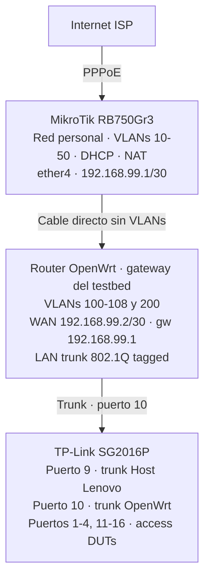

# Configuración del router Gateway/Ingress

* Router OpenWrt (actualmente TL-WDR3500) en el trunk al switch.
* VLANs 100-108 y 200, gateway `.254` por subred. 
* Router MikroTik (red personal) da uplink al OpenWrt (192.168.99.0/30), esto es temporal.

## 1. Contexto

openwrt-tests necesita acceso serial, SSH y TFTP a cada DUT de forma **aislada**.

Cada DUT en su propia VLAN:

| Requisito | Efecto                                                                                                                            |
|-----------|-----------------------------------------------------------------------------------------------------------------------------------|
| **Determinismo** | Tráfico por VLAN; sin cruce entre DUTs en tests simultáneos.                                                                      |
| **Seguridad** | Sin L2 entre DUTs; menos riesgo de un router mal configurado afectando a otro.                                                    |
| **Convención de direccionamiento** | OpenWrt usa por defecto `192.168.1.1` en LAN; con una VLAN por DUT, la misma IP en cada subred sin conflicto (broadcast distinto). |
| **Coordinador** | El exporter de Labgrid tiene interfaz en cada VLAN; SSH a `192.168.1.1` con binding a la interfaz de esa VLAN.                    |

**Rol del gateway:** L3 (subredes, gateway por VLAN), internet opcional (opkg), firewall. El switch se conecta por puerto trunk (802.1Q).

**DHCP:** El router gateway (OpenWrt) no ejecuta DHCP en las VLANs de prueba. El host de orquestación ejecuta dnsmasq como DHCP y TFTP en cada VLAN; ver [tftp-server.md](./tftp-server.md).

---

## 2. Requisitos

- **Trunk** - Puerto que transporta VLANs etiquetadas (802.1Q).
- **Interfaces VLAN** - Una por DUT para OpenWrt (VLANs 100-108, subredes 192.168.100.0/24, etc.). Además, VLAN 200 para LibreMesh (todos los DUTs en red compartida 192.168.200.0/24).
- **Firewall** - Permitir tráfico desde las VLANs hacia el router (SSH, Webfig) y hacia internet.
- **NAT** (opcional) - Para que los DUTs accedan a internet.

### Implementación actual: TP-Link TL-WDR3500 v1

- **OpenWrt** instalado (probado con 25.12.1, ath79).
- Puerto WAN separado para el uplink al MikroTik.
- Al menos un puerto LAN para trunk 802.1Q al switch.
- Soporte de VLANs en el switch interno (swconfig o DSA).

| Dato | Valor |
|------|-------|
| SoC | AR9344 (ath79/generic) |
| Switch interno | AR934x, swconfig, 5 puertos (CPU + 4 LAN) |
| WAN | eth1 (interfaz separada, fuera del switch) |
| LAN | eth0 a través del switch interno (ports 1-4) |
| Trunk | Switch port 1 (físicamente LAN4 en el panel trasero) |

---

## 3. Esquema de Red

### 3.1 Topología



El MikroTik solo provee internet al router OpenWrt vía enlace punto a punto (192.168.99.0/30). El router OpenWrt hace NAT/masquerade hacia el MikroTik, sin que este conozca las subredes del testbed.

### 3.2 Modos de VLAN

Mapeo del lab FCEFyN (8 DUTs). Tabla VLAN→Gateway: [duts-config.md](./duts-config.md#acceso-a-internet-opkg). Alinear IDs y subredes con `exporter.yaml` y las VLAN del host.

| Modo      | VLANs           | Uso                               |
|-----------|-----------------|-----------------------------------|
| OpenWrt   | 100-108 (aisladas) | Tests aislados, una VLAN por DUT  |
| LibreMesh | 200 (compartida)   | Tests multi-nodo en malla L2      |

### 3.3 Dos IPs por VLAN en el host

El servidor usa dos IPs por VLAN (ver [host-config 2.4](./host-config.md#24-direccionamiento-dos-ips-por-vlan)):

- `192.168.X.1/24` - Fase de provisioning: host como servidor DHCP/TFTP; el DUT obtiene IP en 192.168.X.x al arrancar.
- `192.168.1.X/24` - Fase de SSH: host en la misma subred que OpenWrt (192.168.1.1); binding de socket para alcanzar al DUT.

### 3.4 Conexión física

Dos cables ethernet:

| Cable | Desde | Hasta |
|-------|-------|-------|
| **WAN** | Router OpenWrt → puerto WAN | MikroTik → ether4 |
| **Trunk** | Router OpenWrt → un puerto LAN | Switch SG2016P → puerto 10 |

!!! note "TL-WDR3500: puerto LAN físico para trunk"
    El puerto LAN que se usa como trunk corresponde al switch port 1 interno. En el panel trasero es el puerto marcado como LAN4 (numeración inversa: LAN1=port4, LAN2=port3, LAN3=port2, LAN4=port1).

---

## 4. Labgrid y el host sobre esta red
{: #4-labgrid-y-host }

**Router OpenWrt (lo de §5 en adelante):** VLANs 100-108 y 200, gateway `.254` en cada subred, firewall y trunk al switch. Define el entorno de red del testbed.

**Host orquestador + Labgrid:** No se configura en el router. Cada DUT en `exporter.yaml` declara un `NetworkService` con sufijo `%vlanXXX` para que el SSH salga por la VLAN correcta del **host**; muchos DUTs comparten `192.168.1.1` en broadcast domains distintos.

```yaml
NetworkService:
  address: "192.168.1.1%vlan100"
  username: "root"
```

`%vlan100` fuerza el tráfico por la interfaz `vlan100` del servidor. Labgrid usa `labgrid-bound-connect` (p. ej. `socat` con `so-bindtodevice`) para TCP/SSH. Sin binding, el kernel usaría la ruta por defecto y no distinguiría entre DUTs con la misma IP.

**Flujo resumido (VLAN 100):**

1. El exporter publica `address: "192.168.1.1%vlan100"` para el place del DUT.
2. Al abrir SSH, Labgrid invoca p. ej. `labgrid-bound-connect vlan100 192.168.1.1 22`.
3. El tráfico sale por `vlan100` del host (p. ej. origen `192.168.1.100`).
4. El switch entrega en VLAN 100 al DUT; en fase SSH, host y DUT comparten `192.168.1.0/24` en esa VLAN (mismo dominio L2): la sesión no tiene por qué pasar por el gateway.

Netplan, VLANs en el host y detalle de SSH: [host-config §1](host-config.md#1-contexto), [§2 Netplan](host-config.md#2-configuracion-de-red-netplan-con-networkmanager), [§3 SSH a DUTs](host-config.md#3-ssh-a-duts).

---

## 5. Configuración OpenWrt - implementación actual

Aplicar vía SSH o serial al router con OpenWrt recién instalado (`ssh root@192.168.1.1`).

### 5.1 `/etc/config/network`

Reemplazar el contenido completo. Adaptar las secciones marcadas con comentarios si el hardware es distinto al TL-WDR3500.

```
config interface 'loopback'
	option device 'lo'
	option proto 'static'
	list ipaddr '127.0.0.1/8'

config globals 'globals'
	option ula_prefix 'fdf5:5b96:8798::/48'

# --- Switch interno (solo si el router usa swconfig) ---
# En routers con DSA, omitir esta sección y usar bridge VLANs.
# Verificar con: swconfig list

config switch
	option name 'switch0'
	option reset '1'
	option enable_vlan '1'

# VLAN 1: puertos LAN sin usar (management local)
config switch_vlan
	option device 'switch0'
	option vlan '1'
	option vid '1'
	option ports '2 3 4 0t'

# Testbed VLANs: trunk en port 1 (tagged) + CPU (tagged)
# Port 1 = el puerto LAN conectado al switch SG2016P.

config switch_vlan
	option device 'switch0'
	option vlan '2'
	option vid '100'
	option ports '1t 0t'

config switch_vlan
	option device 'switch0'
	option vlan '3'
	option vid '101'
	option ports '1t 0t'

config switch_vlan
	option device 'switch0'
	option vlan '4'
	option vid '102'
	option ports '1t 0t'

config switch_vlan
	option device 'switch0'
	option vlan '5'
	option vid '103'
	option ports '1t 0t'

config switch_vlan
	option device 'switch0'
	option vlan '6'
	option vid '104'
	option ports '1t 0t'

config switch_vlan
	option device 'switch0'
	option vlan '7'
	option vid '105'
	option ports '1t 0t'

config switch_vlan
	option device 'switch0'
	option vlan '8'
	option vid '106'
	option ports '1t 0t'

config switch_vlan
	option device 'switch0'
	option vlan '9'
	option vid '107'
	option ports '1t 0t'

config switch_vlan
	option device 'switch0'
	option vlan '10'
	option vid '108'
	option ports '1t 0t'

config switch_vlan
	option device 'switch0'
	option vlan '11'
	option vid '200'
	option ports '1t 0t'

# --- WAN ---
# Uplink al MikroTik vía enlace punto a punto.
# En el TL-WDR3500, WAN es eth1 (separado del switch).

config interface 'wan'
	option device 'eth1'
	option proto 'static'
	option ipaddr '192.168.99.2'
	option netmask '255.255.255.252'
	option gateway '192.168.99.1'
	list dns '8.8.8.8'
	list dns '1.1.1.1'

# --- LAN (management local, puertos sin usar) ---

config device
	option name 'br-lan'
	option type 'bridge'
	list ports 'eth0.1'

config interface 'lan'
	option device 'br-lan'
	option proto 'static'
	list ipaddr '192.168.1.1/24'

# --- Interfaces VLAN del testbed ---
# Una interfaz por VLAN. Gateway en .254 de cada subred.
# El host de orquestación es .1 y ejecuta dnsmasq (DHCP/TFTP).

config interface 'vlan100'
	option device 'eth0.100'
	option proto 'static'
	option ipaddr '192.168.100.254'
	option netmask '255.255.255.0'

config interface 'vlan101'
	option device 'eth0.101'
	option proto 'static'
	option ipaddr '192.168.101.254'
	option netmask '255.255.255.0'

config interface 'vlan102'
	option device 'eth0.102'
	option proto 'static'
	option ipaddr '192.168.102.254'
	option netmask '255.255.255.0'

config interface 'vlan103'
	option device 'eth0.103'
	option proto 'static'
	option ipaddr '192.168.103.254'
	option netmask '255.255.255.0'

config interface 'vlan104'
	option device 'eth0.104'
	option proto 'static'
	option ipaddr '192.168.104.254'
	option netmask '255.255.255.0'

config interface 'vlan105'
	option device 'eth0.105'
	option proto 'static'
	option ipaddr '192.168.105.254'
	option netmask '255.255.255.0'

config interface 'vlan106'
	option device 'eth0.106'
	option proto 'static'
	option ipaddr '192.168.106.254'
	option netmask '255.255.255.0'

config interface 'vlan107'
	option device 'eth0.107'
	option proto 'static'
	option ipaddr '192.168.107.254'
	option netmask '255.255.255.0'

config interface 'vlan108'
	option device 'eth0.108'
	option proto 'static'
	option ipaddr '192.168.108.254'
	option netmask '255.255.255.0'

config interface 'vlan200'
	option device 'eth0.200'
	option proto 'static'
	option ipaddr '192.168.200.254'
	option netmask '255.255.255.0'
```

### 5.2 `/etc/config/firewall`

Reemplazar el contenido completo.

```
config defaults
	option syn_flood '1'
	option input 'REJECT'
	option output 'ACCEPT'
	option forward 'REJECT'

config zone
	option name 'lan'
	option input 'ACCEPT'
	option output 'ACCEPT'
	option forward 'ACCEPT'
	list network 'lan'

config zone
	option name 'wan'
	option input 'REJECT'
	option output 'ACCEPT'
	option forward 'REJECT'
	option masq '1'
	option mtu_fix '1'
	list network 'wan'

config zone
	option name 'testbed'
	option input 'ACCEPT'
	option output 'ACCEPT'
	option forward 'ACCEPT'
	list network 'vlan100'
	list network 'vlan101'
	list network 'vlan102'
	list network 'vlan103'
	list network 'vlan104'
	list network 'vlan105'
	list network 'vlan106'
	list network 'vlan107'
	list network 'vlan108'
	list network 'vlan200'

config forwarding
	option src 'lan'
	option dest 'wan'

config forwarding
	option src 'testbed'
	option dest 'wan'

config rule
	option name 'Allow-DHCP-Renew'
	option src 'wan'
	option proto 'udp'
	option dest_port '68'
	option target 'ACCEPT'
	option family 'ipv4'

config rule
	option name 'Allow-Ping'
	option src 'wan'
	option proto 'icmp'
	option icmp_type 'echo-request'
	option target 'ACCEPT'
	option family 'ipv4'
```

### 5.3 Desactivar DHCP en las VLANs del testbed

El host de orquestación ejecuta dnsmasq como servidor DHCP/TFTP en cada VLAN (ver [tftp-server.md](./tftp-server.md)). El router OpenWrt **no** debe servir DHCP en las VLANs del testbed.

```bash
for vid in 100 101 102 103 104 105 106 107 108 200; do
    uci set dhcp.vlan${vid}=dhcp
    uci set dhcp.vlan${vid}.interface="vlan${vid}"
    uci set dhcp.vlan${vid}.ignore='1'
done
uci commit dhcp
```

### 5.4 Aplicar y reiniciar

```bash
reboot
```

Tras el reinicio, mover los cables según sección 3.4 si aún no se hizo. Las interfaces tardan ~30-60 segundos en estar operativas (ARP resolution).

### 5.5 Acceso SSH al gateway desde el host

El host accede al router OpenWrt vía VLAN 100 (`192.168.100.254`), tanto en modo isolated como en mesh. Los trunks del switch (puertos 9 y 10) llevan VLANs 100-108 tagged en ambos modos.

Agregar a `~/.ssh/config` del host (o copiar desde `configs/templates/ssh_config_fcefyn`):

```
Host gateway-openwrt
    HostName 192.168.100.254
    User root
```

Uso: `ssh gateway-openwrt`

| Modo | VLANs en trunk | Acceso al gateway |
|------|----------------|-------------------|
| Isolated | 100-108 | `192.168.100.254` (o cualquier 101-108) |
| Mesh | 100-108, 200 | `192.168.100.254` o `192.168.200.254` |

### 5.6 Extroot (USB) - Ampliar almacenamiento

El TL-WDR3500 tiene solo 8MB de flash (~1MB usable en `/overlay`). Para instalar ZeroTier y etherwake se necesita más espacio. Extroot monta un USB como `/overlay`.

**Requisitos:** pendrive USB (cualquier tamaño, ej. 2-8GB), puerto USB disponible.

```bash
apk update
apk add kmod-usb-storage block-mount kmod-fs-ext4 e2fsprogs

ls /dev/sd*     # Debe aparecer /dev/sda, /dev/sda1
dmesg | tail -5

# Formatear como ext4 (features compatibles)
mkfs.ext4 -O ^metadata_csum,^64bit,^orphan_file -F /dev/sda1

# Si mkfs.ext4 falla, instalar kmod-fs-ext4 primero.
# Si no cabe, borrar e2fsprogs: apk del e2fsprogs && apk add kmod-fs-ext4
# y formatear el USB desde el host de orquestación antes de enchufarlo.

modprobe ext4
mount /dev/sda1 /mnt
cp -a /overlay/. /mnt/
umount /mnt

block detect | uci import fstab
uci set fstab.@mount[0].target='/overlay'
uci set fstab.@mount[0].enabled='1'
uci commit fstab

apk del e2fsprogs
reboot
```

Verificación: `df -h /overlay` (debe mostrar el tamaño del pendrive).

### 5.7 ZeroTier (acceso remoto)

Acceso al router gateway desde fuera de la red local. Requiere extroot (sección 5.6) por falta de espacio en flash.

```bash
apk update
apk add zerotier

uci set zerotier.global.enabled='1'

# Unirse a la red del lab: el init de OpenWrt solo aplica secciones UCI tipo "network"
# (ver nota debajo). El nombre "fcefyn_vpn" es arbitrario.
uci set zerotier.fcefyn_vpn=network
uci set zerotier.fcefyn_vpn.id='b103a835d2ead2b6'
uci set zerotier.fcefyn_vpn.allow_managed='1'
uci set zerotier.fcefyn_vpn.allow_global='0'
uci set zerotier.fcefyn_vpn.allow_default='0'
uci set zerotier.fcefyn_vpn.allow_dns='0'

uci commit zerotier

/etc/init.d/zerotier enable
/etc/init.d/zerotier restart
sleep 8

zerotier-cli info            # ONLINE
zerotier-cli listnetworks    # b103a835d2ead2b6 OK + IP (ej. 10.246.3.95/24)
```

**UCI y persistencia:** `/etc/init.d/zerotier` llama `config_foreach join_network network`: solo entran secciones UCI `config …` de tipo `network` con `option id '<nwid>'`; ahí genera `networks.d/<nwid>.conf`. Otras plantillas (p. ej. `list join` / `openwrt_network`) las ignora: el servicio levanta pero no hace join al reiniciar. Si quedó un `network` con NWID inválido (`zerotier.earth` → `NOT_FOUND`), borrarlo y dejar solo la entrada con `b103a835d2ead2b6`.

**Limpieza típica** (si `listnetworks` muestra un NWID en `NOT_FOUND` o quedó basura de plantillas):

```bash
uci delete zerotier.earth 2>/dev/null
uci delete zerotier.openwrt_network 2>/dev/null
uci commit zerotier
```

Luego añadir la sección `fcefyn_vpn` (o equivalente) como arriba y `restart`.

Autorizar el nodo en [my.zerotier.com](https://my.zerotier.com) → network `b103a835d2ead2b6` → Members.

**Firewall:** agregar la interfaz ZeroTier a la zona `testbed`:

```bash
uci add_list firewall.@zone[2].device='zt+'
uci commit firewall
service firewall restart
```

El wildcard `zt+` matchea cualquier interfaz `zt*`. Si la zona cambia, ajustar el índice (`@zone[2]` = `testbed`). Verificar con `uci show firewall`.

| Síntoma | Causa | Solución |
|---------|-------|----------|
| `disabled in /etc/config/zerotier` | `zerotier.global.enabled` es `0` | `uci set zerotier.global.enabled='1'; uci commit zerotier` |
| `missing port and zerotier-one.port not found` | Daemon no está corriendo | `/etc/init.d/zerotier restart` |
| `ACCESS_DENIED` en `listnetworks` | Nodo no autorizado | Autorizar en my.zerotier.com |
| `NOT_FOUND` para un NWID en `listnetworks` | NWID inválido o red inexistente; a menudo sección UCI `network` vieja (`earth`, etc.) | `uci delete zerotier.<nombre>` de esa sección; usar solo `option id` con el NWID correcto (ver arriba) |
| `listnetworks` solo muestra el encabezado (sin redes) | Falta sección UCI `network` con `id`, o solo quedó `openwrt_network.join` | Añadir `uci set zerotier.fcefyn_vpn=network` + `id='b103a835d2ead2b6'` + `allow_*`; `commit`; `restart` |
| `zerotier-cli info` ONLINE pero SSH desde fuera: *No route to host* | Nodo no en la red ZT o IP mal asignada | Comprobar `listnetworks` OK en el router; laptop en la misma red ZT (`zerotier-cli listnetworks`) |
| `Connection refused` al SSH por ZeroTier IP | Firewall bloquea la interfaz zt* | Agregar `zt+` al firewall (ver arriba) |

### 5.8 Wake-on-LAN (encendido remoto del host)

Encender el host de orquestación remotamente desde el router gateway vía ZeroTier.


**Requisitos:**

1. **Host de orquestación:** WoL habilitado en BIOS y en Linux. Ver [wake-on-lan-setup.md](../operar/wake-on-lan-setup.md).
2. **Router OpenWrt:** `etherwake` instalado y accesible vía ZeroTier.

```bash
apk add etherwake
```

Enviar WoL desde cualquier equipo con acceso ZeroTier al router:

```bash
ssh root@<IP-ZeroTier-del-router> 'etherwake -i eth0.100 00:21:cc:c4:25:3b'
```

| Parámetro                    | Valor | Notas |
|------------------------------|-------|-------|
| IP ZeroTier del router       | `10.246.3.95` (actual) | Verificar en my.zerotier.com o `zerotier-cli listnetworks` |
| Interfaz                     | `eth0.100` | VLAN 100 (cualquier VLAN del testbed funciona) |
| MAC del Host de orquestación | `00:21:cc:c4:25:3b` | Interfaz `enp0s25` del host |

**Magic packet por `eth0.100`:** WoL es broadcast L2. El paquete sale por `eth0.100`, entra al trunk del switch (puerto 10), el switch lo reenvía tagged al host (puerto 9) y la NIC lo acepta con 802.1Q.

**Servicio wol.service en el host (fix de timing):** debe ejecutarse **después** de NetworkManager, porque NM resetea el setting. Contenido: `/etc/systemd/system/wol.service`:

```ini
[Unit]
Description=Enable Wake On LAN
After=NetworkManager.service
Wants=NetworkManager.service

[Service]
Type=oneshot
ExecStartPre=/bin/sleep 5
ExecStart=/usr/sbin/ethtool -s enp0s25 wol g
RemainAfterExit=yes

[Install]
WantedBy=multi-user.target
```

Verificar: `sudo ethtool enp0s25 | grep Wake-on` (debe ser `g`, no `d`).

**Secuencia:**

1. Admin se conecta al router vía ZeroTier: `ssh root@10.246.3.95`
2. Envía WoL: `etherwake -i eth0.100 00:21:cc:c4:25:3b`
3. Host de orquestación arranca (~30-60s). `wol.service` re-habilita WoL para el próximo apagado.
4. Admin puede SSH al host vía ZeroTier: `ssh laryc@10.246.3.118` (o la IP ZT del host)

---

## 6. Verificación

Desde el host de orquestación:

```bash
# Switch accesible (VLAN 1, management)
ping -c 2 192.168.0.1

# Gateway accesible en cada VLAN
for v in 100 101 102 103 104 105 106 107 108; do
    ping -c 1 -W 2 192.168.${v}.254 && echo "VLAN $v: OK" || echo "VLAN $v: FAIL"
done

# Internet desde el router OpenWrt
ssh root@192.168.100.254 'ping -c 2 8.8.8.8'

# DNS desde el router OpenWrt
ssh root@192.168.100.254 'nslookup openwrt.org'
```

Si alguna VLAN no responde al ping inmediatamente después del reboot pero SSH sí funciona, esperar ~30 segundos (resolución ARP).

---

## 7. Notas y Troubleshooting

### swconfig vs DSA

- **swconfig** (TL-WDR3500, ath79): VLANs en secciones `config switch_vlan` con `option vlan` (índice) y `option vid` (VLAN ID 802.1Q). Interfaces: `eth0.<vid>`.
- **DSA** (routers más nuevos): cada puerto LAN es una interfaz independiente (`lan1`, `lan2`, …). VLANs con bridge VLAN filtering. Consultar la wiki de OpenWrt.

```bash
swconfig list          # Si responde → swconfig
ls /sys/class/net/     # Si hay lan1, lan2, ... → DSA
```

### Mapeo de puertos (swconfig)

```bash
swconfig dev switch0 show
```

Confirmar CPU port (generalmente 0) y puertos LAN (1-4). El trunk va en uno de los puertos LAN, marcado como tagged (`t`).

### Verificar VLANs creadas

```bash
swconfig dev switch0 show   # Tabla de VLANs del switch interno
ifconfig | grep "inet addr" # IPs asignadas
ls /sys/class/net/          # Interfaces existentes
```

### Pérdida de acceso al switch SG2016P

Si tras aplicar `testbed-mode.sh` se pierde acceso al switch (192.168.0.1):

1. **Trunk sin VLAN 1 untagged**: los puertos trunk del SG2016P deben mantener VLAN 1 untagged con PVID 1 para management (192.168.0.x). Verificar en `tplink_jetstream.py` que los trunks incluyan `switchport general allowed vlan 1 untagged` y `switchport pvid 1`.
2. **NetworkManager con DHCP en la interfaz física**: si el host tiene `dhcp4: true` en la interfaz trunk (enp0s25) y no hay servidor DHCP en VLAN 1, NetworkManager desconecta la interfaz cada ~45s. Solución: `dhcp4: false` en netplan.
3. **Perfiles "Wired connection N"**: borrar perfiles automáticos de NM que compiten con netplan: `nmcli connection delete "Wired connection 1"`.

---

## 8. Adaptación a otro router

Para usar un router distinto al TL-WDR3500:

1. **Instalar OpenWrt** y verificar compatibilidad en la [Table of Hardware](https://openwrt.org/toh/start).
2. **Identificar interfaces**: `swconfig list` (o DSA), `ip link show`. Determinar WAN y LAN.
3. **Adaptar `/etc/config/network`**:
   - Cambiar `option device 'eth1'` en WAN si la interfaz tiene otro nombre.
   - Ajustar `option ports` en `switch_vlan` según el mapeo de puertos.
   - Si usa DSA, reemplazar las secciones `config switch*` por bridge VLAN filtering.
4. **Firewall y DHCP**: no requieren cambios (independientes del hardware).
5. **Verificar** con los comandos de la sección 6.

| Parámetro | Valor actual | Qué cambiar |
|-----------|-------------|-------------|
| WAN device | `eth1` | Nombre de la interfaz WAN del nuevo router |
| WAN IP | `192.168.99.2/30` | Solo si se cambia el enlace al MikroTik |
| Switch name | `switch0` | Verificar con `swconfig list` |
| Trunk port | `1` (port interno) | Verificar con `swconfig dev switch0 show` |
| CPU port | `0` (tagged) | Verificar (generalmente es 0) |
| Puertos sin usar | `2 3 4` | Los LAN restantes |
| VLAN range | 100-108, 200 | Adaptar si se agregan/quitan DUTs |
| Gateway IPs | `192.168.X.254/24` | Consistente con host y switch |

---

## 9. MikroTik RouterOS (DEPRECADO por cambio a WDR3500)

El gateway del lab es OpenWrt en el trunk. Si el MikroTik aún tiene VLANs o firewall de cuando hacía de L3 hacia el testbed, los bloques siguientes documentan esa config; la limpieza está en la sección 9.5. 8 DUTs (VLANs 100-108), VLAN 200 para LibreMesh. Interfaz al switch: `LAB-TRUNK` (renombrada desde `ether3`).

### 9.1 Crear interfaces VLAN

```routeros
/interface vlan
add interface=LAB-TRUNK name=vlan100-testbed vlan-id=100
add interface=LAB-TRUNK name=vlan101-testbed vlan-id=101
add interface=LAB-TRUNK name=vlan102-testbed vlan-id=102
add interface=LAB-TRUNK name=vlan103-testbed vlan-id=103
add interface=LAB-TRUNK name=vlan104-testbed vlan-id=104
add interface=LAB-TRUNK name=vlan105-testbed vlan-id=105
add interface=LAB-TRUNK name=vlan106-testbed vlan-id=106
add interface=LAB-TRUNK name=vlan107-testbed vlan-id=107
add interface=LAB-TRUNK name=vlan108-testbed vlan-id=108
add interface=LAB-TRUNK name=vlan200-mesh vlan-id=200
```

### 9.2 Asignar direcciones IP

```routeros
/ip address
add address=192.168.100.254/24 interface=vlan100-testbed network=192.168.100.0
add address=192.168.101.254/24 interface=vlan101-testbed network=192.168.101.0
add address=192.168.102.254/24 interface=vlan102-testbed network=192.168.102.0
add address=192.168.103.254/24 interface=vlan103-testbed network=192.168.103.0
add address=192.168.104.254/24 interface=vlan104-testbed network=192.168.104.0
add address=192.168.105.254/24 interface=vlan105-testbed network=192.168.105.0
add address=192.168.106.254/24 interface=vlan106-testbed network=192.168.106.0
add address=192.168.107.254/24 interface=vlan107-testbed network=192.168.107.0
add address=192.168.108.254/24 interface=vlan108-testbed network=192.168.108.0
add address=192.168.200.254/24 interface=vlan200-mesh network=192.168.200.0
```

### 9.3 Reglas de firewall

```routeros
/ip firewall filter
add action=accept chain=input comment="Allow access from VLAN100 testbed to router" in-interface=vlan100-testbed
add action=accept chain=input comment="Allow access from VLAN101 testbed to router" in-interface=vlan101-testbed
add action=accept chain=input comment="Allow access from VLAN102 testbed to router" in-interface=vlan102-testbed
add action=accept chain=input comment="Allow access from VLAN103 testbed to router" in-interface=vlan103-testbed
add action=accept chain=input comment="Allow access from VLAN104 testbed to router" in-interface=vlan104-testbed
add action=accept chain=input comment="Allow access from VLAN105 testbed to router" in-interface=vlan105-testbed
add action=accept chain=input comment="Allow access from VLAN106 testbed to router" in-interface=vlan106-testbed
add action=accept chain=input comment="Allow access from VLAN107 testbed to router" in-interface=vlan107-testbed
add action=accept chain=input comment="Allow access from VLAN108 testbed to router" in-interface=vlan108-testbed
add action=accept chain=input comment="Allow access from VLAN200 mesh to router" in-interface=vlan200-mesh
```

Insertar **antes** de la regla `drop` al final de la cadena `input`.

---