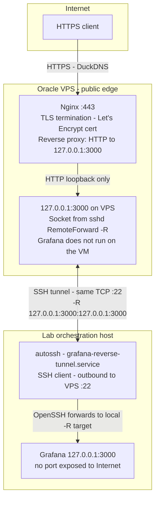

# Public Grafana - HTTPS access via Oracle VPS

Exposes Grafana on the Internet with HTTPS using a **reverse SSH tunnel** from the lab host to a VM on Oracle Cloud (Free Tier). No ports are opened on the lab network: all external traffic hits the VM and reaches Grafana through the tunnel.

See also: [observabilidad.md](observabilidad.md) for the Prometheus + Grafana stack on the host.

## URL and access {: #url-and-access }

- **Site:** [https://fcefyn-testbed.duckdns.org/](https://fcefyn-testbed.duckdns.org/)
- Access is **by invitation** - contacts in [SOM - Ownership and support](../operar/system-operation-manual.md#ownership-and-support).

---

## Architecture



Data path for Grafana requests: **TLS terminates at Nginx**; between Nginx and the tunnel endpoint on the VPS, traffic is **HTTP on loopback** (it does not leave the VM). **sshd** on the VPS listens on `127.0.0.1:3000` due to `RemoteForward`; each connection to that socket is encrypted over the SSH session that **the lab opens toward the VPS** (`autossh`). On the lab, the SSH client hands traffic to **Grafana on loopback**.

The lab **starts and keeps** the tunnel; the VPS **does not** open inbound connections to the lab network. No port forwarding is required on the lab firewall. Prometheus stays on the host loopback only (not part of this path).

---

## Components

| Component | Role |
|-----------|------|
| **Oracle VM (Free Tier)** | Public VM (`VM.Standard.E2.1.Micro`, Ubuntu 24.04) |
| **DuckDNS** | Free dynamic DNS; subdomain pointing at the VPS public IP |
| **Nginx** | Reverse proxy HTTPS to `127.0.0.1:3000` (VPS loopback) |
| **Let's Encrypt + Certbot** | Free TLS certificate; renewal via cron |
| **autossh** | Keeps the reverse SSH tunnel from the lab to the VPS |
| **iptables** | Firewall on the VM (persistent rules via `netfilter-persistent`) |

---

## 1. Provisioning the Oracle Cloud VPS

### 1.1 Instance

| Field | Value |
|-------|-------|
| Shape | `VM.Standard.E2.1.Micro` (Always Free) |
| OS | Canonical Ubuntu 24.04 |
| Shielded instance | Disabled |
| Boot volume | Default size (~47 GB); no extra volumes |

### 1.2 Network (VCN)

Create these resources manually if there is no VCN with Internet access yet:

1. **VCN** - CIDR e.g. `10.0.0.0/16`.
2. **Internet Gateway** - attached to the VCN.
3. **Route table for subnets** (different from the IGW route table) - rule `0.0.0.0/0 -> Internet Gateway`.
4. **Public subnet** - CIDR e.g. `10.0.0.0/24`; type **Public**; route table from step 3.

> OCI requires that the route table attached to the Internet Gateway **cannot** have rules with target Internet Gateway (only Private IP or empty). That is why **two** separate route tables are needed.

### 1.3 Security list (ingress)

| Port | Protocol | Source | Description |
|------|----------|--------|---------------|
| 22 | TCP | `0.0.0.0/0` | SSH administration |
| 80 | TCP | `0.0.0.0/0` | HTTP (Let's Encrypt ACME challenge) |
| 443 | TCP | `0.0.0.0/0` | HTTPS Grafana |

### 1.4 SSH key

Generate or use a dedicated RSA/ED25519 key pair for the VPS. On the lab host:

```bash
# Store under ~/.ssh/ with a descriptive name
chmod 600 ~/.ssh/id_rsa_oci
chmod 644 ~/.ssh/id_rsa_oci.pub
```

In the lab user's `~/.ssh/config`:

```text
Host oracle-vps
  HostName <VPS_PUBLIC_IP>
  User ubuntu
  IdentityFile ~/.ssh/id_rsa_oci
```

Verify access:

```bash
ssh oracle-vps
```

---

## 2. DuckDNS

1. Create an account at [duckdns.org](https://www.duckdns.org) (login with Google or others).
2. Add a subdomain (e.g. `fcefyn-testbed`) - full domain: `fcefyn-testbed.duckdns.org`.
3. Enter the **VPS public IP** in *current ip* - **update ip**.
4. Verify resolution (from any machine):

```bash
dig +short fcefyn-testbed.duckdns.org
# Should return the VPS public IP
```

---

## 3. Nginx + Let's Encrypt on the VPS

Connect to the VPS:

```bash
ssh oracle-vps
```

### 3.1 Install packages

```bash
sudo apt update
sudo apt install -y nginx certbot python3-certbot-nginx
```

### 3.2 Obtain certificate

```bash
sudo certbot --nginx -d fcefyn-testbed.duckdns.org
```

Certbot validates the domain over HTTP (port 80), issues the certificate, and updates Nginx automatically.

Certificates live under `/etc/letsencrypt/live/fcefyn-testbed.duckdns.org/`. Automatic renewal is set up via cron/timer when Certbot is installed.

### 3.3 Configure proxy to Grafana

In the Nginx site file (e.g. `/etc/nginx/sites-enabled/default`), inside the `server { listen 443 ssl; ... }` block, replace `location /` with:

```nginx
location / {
    proxy_pass http://127.0.0.1:3000;
    proxy_set_header Host $host;
    proxy_set_header X-Real-IP $remote_addr;
    proxy_set_header X-Forwarded-For $proxy_add_x_forwarded_for;
    proxy_set_header X-Forwarded-Proto $scheme;
    proxy_http_version 1.1;
    proxy_set_header Upgrade $http_upgrade;
    proxy_set_header Connection "upgrade";
}
```

Check syntax and reload:

```bash
sudo nginx -t && sudo systemctl reload nginx
```

---

## 4. Firewall on the VM (iptables)

Ubuntu on Oracle Cloud ships iptables rules that **reject** all inbound traffic except SSH by default. Open ports 80 and 443 explicitly:

```bash
sudo iptables -I INPUT -p tcp --dport 80 -j ACCEPT
sudo iptables -I INPUT -p tcp --dport 443 -j ACCEPT
sudo netfilter-persistent save
```

Verify:

```bash
sudo iptables -L INPUT -n -v --line-numbers
```

Rules must appear **before** the `REJECT icmp-host-prohibited` line.

---

## 5. Reverse SSH tunnel from the lab

The lab host keeps a persistent reverse SSH tunnel to the VPS using `autossh`. It forwards VPS loopback port `3000` to local `3000` (where Grafana listens).

### 5.1 Bring up the tunnel (manual or test)

On the lab host, with Grafana running (`systemctl is-active grafana-server`):

```bash
autossh -M 0 -N \
  -R 127.0.0.1:3000:127.0.0.1:3000 oracle-vps \
  -o ExitOnForwardFailure=yes \
  -o ServerAliveInterval=30 \
  -o ServerAliveCountMax=3
```

Verify on the VPS:

```bash
curl -sS -o /dev/null -w '%{http_code}\n' http://127.0.0.1:3000/login
# Should return 200 when Grafana is reachable
```

### 5.2 Persistent tunnel via systemd (Ansible)

The Ansible `observability` role can generate the `grafana-reverse-tunnel.service` unit. Enable it in `ansible/roles/observability/defaults/main.yml` (repository root):

```yaml
grafana_public_tunnel:
  enabled: true
  ssh_alias: oracle-vps
```

Apply:

```bash
ansible-playbook -i ansible/inventory/hosts.yml ansible/playbook_testbed.yml --tags observability -K
```

---

## 6. Grafana security

### 6.1 Configuration in `grafana.ini`

On the lab host, edit `/etc/grafana/grafana.ini`:

```ini
[server]
root_url = https://fcefyn-testbed.duckdns.org/

[security]
cookie_secure = true
cookie_samesite = lax

[users]
allow_sign_up = false
```

Restart Grafana:

```bash
sudo systemctl restart grafana-server
```

### 6.2 User accounts

| Account | Role | Use |
|---------|------|-----|
| `admin` | Server Admin | Server administration only; strong password; minimal use |
| Personal user | Editor or Org Admin | Daily dashboard work |
| Optional viewer | Viewer | Read-only; demos or public sharing |

Reset admin password if needed:

```bash
sudo grafana-cli admin reset-admin-password 'new-password'
sudo systemctl restart grafana-server
```

Create and manage users under **Administration - Users and access - Users** in the UI.

---

## 7. End-to-end verification

```bash
# From the lab: Nginx responds on the VPS
curl -sS -I https://fcefyn-testbed.duckdns.org/

# On the VPS: Grafana reachable through the tunnel
curl -sS -o /dev/null -w '%{http_code}\n' http://127.0.0.1:3000/login

# Tunnel status (if using systemd)
systemctl status grafana-reverse-tunnel

# Nginx and cert status
sudo systemctl status nginx
sudo certbot certificates
```

In the browser: [https://fcefyn-testbed.duckdns.org](https://fcefyn-testbed.duckdns.org) - Grafana login.

---

## 8. Maintenance

| Task | Detail |
|------|--------|
| Certificate renewal | Automatic via Certbot (systemd timer or cron). Test with `sudo certbot renew --dry-run`. |
| Update IP in DuckDNS | If the VPS public IP changes, update manually at [duckdns.org](https://www.duckdns.org) and in `~/.ssh/config` (`HostName`). |
| Restart tunnel | `systemctl restart grafana-reverse-tunnel` or rerun the `autossh` command manually. |
| VPS updates | `sudo apt update && sudo apt upgrade -y` periodically; reboot after kernel updates. |

---

## Key files

| File / resource | Description |
|-----------------|-------------|
| `/etc/nginx/sites-enabled/default` | Nginx config on the VPS (HTTPS proxy to :3000) |
| `/etc/letsencrypt/live/<domain>/` | Let's Encrypt certificates (managed by Certbot) |
| `/etc/iptables/rules.v4` | Persistent iptables rules on the VPS |
| `/etc/grafana/grafana.ini` | Grafana on the lab (`root_url`, cookies, sign_up) |
| `~/.ssh/config` - `Host oracle-vps` | SSH alias from the lab to the VPS |
| `ansible/roles/observability/defaults/main.yml` | `grafana_public_tunnel` to enable the Ansible unit |
