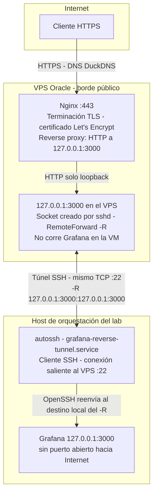

# Grafana público - Acceso HTTPS via Oracle VPS

Expone Grafana en Internet con HTTPS usando un **túnel SSH inverso** desde el host del lab hacia una VM en Oracle Cloud (Free Tier). No se abren puertos en la infraestructura del lab: todo el tráfico externo entra por la VM y llega a Grafana a través del túnel.

Ver también: [observabilidad.md](observabilidad.md) para el stack Prometheus + Grafana en el host.

## URL y acceso

- **Sitio:** [https://fcefyn-testbed.duckdns.org/](https://fcefyn-testbed.duckdns.org/)
- Para acceder **solicitar acceso** a operadores del lab - contactos en [SOM - Propiedad y soporte](../operar/SOM.md#propiedad-y-soporte).

---

## Arquitectura



Flujo de datos del request Grafana: **TLS termina en Nginx**; entre Nginx y el extremo del túnel en el VPS el tráfico es **HTTP en loopback** (no sale de la VM). **sshd** en el VPS escucha `127.0.0.1:3000` por el `RemoteForward`; cada conexión a ese socket viaja cifrada por la sesión SSH que **el lab abre hacia el VPS** (`autossh`). En el lab, el cliente SSH entrega el tráfico a **Grafana en loopback**.

El lab **inicia y mantiene** el túnel; el VPS **no** abre conexiones entrantes hacia la red del lab. No hace falta port forwarding en el firewall del lab. Prometheus sigue solo en loopback del host (no forma parte de este camino).

---

## Componentes

| Componente | Rol |
|------------|-----|
| **Oracle VM (Free Tier)** | VM pública (`VM.Standard.E2.1.Micro`, Ubuntu 24.04) |
| **DuckDNS** | DNS dinámico gratuito; subdominio apuntado a la IP pública del VPS |
| **Nginx** | Reverse proxy HTTPS → `127.0.0.1:3000` (loopback del VPS) |
| **Let's Encrypt + Certbot** | Certificado TLS gratuito; renovación automatica via cron |
| **autossh** | Mantiene el túnel SSH inverso desde el lab hacia el VPS |
| **iptables** | Firewall en la VM (reglas persistentes via `netfilter-persistent`) |

---

## 1. Provisioning del VPS en Oracle Cloud

### 1.1 Instancia

| Campo | Valor |
|-------|-------|
| Shape | `VM.Standard.E2.1.Micro` (Always Free) |
| OS | Canonical Ubuntu 24.04 |
| Shielded instance | Desactivado |
| Boot volume | Tamaño por defecto (~47 GB); sin volúmenes extra |

### 1.2 Red (VCN)

Crear manualmente los siguientes recursos si no existe una VCN con acceso a Internet:

1. **VCN** - CIDR p. ej. `10.0.0.0/16`.
2. **Internet Gateway** - asociado a la VCN.
3. **Route table para subnets** (distinta de la que usa el IGW) - regla `0.0.0.0/0 → Internet Gateway`.
4. **Subnet pública** - CIDR p. ej. `10.0.0.0/24`; tipo **Public**; route table del punto 3.

> OCI impone que la route table asociada al Internet Gateway **no** puede tener reglas con target Internet Gateway (solo Private IP o vacía). Por eso se necesitan **dos** route tables separadas.

### 1.3 Security List (ingress)

| Puerto | Protocolo | Fuente | Descripción |
|--------|-----------|--------|-------------|
| 22 | TCP | `0.0.0.0/0` | SSH administración |
| 80 | TCP | `0.0.0.0/0` | HTTP (ACME challenge Let's Encrypt) |
| 443 | TCP | `0.0.0.0/0` | HTTPS Grafana |

### 1.4 SSH key

Generar o usar un par de claves RSA/ED25519 dedicado para el VPS. En el host del lab:

```bash
# Guardar en ~/.ssh/ con nombre descriptivo
chmod 600 ~/.ssh/id_rsa_oci
chmod 644 ~/.ssh/id_rsa_oci.pub
```

En `~/.ssh/config` del usuario del lab:

```text
Host oracle-vps
  HostName <IP_PUBLICA_VPS>
  User ubuntu
  IdentityFile ~/.ssh/id_rsa_oci
```

Verificar acceso:

```bash
ssh oracle-vps
```

---

## 2. DuckDNS

1. Crear cuenta en [duckdns.org](https://www.duckdns.org) (login con cuenta de Google u otros).
2. Agregar subdominio (p. ej. `fcefyn-testbed`) → dominio completo: `fcefyn-testbed.duckdns.org`.
3. Ingresar la **IP pública del VPS** en el campo *current ip* → **update ip**.
4. Verificar resolución (desde cualquier máquina):

```bash
dig +short fcefyn-testbed.duckdns.org
# Debe devolver la IP pública del VPS
```

---

## 3. Nginx + Let's Encrypt en el VPS

Conectarse al VPS:

```bash
ssh oracle-vps
```

### 3.1 Instalar paquetes

```bash
sudo apt update
sudo apt install -y nginx certbot python3-certbot-nginx
```

### 3.2 Obtener certificado

```bash
sudo certbot --nginx -d fcefyn-testbed.duckdns.org
```

Certbot valida el dominio via HTTP (puerto 80), emite el certificado y modifica la configuración de Nginx automáticamente.

Los certificados quedan en `/etc/letsencrypt/live/fcefyn-testbed.duckdns.org/`. La renovación automática se configura via cron/timer al instalar Certbot.

### 3.3 Configurar proxy a Grafana

En el archivo de sitio de Nginx (p. ej. `/etc/nginx/sites-enabled/default`), dentro del bloque `server { listen 443 ssl; ... }`, reemplazar el `location /` por:

```nginx
location / {
    proxy_pass http://127.0.0.1:3000;
    proxy_set_header Host $host;
    proxy_set_header X-Real-IP $remote_addr;
    proxy_set_header X-Forwarded-For $proxy_add_x_forwarded_for;
    proxy_set_header X-Forwarded-Proto $scheme;
    proxy_http_version 1.1;
    proxy_set_header Upgrade $http_upgrade;
    proxy_set_header Connection "upgrade";
}
```

Verificar sintaxis y recargar:

```bash
sudo nginx -t && sudo systemctl reload nginx
```

---

## 4. Firewall en la VM (iptables)

Ubuntu en Oracle Cloud incluye reglas de iptables que por defecto **rechazan** todo tráfico entrante excepto SSH. Es necesario abrir los puertos 80 y 443 explícitamente:

```bash
sudo iptables -I INPUT -p tcp --dport 80 -j ACCEPT
sudo iptables -I INPUT -p tcp --dport 443 -j ACCEPT
sudo netfilter-persistent save
```

Verificar:

```bash
sudo iptables -L INPUT -n -v --line-numbers
```

Las reglas deben aparecer **antes** de la línea `REJECT icmp-host-prohibited`.

---

## 5. Túnel SSH inverso desde el lab

El host del lab mantiene un túnel SSH inverso persistente hacia el VPS usando `autossh`. Este túnel redirige el puerto `3000` del loopback del VPS al `3000` local (donde escucha Grafana).

### 5.1 Levantar el túnel (manual o prueba)

En el host del lab, con Grafana activo (`systemctl is-active grafana-server`):

```bash
autossh -M 0 -N \
  -R 127.0.0.1:3000:127.0.0.1:3000 oracle-vps \
  -o ExitOnForwardFailure=yes \
  -o ServerAliveInterval=30 \
  -o ServerAliveCountMax=3
```

Verificar en el VPS:

```bash
curl -sS -o /dev/null -w '%{http_code}\n' http://127.0.0.1:3000/login
# Debe responder 200 cuando Grafana está accesible
```

### 5.2 Túnel persistente via systemd (Ansible)

El role Ansible `observability` incluye soporte para generar el unit `grafana-reverse-tunnel.service` de forma automática. Activarlo en [`ansible/roles/observability/defaults/main.yml`](../../ansible/roles/observability/defaults/main.yml):

```yaml
grafana_public_tunnel:
  enabled: true
  ssh_alias: oracle-vps
```

Aplicar:

```bash
ansible-playbook -i ansible/inventory/hosts.yml ansible/playbook_testbed.yml --tags observability -K
```

---

## 6. Seguridad en Grafana

### 6.1 Configuración en `grafana.ini`

En el host del lab, editar `/etc/grafana/grafana.ini`:

```ini
[server]
root_url = https://fcefyn-testbed.duckdns.org/

[security]
cookie_secure = true
cookie_samesite = lax

[users]
allow_sign_up = false
```

Reiniciar Grafana:

```bash
sudo systemctl restart grafana-server
```

### 6.2 Cuentas de usuario

| Cuenta | Rol | Uso |
|--------|-----|-----|
| `admin` | Server Admin | Solo tareas de administración del servidor; contraseña fuerte; uso mínimo |
| Usuario personal | Editor u Org Admin | Uso diario para gestionar dashboards |
| Viewer opcional | Viewer | Solo lectura; para terceros o demo pública |

Resetear contraseña de admin si fuera necesario:

```bash
sudo grafana-cli admin reset-admin-password 'nueva-clave'
sudo systemctl restart grafana-server
```

Crear y gestionar usuarios desde **Administration → Users and access → Users** en la UI.

---

## 7. Verificación end-to-end

```bash
# Desde el lab: Nginx responde en el VPS
curl -sS -I https://fcefyn-testbed.duckdns.org/

# En el VPS: Grafana llega por el túnel
curl -sS -o /dev/null -w '%{http_code}\n' http://127.0.0.1:3000/login

# Estado del túnel (si usa systemd)
systemctl status grafana-reverse-tunnel

# Estado de Nginx y cert
sudo systemctl status nginx
sudo certbot certificates
```

En el navegador: [https://fcefyn-testbed.duckdns.org](https://fcefyn-testbed.duckdns.org) → login de Grafana.

---

## 8. Mantenimiento

| Tarea | Detalle |
|-------|---------|
| Renovación del certificado | Automática via Certbot (timer systemd o cron). Verificar con `sudo certbot renew --dry-run`. |
| Actualizar IP en DuckDNS | Si la IP pública del VPS cambia, actualizar manualmente en [duckdns.org](https://www.duckdns.org) y en `~/.ssh/config` (`HostName`). |
| Reiniciar túnel | `systemctl restart grafana-reverse-tunnel` o relevantar el comando `autossh` manual. |
| Actualizaciones del VPS | `sudo apt update && sudo apt upgrade -y` periódicamente; reiniciar si hay kernel updates. |

---

## Archivos clave

| Archivo / recurso | Descripción |
|-------------------|-------------|
| `/etc/nginx/sites-enabled/default` | Config Nginx en el VPS (proxy HTTPS → :3000) |
| `/etc/letsencrypt/live/<dominio>/` | Certificados Let's Encrypt (gestionados por Certbot) |
| `/etc/iptables/rules.v4` | Reglas iptables persistentes en el VPS |
| `/etc/grafana/grafana.ini` | Config Grafana en el lab (root_url, cookies, sign_up) |
| `~/.ssh/config` → `Host oracle-vps` | Alias SSH hacia el VPS desde el lab |
| `ansible/roles/observability/defaults/main.yml` | Variable `grafana_public_tunnel` para activar el unit Ansible |
