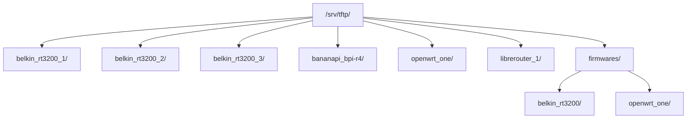

# Servidor TFTP y dnsmasq – Banco de Pruebas HIL

El **host (Lenovo)** ejecuta **dnsmasq**, que actúa como servidor **DHCP** y **TFTP** en cada VLAN. Sirve para que los DUTs descarguen firmware durante el arranque (modo recovery) y para que la interfaz WAN obtenga IP cuando está conectada.

**Rutas:** `/etc/dnsmasq.conf`, `/srv/tftp/` - ver [Rutas en el host](../index.md#rutas-en-el-host).

---

## 1. Qué hace dnsmasq aquí

dnsmasq ofrece DNS, DHCP y TFTP. Aquí usamos solo **DHCP** y **TFTP** (DNS deshabilitado con `port=0`).

**Flujo recovery:** El DUT arranca, pide DHCP, obtiene IP y servidor TFTP, descarga el firmware por TFTP, flashea y reinicia.


El host debe tener DHCP y TFTP activos en **cada VLAN** donde hay un DUT. Si falta la VLAN en dnsmasq, el DUT no obtiene IP ni puede descargar. El gateway del testbed (OpenWrt) tampoco sirve DHCP en las VLANs de prueba; el host lo hace con dnsmasq. Contexto: [gateway.md](./gateway.md).

| Componente | Relación |
|------------|----------|
| Netplan / VLANs | Cada `vlanXXX` debe existir (192.168.X.1/24). dnsmasq escucha ahí. |
| exporter.yaml | `TFTPProvider.external_ip` es la IP del host en esa VLAN. |
| /srv/tftp/ | Raíz TFTP. Subcarpetas por DUT coinciden con `external` del TFTPProvider. |

---

## 2. Configuración

- **Archivo:** `/etc/dnsmasq.conf`
- **Origen:** `openwrt-tests/ansible/files/exporter/labgrid-fcefyn/dnsmasq.conf`

Para FCEFyN: VLANs 100–108, una por DUT. Ejemplo:

```
port=0
interface=vlan100
dhcp-range=vlan100,192.168.100.100,192.168.100.200,24h
# ... vlan101 a vlan108 ...
enable-tftp
tftp-root=/srv/tftp/
```

Mapeo VLAN ↔ DUT: [rack-cheatsheets.md](../operar/rack-cheatsheets.md).

---

## 3. Estructura de directorios TFTP

| Tipo | Ruta | Propósito |
|------|------|-----------|
| Carpeta por DUT | `/srv/tftp/<place>/` (ej. `belkin_rt3200_1/`, `openwrt_one/`) | Symlinks al firmware. El nombre del symlink = lo que U-Boot pide por TFTP. |
| Firmwares reales | `/srv/tftp/firmwares/<device>/` | Los `.itb`/`.bin` descargados. Un archivo puede servir varios DUTs del mismo tipo. |



Los nombres de carpetas DUT deben coincidir con `external` en exporter.yaml.

---

## 4. Cómo funciona con Labgrid

En exporter.yaml cada place tiene un TFTPProvider:

```yaml
TFTPProvider:
  internal: "/srv/tftp/belkin_rt3200_1/"
  external: "belkin_rt3200_1/"
  external_ip: "192.168.100.1"
```

- **internal**: Directorio donde Labgrid crea/actualiza symlinks al firmware.
- **external**: Subruta que el DUT pide por TFTP.
- **external_ip**: IP del servidor TFTP en esa VLAN (vía DHCP).

El usuario que corre los tests debe tener **permiso de escritura** en cada carpeta DUT para que Labgrid pueda crear symlinks.

---

## 5. Añadir firmware

### 5.1 Permisos (una vez)

El usuario que ejecuta los tests (`laryc`) debe poder crear y modificar archivos en las carpetas DUT:

```bash
sudo chown -R laryc:laryc /srv/tftp/belkin_rt3200_1/ /srv/tftp/belkin_rt3200_2/ /srv/tftp/belkin_rt3200_3/ \
  /srv/tftp/bananapi_bpi-r4/ /srv/tftp/openwrt_one/ /srv/tftp/librerouter_1/
# Añadir más carpetas DUT según el lab
```

### 5.2 Procedimiento

1. **Descargar** en firmwares por tipo de dispositivo:

   ```bash
   sudo mkdir -p /srv/tftp/firmwares/openwrt_one
   sudo wget -O /srv/tftp/firmwares/openwrt_one/openwrt_one_initramfs.itb \
     https://downloads.openwrt.org/snapshots/targets/mediatek/filogic/openwrt-24.10.0-rc2-mediatek-filogic-openwrt_one-initramfs.itb
   ```

2. **Crear symlink** en la carpeta del DUT. El nombre del symlink debe ser **exactamente** el que U-Boot pide por TFTP:

   ```bash
   ln -sf /srv/tftp/firmwares/openwrt_one/openwrt_one_initramfs.itb \
     /srv/tftp/openwrt_one/openwrt-24.10.0-rc2-mediatek-filogic-openwrt_one-initramfs.itb
   ```

   Para varios DUTs del mismo tipo (Belkin 1, 2, 3): un symlink en cada carpeta DUT apuntando al mismo archivo.

3. **LG_IMAGE** con la ruta al symlink en la carpeta DUT:

   ```bash
   export LG_IMAGE=/srv/tftp/openwrt_one/openwrt-24.10.0-rc2-mediatek-filogic-openwrt_one-initramfs.itb
   ```

### 5.3 Reglas rápidas

- Archivos reales → siempre en `firmwares/<device>/`. Nunca en carpetas DUT.
- Symlinks → solo en carpetas DUT. Usar rutas absolutas.
- Verificar: `readlink -f /srv/tftp/<dut>/<symlink>` debe mostrar un archivo existente.
- `tree -L 3 /srv/tftp` — symlinks en azul = ok, en rojo = roto.

### 5.4 Borrar symlinks rotos

Los symlinks quedan rotos cuando se elimina el firmware de destino (ej. imágenes .itb obsoletas o que brickean dispositivos). Para listar y borrar:

```bash
cd /srv/tftp

# Listar symlinks rotos (revisar antes de borrar)
find . -type l ! -exec test -e {} \; -print

# Borrar todos los symlinks rotos
find . -type l ! -exec test -e {} \; -delete
```

Solo en carpetas Belkin (ej. tras eliminar firmwares .itb obsoletos):

```bash
cd /srv/tftp

find belkin_rt3200_1 belkin_rt3200_2 belkin_rt3200_3 -maxdepth 1 -type l ! -exec test -e {} \; -name "*.itb" -delete
```

---

## 6. Verificación

```bash
systemctl status dnsmasq
grep -E "vlan104|192.168.104" /etc/dnsmasq.conf
tree -L 3 /srv/tftp
ls -la /srv/tftp/openwrt_one/
readlink -f /srv/tftp/openwrt_one/openwrt-24.10.0-rc2-mediatek-filogic-openwrt_one-initramfs.itb

# Probar TFTP (tftp-hpa)
tftp 192.168.104.1 -c get openwrt_one/openwrt-24.10.0-rc2-mediatek-filogic-openwrt_one-initramfs.itb /tmp/test.itb
```

---

## 7. Retención y limpieza

Políticas para evitar que `/srv/tftp/firmwares/` crezca indefinidamente. Valores iniciales, a ajustar con experiencia operativa.

| Política | Regla |
|----------|-------|
| Máximo de imágenes por device | 3 (actual + 2 anteriores) |
| Antigüedad máxima | 90 días desde el último uso en CI |
| Alerta de disco | Avisar si `/srv/tftp/firmwares/` supera 10 GB |
| Mecanismo de limpieza | Manual (admin revisa); futuro: script cron |

### Procedimiento de limpieza manual

```bash
# Ver uso de disco
du -sh /srv/tftp/firmwares/*/

# Listar imágenes por antigüedad (más antiguas primero)
find /srv/tftp/firmwares/ -type f -printf '%T+ %p\n' | sort

# Borrar imagen obsoleta (verificar que no haya symlinks apuntando a ella)
# 1. Buscar symlinks que apunten al archivo
find /srv/tftp/ -type l -lname '*<filename>' -print
# 2. Si no hay symlinks, borrar
sudo rm /srv/tftp/firmwares/<device>/<filename>
# 3. Limpiar symlinks rotos resultantes (ver §5.4)
```

Ver también [ci-use-cases-proposal](../diseno/ci-use-cases-proposal.md) §4.5 para el contexto de diseño.

---

## 8. Referencias

- [SOM.md](../operar/SOM.md) – Ejecutar tests
- [host-config.md](./host-config.md) – Host y PDUDaemon
