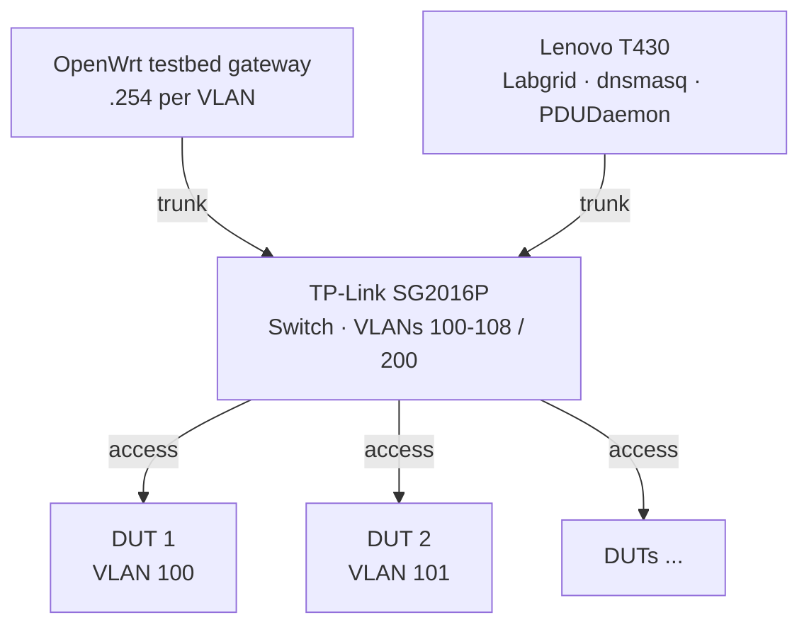
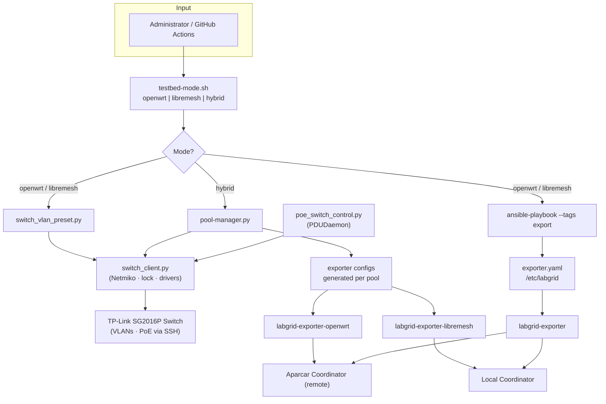

# Proposal: Hybrid OpenWrt/LibreMesh Lab

**Technical design document** for a lab capable of contributing to both [openwrt-tests](https://github.com/openwrt/openwrt-tests) and [LibreMesh](https://libremesh.org/), using the same physical set of DUTs.

The FCEFyN lab is presented as the initial use case. This proposal defines the scope, architecture, and key technical decisions required for implementation.

---

## 1. Context and Objective

### 1.1 Scenario

A HIL (Hardware-in-the-Loop) lab with several DUTs (OpenWrt/LibreMesh routers) connected to a managed switch and an orchestration host.

### 1.2 Objective

Allow a single lab to contribute to:

- **openwrt-tests** — OpenWrt vanilla CI (remote coordinator, e.g. Aparcar)
- **libremesh-tests** — LibreMesh testing fork (local coordinator in our case)

with **mode switching** via a single CLI command, or a **simultaneous split** of DUTs between both projects in hybrid mode.

---

## 2. Technical Foundations: Isolated VLANs vs Shared VLAN

### 2.1 Why openwrt-tests requires isolated VLANs

In openwrt-tests, each DUT must be on its own VLAN (100-108). The reason is that **vanilla OpenWrt assigns the same IP to all devices**:

- **Default IP**: `192.168.1.1` on `br-lan`
- **DHCP server**: `odhcpd` active on each DUT, offering IPs in the 192.168.1.x range

If multiple DUTs shared the same L2 segment, the following issues would arise:

| Problem | Description |
|---------|-------------|
| **SSH impossible** | `ssh root@192.168.1.1` cannot distinguish between devices |
| **ARP conflicts** | Multiple MACs responding for the same IP degrade the network |
| **DHCP wars** | Multiple DHCP servers competing; the host might receive an IP from a DUT instead of the lab's dnsmasq |
| **Non-deterministic tests** | A test could run against the wrong device |
| **Failed TFTP boot** | During U-Boot, the DUT runs `dhcp`; it could receive a response from a neighboring DUT instead of the host's TFTP server |

Therefore, **VLAN isolation is technically required** for openwrt-tests when multiple DUTs are present.

### 2.2 Why LibreMesh can use a shared VLAN

LibreMesh **does not share** the vanilla OpenWrt assumption. It is designed for mesh networks with multiple nodes:

| Aspect | Vanilla OpenWrt | LibreMesh |
|--------|-----------------|-----------|
| **br-lan IP** | Fixed `192.168.1.1` (same on all devices) | Dynamic `10.13.<MAC[4]>.<MAC[5]>` (unique per device) |
| **IP conflict** | Yes | No; each node has a MAC-derived IP |
| **DHCP server** | `odhcpd` active on 192.168.1.x | Disabled or in a non-conflicting range in mesh mode |
| **Design assumption** | "I am the only router on the network" | "There are multiple nodes in the mesh" |

#### How issues are avoided or mitigated in LibreMesh

| Problem (OpenWrt) | In LibreMesh |
|-------------------|--------------|
| **SSH impossible** | Each DUT has a unique IP (10.13.x.x). The framework adds a deterministic fixed IP (`10.13.200.x`) via serial before SSH to guarantee connectivity regardless of the LibreMesh version |
| **ARP conflicts** | None; each device has a unique MAC and unique IP |
| **DHCP wars** | LibreMesh does not run a traditional DHCP server on the LAN port by default; the host uses dnsmasq on 192.168.200.x for VLAN 200 |
| **Non-deterministic tests** | Labgrid acquires the place exclusively; the exporter knows the DUT's IP; SSH connects to the correct device |
| **TFTP boot** | LibreMesh DUTs do not offer DHCP on LAN by default; the host's dnsmasq responds |

**Conclusion**: LibreMesh can operate with all DUTs on a shared VLAN (VLAN 200) because it assigns unique IPs by design. The proposal includes:

- **Isolated mode** (VLANs 100-108): for OpenWrt tests
- **Mesh mode** (VLAN 200): for LibreMesh tests (single-node and multi-node)

---

## 3. Lab Roles

| Mode | Coordinator | Lab exporter | Other labs |
|------|-------------|--------------|------------|
| **OpenWrt** | Aparcar (remote) | DUTs → Aparcar | Remote exporters → Aparcar |
| **LibreMesh** | FCEFyN (local) | DUTs → local coordinator | Remote exporters → our coordinator |

- In openwrt-only or libremesh-only modes, only one exporter is active at a time.
- In **hybrid mode**, two exporters run simultaneously: one per pool, each connected to its coordinator (remote and local), with a predefined subset of DUTs per pool.

---

## 4. Proposed Network Topology

| Test type | Topology | Usage |
|-----------|----------|-------|
| **OpenWrt** | 1 DUT per VLAN (100-108) | Isolated tests |
| **LibreMesh** | DUTs on shared VLAN 200 | Single-node and multi-node tests |

### 4.1 Physical network topology

The switch is the central element connecting the gateway, host, and DUTs. Gateway and host use trunk ports (802.1Q); each DUT uses an access port.

### 4.2 VLAN scheme

- **VLANs 100-108**: OpenWrt (one per DUT).
- **VLAN 200**: Shared LibreMesh mesh.

### 4.3 IP addressing

| Context | IP range | Source |
|---------|----------|--------|
| **OpenWrt (isolated mode)** | 192.168.1.1 per DUT | Each DUT on its own VLAN; dnsmasq per VLAN |
| **LibreMesh (mesh mode)** | 10.13.x.x dynamic + 10.13.200.x fixed | LibreMesh assigns 10.13.x.x; the framework configures 10.13.200.x via serial for stable SSH |

For the labgrid host to reach LibreMesh DUTs, the route `10.13.0.0/16` would be added to the `vlan200` interface.

### 4.4 Fixed IP for SSH (LibreMesh)

To avoid depending on the dynamic LibreMesh IP (which may vary between versions), the proposed framework:

1. Generates a deterministic IP: `MD5(place_name) % 253 + 1` → `10.13.200.x`
2. Configures it via serial console as a secondary address on `br-lan`
3. The exporter uses this IP in `NetworkService`

---

## 5. Architecture Decision: Mesh Mode for LibreMesh

**Criterion**: All LibreMesh tests (single-node and multi-node) run with the switch in **mesh mode (VLAN 200)**.

| Question | Proposed decision | Justification |
|----------|-------------------|---------------|
| Single-node in isolated or mesh? | **Mesh** | In isolated mode, the 10.13.0.0/16 route only exists on vlan200. If the DUT is on vlan101, LibreMesh assigns it 10.13.x.x but the host cannot reach it. |
| When to switch modes? | **Only when switching between openwrt-tests and libremesh-tests** | A single CLI command (`testbed-mode openwrt` or `testbed-mode libremesh`). No internal switching within a single test suite. |
| Interference between DUTs on VLAN 200? | **Minimal and acceptable** | Labgrid locks the place exclusively. DUTs forming a mesh is expected behavior and does not interfere with single-node tests. |

---

## 6. Proposed Architecture

### 6.1 Components

| Component | Function |
|-----------|----------|
| **testbed-mode (CLI)** | Single command to switch between openwrt \| libremesh \| hybrid |
| **switch_client** | Central SSH client (Netmiko): lock, credentials, operations. Driver selectable via config (`POE_SWITCH_DRIVER`); delegates to `switch_drivers/<name>.py`. To change switches: create a new driver and update config. Used by switch_vlan_preset, pool-manager, and poe_switch_control. Location: `scripts/switch/`. |
| **switch_vlan_preset** | Applies isolated/mesh presets to the switch via switch_client. Location: `scripts/switch/`. |
| **pool-manager** | In hybrid mode: defines DUT split per pool, generates exporter configs, applies VLANs to the switch via switch_client. Location: `scripts/switch/`. |
| **poe_switch_control** | PoE on/off control per port; called by PDUDaemon during power cycle; uses switch_client. Location: `scripts/switch/`. |
| **Ansible** | Deploys exporter, dnsmasq, netplan, coordinator in openwrt/libremesh modes |

### 6.2 Proposed flow

- The **Switch** is configured via SSH by `switch_vlan_preset` (openwrt/libremesh modes) or `pool-manager` (hybrid mode). All use `switch_client.py` (Netmiko, lock, pluggable drivers). The driver is selected via `POE_SWITCH_DRIVER` in `~/.config/poe_switch_control.conf`; see `scripts/switch/switch_drivers/DRIVER_INTERFACE.md`. `poe_switch_control.py` (called by PDUDaemon) also uses `switch_client`. It does not depend on the coordinators.
- The **exporters** run on the host and send places to their respective coordinators.

### 6.3 Differential switch configuration

To reduce reconfiguration time and avoid unnecessary changes, the pool-manager could maintain a record of the last applied configuration and only apply per-port changes (differential apply). The switch would be fully reconfigured only on first run or when the state is invalid.

This was validated via POCs consisting of simple scripts that connect via SSH to the switch and apply valid commands (changing port-to-VLAN assignments, enabling/disabling PoE on ports) for the TP-Link SG2016P model.

The component responsible for applying switch configurations should ideally be vendor-agnostic — avoiding an ad-hoc solution that becomes useless if the switch is replaced. For this, existing solutions such as [netmiko](https://github.com/ktbyers/netmiko) would be explored.

---
