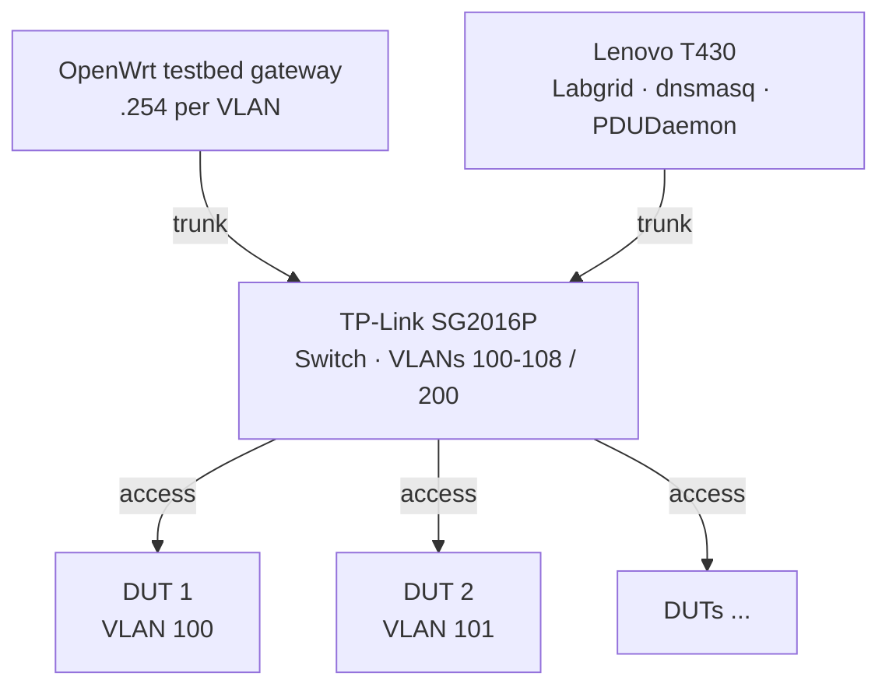
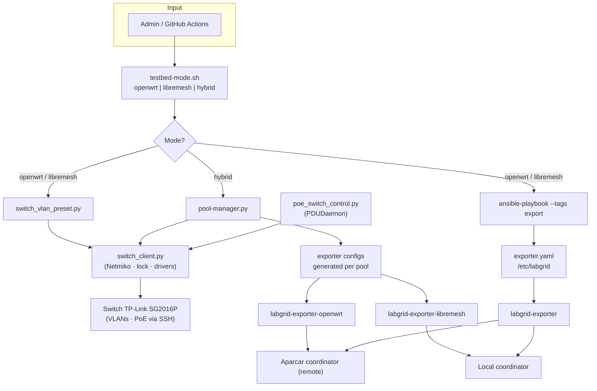

!!! warning "Historical document"
    This document describes the fixed-pool approach (2025-2026). It was superseded by
    [Unified pool architecture](unified-pool-proposal.md). Kept as a reference for the
    original design and the technical decisions behind it.

# Proposal: Hybrid OpenWrt/LibreMesh lab

**Technical design document** for a lab that can contribute to both [openwrt-tests](https://github.com/openwrt/openwrt-tests) and [LibreMesh](https://libremesh.org/) on the same physical DUT set.

The FCEFyN lab is the initial use case. This proposal defines scope, architecture, and technical decisions needed to implement it.

---

## 1. Context and goal

### 1.1 Scenario

A HIL (Hardware-in-the-Loop) lab with several OpenWrt/LibreMesh DUTs connected to a managed switch and an orchestration host.

### 1.2 Goal

Allow the same lab to contribute to:

- **openwrt-tests** - vanilla OpenWrt CI (remote coordinator, e.g. Aparcar)
- **libremesh-tests** - LibreMesh testing fork (local coordinator in our case)

with **mode switching** via a single CLI command, or **simultaneous split** of DUTs between both projects in hybrid mode.

---

## 2. Technical foundations: isolated VLANs vs shared VLAN

### 2.1 Why openwrt-tests needs isolated VLANs

In openwrt-tests, each DUT must be on its own VLAN (100-108) because **OpenWrt vanilla assigns the same IP to all devices**:

- **Default IP**: `192.168.1.1` on `br-lan`
- **DHCP server**: `odhcpd` active on each DUT offering 192.168.1.x

If several DUTs shared the same L2 segment, issues would include:

| Issue | Description |
|-------|-------------|
| **SSH impossible** | `ssh root@192.168.1.1` cannot distinguish devices |
| **ARP conflicts** | Multiple MACs for the same IP degrade the network |
| **DHCP wars** | Multiple DHCP servers; the host might get an IP from a neighbor DUT instead of lab dnsmasq |
| **Non-deterministic tests** | A test might run against the wrong device |
| **TFTP boot failure** | During U-Boot the DUT runs `dhcp`; it could get a response from a neighbor instead of the host TFTP server |

Therefore **VLAN isolation is technically required** for openwrt-tests with multiple DUTs.

### 2.2 Why LibreMesh can use a shared VLAN

LibreMesh **does not** share OpenWrt vanilla's premise. It targets mesh networks with multiple nodes:

| Aspect | OpenWrt vanilla | LibreMesh |
|--------|-----------------|-----------|
| **br-lan IP** | Fixed `192.168.1.1` (same on all) | Dynamic `10.13.<MAC[4]>.<MAC[5]>` (unique per device) |
| **IP conflict** | Yes | No; each node has MAC-derived unique IP |
| **DHCP server** | `odhcpd` active on 192.168.1.x | Disabled or non-conflicting range in mesh mode |
| **Design assumption** | "I am the only router" | "Multiple nodes on the mesh" |

#### How problems are avoided or mitigated in LibreMesh

| Problem (OpenWrt) | In LibreMesh |
|-------------------|--------------|
| **SSH impossible** | Each DUT has unique IP (10.13.x.x). The framework adds a deterministic fixed IP (`10.13.200.x`) via serial before SSH for connectivity independent of LibreMesh version |
| **ARP conflicts** | None; each device has unique MAC and IP |
| **DHCP wars** | LibreMesh does not run a traditional DHCP server on LAN by default; the host uses dnsmasq on 192.168.200.x for VLAN 200 |
| **Non-deterministic tests** | Labgrid acquires the place exclusively; the exporter knows the DUT IP; SSH targets the correct device |
| **TFTP boot** | LibreMesh DUTs do not offer DHCP on LAN by default; host dnsmasq responds |

**Conclusion**: LibreMesh can run with all DUTs on a shared VLAN (VLAN 200) because it assigns unique IPs by design. The proposal covers:

- **Isolated mode** (VLANs 100-108): for OpenWrt tests
- **Mesh mode** (VLAN 200): for LibreMesh tests (single and multi-node)

---

## 3. Lab roles

| Mode | Coordinator | Lab exporter | Other labs |
|------|-------------|--------------|------------|
| **OpenWrt** | Aparcar (remote) | DUTs to Aparcar | Remote exporters to Aparcar |
| **LibreMesh** | FCEFyN (local) | DUTs to local coordinator | Remote exporters to our coordinator |

- In openwrt-only or libremesh-only modes, only one exporter is active at a time.
- In **hybrid mode**, two exporters would run simultaneously: one per pool, each connected to its coordinator (remote and local), with a predefined subset of DUTs per pool.

---

## 4. Proposed network topology

| Test type | Topology | Use |
|-----------|----------|-----|
| **OpenWrt** | 1 DUT per VLAN (100-108) | Isolated tests |
| **LibreMesh** | DUTs on shared VLAN 200 | Single and multi-node tests |

### 4.1 Physical network topology

The switch is the central element connecting gateway, host, and DUTs. Gateway and host use trunk ports (802.1Q); each DUT is on an access port.

### 4.2 VLAN scheme

- **VLANs 100-108**: OpenWrt (one per DUT).
- **VLAN 200**: shared LibreMesh mesh.

### 4.3 IP addressing

| Context | IP range | Source |
|---------|----------|--------|
| **OpenWrt (isolated mode)** | 192.168.1.1 per DUT | Each DUT on its VLAN; dnsmasq per VLAN |
| **LibreMesh (mesh mode)** | dynamic 10.13.x.x + fixed 10.13.200.x | LibreMesh assigns 10.13.x.x; the framework configures 10.13.200.x via serial for stable SSH |

For the labgrid host to reach LibreMesh DUTs, add route `10.13.0.0/16` on interface `vlan200`.

### 4.4 Fixed IP for SSH (LibreMesh)

To avoid depending on LibreMesh dynamic IP (which can vary across versions), the proposed framework:

1. Generates a deterministic IP: `MD5(place_name) % 253 + 1` → `10.13.200.x`
2. Configures it via serial console as secondary address on `br-lan`
3. The exporter uses this IP in `NetworkService`

---

## 5. Architecture decision: mesh mode for LibreMesh

**Criterion**: All LibreMesh tests (single and multi-node) would run with the switch in **mesh mode (VLAN 200)**.

| Question | Proposed decision | Rationale |
|----------|-------------------|-----------|
| Single-node on isolated or mesh? | **Mesh** | On isolated VLAN, route 10.13.0.0/16 only exists on vlan200. If the DUT is on vlan101, LibreMesh assigns 10.13.x.x but the host cannot reach it. |
| When to change mode? | **Only when switching between openwrt-tests and libremesh-tests** | One CLI (`testbed-mode openwrt` or `testbed-mode libremesh`). No internal switching within one suite. |
| Interference between DUTs on VLAN 200? | **Minimal and acceptable** | Labgrid locks the place exclusively. DUTs forming a mesh is expected and does not break single-node tests. |

---

## 6. Proposed architecture

### 6.1 Components

| Component | Role |
|-----------|------|
| **testbed-mode (CLI)** | Single command to switch openwrt \| libremesh \| hybrid |
| **switch_client** | Central SSH client (Netmiko): lock, credentials, operations. Selectable driver via config (`SWITCH_DRIVER`); pluggable drivers. To change switch: new driver + config update. Now in standalone package `labgrid-switch-abstraction`. |
| **switch_vlan_preset** | Applies isolated/mesh presets on the switch via switch_client. Location: `scripts/switch/`. |
| **pool-manager** | In hybrid mode: defines DUT split per pool, generates exporter configs, applies VLANs via switch_client. Location: `scripts/switch/`. |
| **poe_switch_control** | PoE on/off per port; invoked by PDUDaemon on power cycle; uses switch_client. Location: `scripts/switch/`. |
| **Ansible** | Deploys exporter, dnsmasq, netplan, coordinator in openwrt/libremesh modes |

### 6.2 Proposed flow

- The **switch** is configured via SSH using `switch-vlan` (CLI from `labgrid-switch-abstraction`) or `vlan_manager` (during tests). All use `SwitchClient` (Netmiko, lock, pluggable drivers). Driver is selected with `SWITCH_DRIVER` in `~/.config/switch.conf`. `poe_switch_control.py` (invoked by PDUDaemon) also uses `SwitchClient`. Independent of coordinators.
- **Exporters** run on the host and publish places to the respective coordinators.

### 6.3 Differential switch apply

To reduce time and avoid unnecessary reconfiguration, pool-manager could keep state of the last applied configuration and apply only port changes (differential apply). The switch would be fully configured only on first run or when state is invalid.

POCs validated this with simple scripts SSHing to the switch and applying valid commands (port-to-VLAN assignment, PoE enable/disable on ports) for the SG2016P model.

The component applying switch configuration should ideally be vendor-agnostic for switch/commands, avoiding an ad-hoc solution that breaks on switch change. For that we would explore existing solutions such as https://github.com/ktbyers/netmiko.

---
