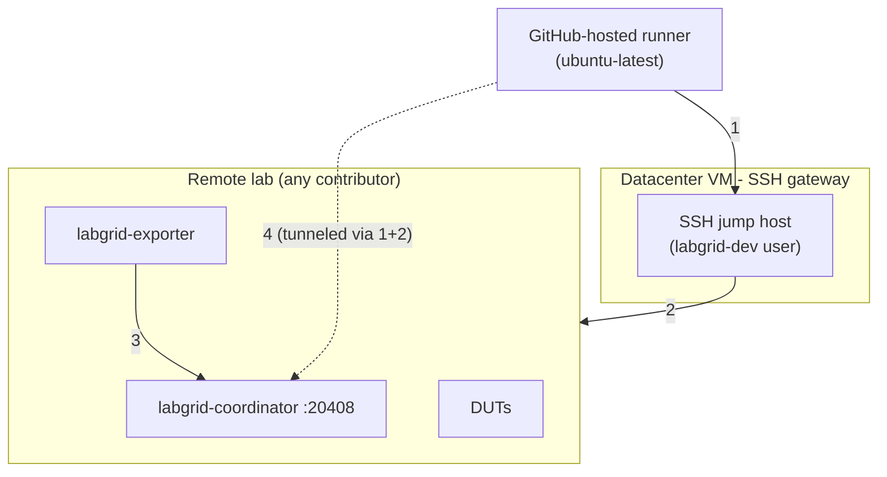
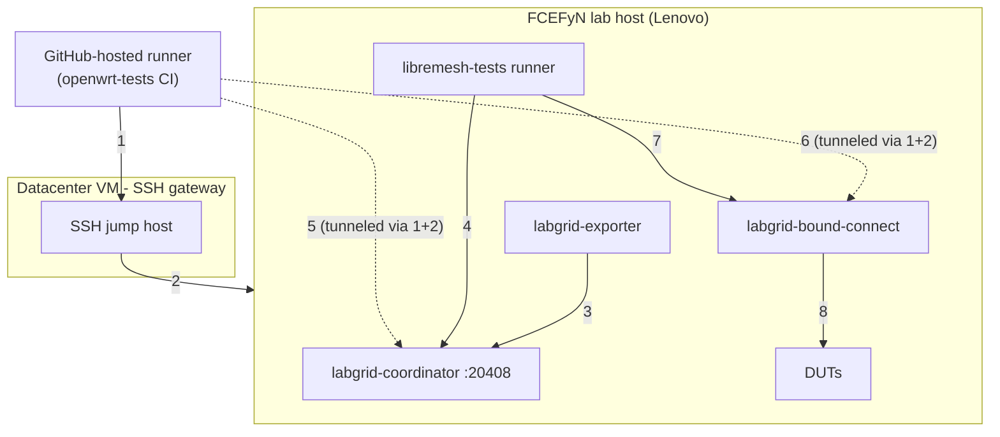
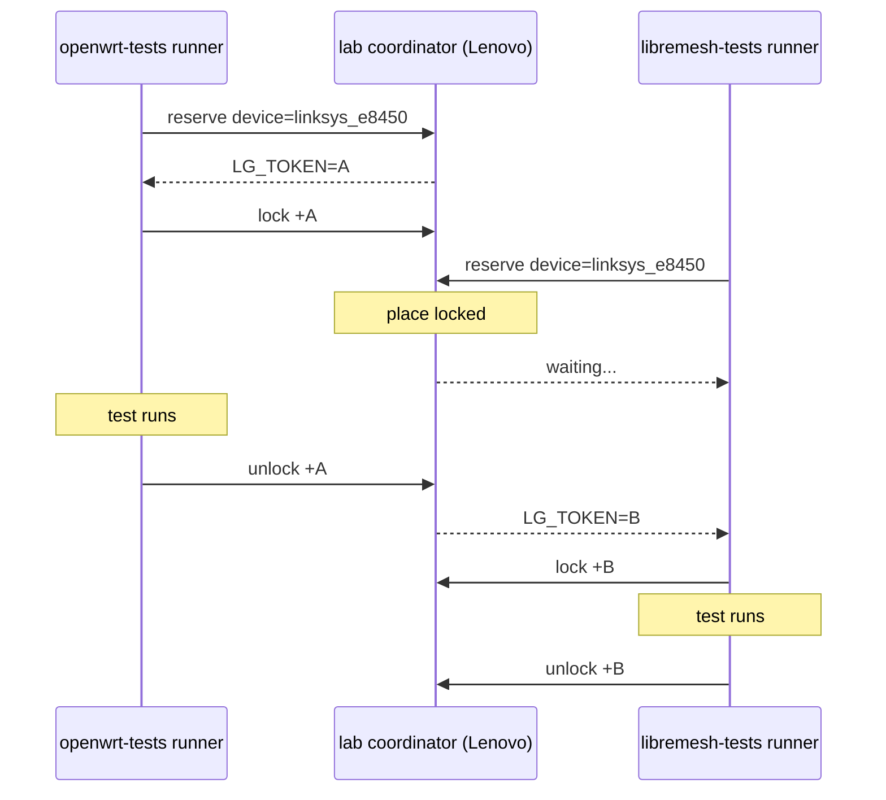

# Integration overview

How the FCEFyN testbed integrates with the existing openwrt-tests ecosystem. Intended as the entry point for the Design section: read this first, then follow the links to the detailed docs.

---

## 1. Starting point: openwrt-tests ecosystem

Before the FCEFyN lab existed, [openwrt-tests](https://github.com/aparcar/openwrt-tests) already operated a distributed testing infrastructure:

- A **VM in a datacenter** (public IP) acts as an **SSH gateway** (`global-coordinator` hostname). GitHub Actions runners (GitHub-hosted, `ubuntu-latest`) reach remote labs through this VM via **WireGuard**.
- **Remote labs** contributed by developers around the world each run a `labgrid-coordinator` and a `labgrid-exporter` locally (deployed by the upstream Ansible playbook `playbook_labgrid.yml`). The exporter registers DUTs with the coordinator on the same host (loopback `127.0.0.1:20408`).
- When CI triggers (daily, PR, or manual), a GitHub-hosted runner SSHs through the VM gateway to the target lab, where the `labgrid-client` plugin tunnels its gRPC calls to the **local coordinator** of that lab via `LG_PROXY` port-forwarding.

| # | Connection | Detail |
|---|---|---|
| 1 | Runner → SSH gateway | SSH to the VM (ProxyJump entry point) |
| 2 | SSH gateway → lab host | SSH over WireGuard tunnel |
| 3 | Exporter → local coordinator | gRPC loopback :20408 (register resources) |
| 4 | Runner → local coordinator | gRPC tunneled through SSH (LG_PROXY port-forward to lab's :20408) |

See [openwrt-tests CI flow](openwrt-tests-ci-flow.md) for the detailed sequence of how a single job runs end-to-end.

---

## 2. Our hardware contribution to openwrt-tests

The FCEFyN lab contributes physical devices to the openwrt-tests pool. This means:

- `labgrid-fcefyn` is added as a lab entry in `labnet.yaml` (the upstream registry).
- A **`labgrid-exporter`** on the FCEFyN host registers all DUTs with the **local `labgrid-coordinator`** (loopback :20408, same host).
- GitHub-hosted runners reach our coordinator through the SSH gateway VM (WireGuard) and can run openwrt-tests jobs on our hardware, exactly as they do with any other lab.

From the coordinator's perspective, our lab is indistinguishable from any other contributor. The process to set this up is documented in [openwrt-tests onboarding](openwrt-tests-onboarding.md).

---

## 3. Our own CI: libremesh-tests runner

For LibreMesh-specific tests, we run our **own GitHub Actions self-hosted runner** on the FCEFyN lab host (not on Paul's VM). This is the key architectural difference from openwrt-tests. Both runners converge on the **same local `labgrid-coordinator`** running on the Lenovo.

| # | Connection | Detail |
|---|---|---|
| 1 | openwrt-tests runner → SSH gateway | SSH to VM (ProxyJump) |
| 2 | SSH gateway → lab host | SSH over WireGuard |
| 3 | Exporter → local coordinator | gRPC loopback :20408 (register resources) |
| 4 | libremesh-tests runner → local coordinator | gRPC loopback :20408 (reserve / lock) |
| 5 | openwrt-tests runner → local coordinator | gRPC tunneled through SSH (LG_PROXY port-forward to :20408) |
| 6 | openwrt-tests runner → bound-connect | SSH via WireGuard (LG_PROXY=labgrid-fcefyn) |
| 7 | libremesh-tests runner → bound-connect | SSH local (LG_PROXY=labgrid-fcefyn resolves to 127.0.1.1) |
| 8 | bound-connect → DUTs | socat bindtodevice on vlanXXX |

### Key differences vs openwrt-tests runner

| | openwrt-tests runner | libremesh-tests runner |
|---|---|---|
| **Location** | GitHub-hosted (`ubuntu-latest`) | FCEFyN lab host (self-hosted) |
| **Runner label** | `ubuntu-latest` | `[self-hosted, testbed-fcefyn]` |
| **Coordinator path** | SSH tunnel via VM gateway → lab's loopback :20408 | Loopback :20408 (same host) |
| **`LG_PROXY`** | SSH via WireGuard to lab host | SSH to `127.0.1.1` (localhost, same machine) |
| **SSH to DUT** | WireGuard + `labgrid-bound-connect` | Local `labgrid-bound-connect` |
| **VLAN per test** | Isolated VLANs 100-108 (no change needed) | Switches to VLAN 200 for mesh, restores on teardown |

### `LG_PROXY` in the local case

Both runners set `LG_PROXY=labgrid-fcefyn`. The difference is in how that hostname resolves:

- From a GitHub-hosted runner: `labgrid-fcefyn` resolves via the SSH gateway VM (ProxyJump over WireGuard) to the lab host.
- From the lab host itself: Ansible sets `127.0.1.1 labgrid-fcefyn` in `/etc/hosts` - SSH goes to localhost. The `labgrid-bound-connect` proxy command still runs, but entirely on the same machine.

In both cases, the `labgrid-client` gRPC calls reach the **same `labgrid-coordinator` process** on the Lenovo via the SSH port-forward that `LG_PROXY` establishes. Neither runner sets `LG_COORDINATOR` explicitly; the default `127.0.0.1:20408` applies to the **forwarded** connection endpoint on the lab host.

### VLAN difference between test suites

openwrt-tests runs single-node tests. Each DUT stays on its **isolated VLAN** (100-108) for the entire test - no switch reconfiguration needed.

libremesh-tests runs multi-node mesh tests. Participating DUTs must all be on **VLAN 200** to form a mesh. The test fixture switches each port to VLAN 200 at start and restores it on teardown. This is the only test suite that modifies VLAN state.

See [Lab architecture](lab-architecture.md) for the full VLAN design and the `switch-vlan` CLI from [labgrid-switch-abstraction](https://github.com/fcefyn-testbed/labgrid-switch-abstraction).

---

## 4. Shared coordinator, no conflicts

Both runners - GitHub-hosted (openwrt-tests) and self-hosted (libremesh-tests) - talk to the **same `labgrid-coordinator`** on the FCEFyN Lenovo. They share the same pool of places (DUTs) for that lab.

The coordinator serializes access via **Labgrid locks**: only one runner can hold a lock on a place at a time. A runner that wants a busy device waits (`reserve --wait`) until the lock is released.

---

## 5. Reading guide for the Design section

| Goal | Start here |
|------|-----------|
| Understand how openwrt-tests CI runs step by step | [openwrt-tests CI flow](openwrt-tests-ci-flow.md) |
| Set up the WireGuard tunnel and contribute hardware to openwrt-tests | [openwrt-tests onboarding](openwrt-tests-onboarding.md) |
| VLAN design, `switch-vlan` CLI, switch configuration | [Lab architecture](lab-architecture.md) |
| Virtual mesh tests with QEMU and vwifi | [Virtual mesh](virtual-mesh.md) |
