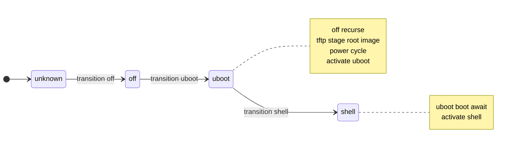
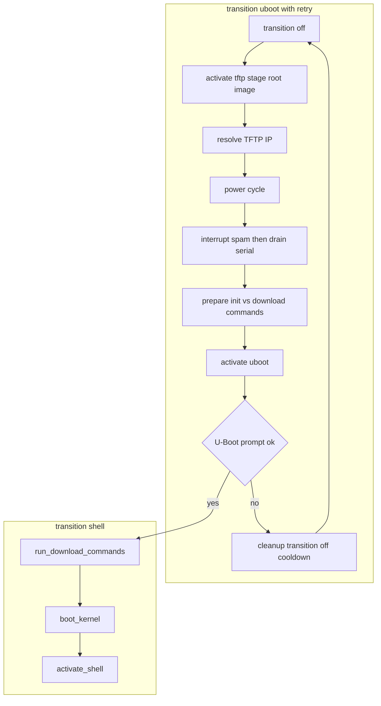
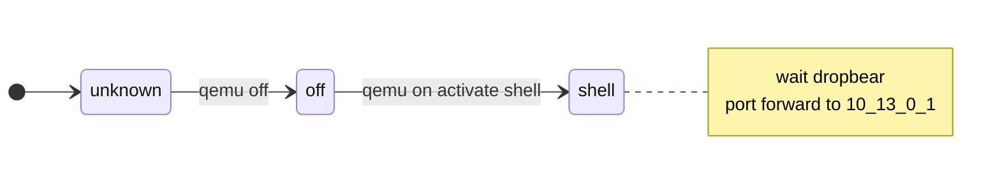
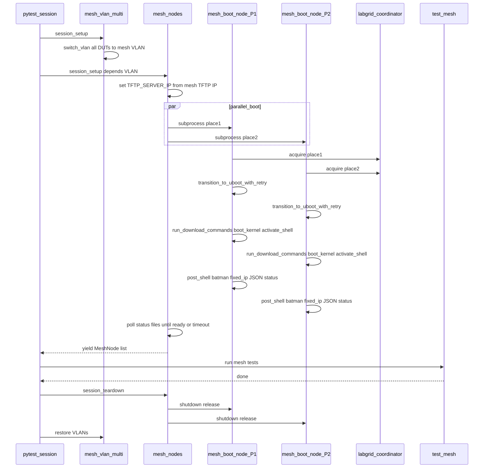
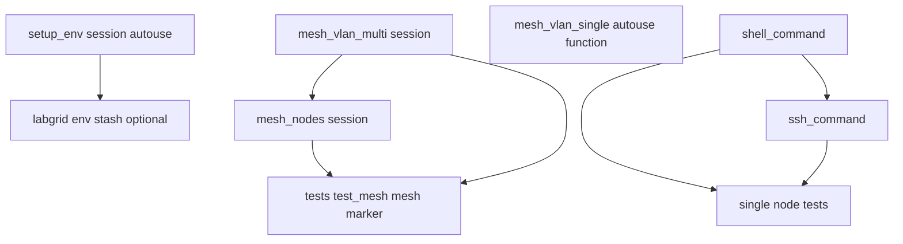

# Labgrid mesh strategy and orchestration

Design-level description of how [libremesh-tests](https://github.com/fcefyn-testbed/libremesh-tests) (branch `staging`) extends the vanilla [openwrt-tests](https://github.com/aparcar/openwrt-tests) Labgrid boot path for **multi-node mesh** tests: state machines for the custom strategies, contrast with upstream `UBootTFTPStrategy`, and the **pytest plus Labgrid** session flow (VLAN switch, parallel subprocess booters, teardown). Intended for maintainers and for thesis or project report background, not for day-to-day testbed operators.

Suite-specific code stays in **libremesh-tests**; this page links to paths there and to upstream blobs on GitHub.

---

## 1. What a Labgrid strategy is

A **strategy** is a small finite-state machine registered as a Labgrid **driver** on a **target**. Tests call `strategy.transition("shell")` (or string names that map to enum members). The strategy sequences **power**, **console**, **U-Boot**, **TFTP staging**, and **shell** drivers so the DUT reaches a known state. Target YAML files import the Python module and declare a driver instance (for example `UBootTFTPStrategy`).

---

## 2. Upstream `UBootTFTPStrategy` (openwrt-tests main)

Source: [`strategies/tftpstrategy.py`](https://github.com/aparcar/openwrt-tests/blob/main/strategies/tftpstrategy.py) (lines 11-82).

**States:** `unknown`, `off`, `uboot`, `shell` (plain `enum.Enum`).

**Behaviour summary:**

| Transition | Actions |
|------------|---------|
| `off` | Deactivate console, activate power, `power.off()`. |
| `uboot` | Recurse to `off`; activate TFTP and console; `tftp.stage(env.get_image_path("root"))`; read `RemoteTFTPProvider.external_ip`; `power.cycle()`; prepend `setenv bootfile` and optional `setenv serverip` / `setenv ipaddr` (DUT = server + 1) to `uboot.init_commands`; `activate(uboot)`. |
| `shell` | Transition to `uboot`; `uboot.boot("")`, `await_boot()`; `activate(shell)`. |

No retry loop on U-Boot activation or on TFTP download. Timeouts come from Labgrid drivers during `activate` / `await_boot`.

---

## 3. libremesh-tests `UBootTFTPStrategy` (staging)

Source: [`strategies/tftpstrategy.py`](https://github.com/fcefyn-testbed/libremesh-tests/blob/main/strategies/tftpstrategy.py).

Same **external** states (`unknown`, `off`, `uboot`, `shell`). Differences:

- **`uboot`:** implemented by `transition_to_uboot_with_retry()` wrapping `_transition_to_uboot_once()` with `_retry_action` (bounded retries, cooldown, cleanup via `transition(off)`).
- **Inside each U-Boot attempt:** `activate(tftp)` and `stage(root image)`; **TFTP server IP** from `_resolve_tftp_server_ip()` (env `TFTP_SERVER_IP` overrides `RemoteTFTPProvider.external_ip`) so mesh VLAN 200 can use a different dnsmasq than the per-DUT VLAN exporter IP; `power.cycle()`; **`_spam_uboot_interrupt()`** then **`_drain_serial_buffer()`** (order matters, documented in code); `_prepare_uboot_commands()` splits init vs `tftp`/`dhcp` download lines; `activate(uboot)`.
- **`shell`:** `transition(uboot)` then `run_download_commands()` (each download line retried until `TFTP_DOWNLOAD_TIMEOUT`), `boot_kernel()`, `activate_shell()`.

The outer `Status` enum still has `uboot` and `shell`; the flowchart shows the substeps inside `transition_to_uboot_with_retry`, `_transition_to_uboot_once`, and `transition(shell)`.

---

## 4. Side-by-side: upstream vs libremesh-tests `UBootTFTPStrategy`

| Topic | openwrt-tests main | libremesh-tests staging |
|-------|---------------------|-------------------------|
| States | `unknown`, `off`, `uboot`, `shell` | Same |
| `off` | Console off, power off | Same |
| Reach U-Boot | Single `power.cycle()` after stage | Retries with cooldown; each attempt runs spam plus drain then activate U-Boot |
| Serial after power-on | None | Interrupt spam (tunable) then bounded drain |
| TFTP server IP | `RemoteTFTPProvider.external_ip` only | `TFTP_SERVER_IP` env overrides (mesh VLAN TFTP) |
| TFTP/DHCP download lines in `init_commands` | Run implicitly as part of U-Boot flow after activate | Stripped into `_download_cmds`; executed in `run_download_commands()` with per-command retry until global TFTP timeout |
| `shell` transition | `uboot.boot` after implicit uboot | Explicit `run_download_commands` then `boot_kernel` then `activate_shell` |
| Multi-node race (STP, link) | Not addressed | Retries, download retry loop, docstring rationale |

Image path for staging remains `get_image_path("root")` in [`tftpstrategy.py` line 288](https://github.com/fcefyn-testbed/libremesh-tests/blob/main/strategies/tftpstrategy.py). Single-node pytest still injects `images["firmware"]` via `setup_env` in [`tests/conftest.py`](https://github.com/fcefyn-testbed/libremesh-tests/blob/main/tests/conftest.py) when Labgrid `env` exists; mesh subprocesses set `LG_IMAGE` and resolve the target per place.

---

## 5. QEMU strategies: upstream vs LibreMesh

**Upstream** [`strategies/qemunetworkstrategy.py`](https://github.com/aparcar/openwrt-tests/blob/main/strategies/qemunetworkstrategy.py): states `unknown`, `off`, `shell`. On `shell`, `qemu.on()`, `activate(shell)`, `update_network_service()` rewrites SLIRP forward to **`192.168.1.1`** (stock OpenWrt LAN).

**LibreMesh** [`strategies/qemunetworkstrategy_libremesh.py`](https://github.com/fcefyn-testbed/libremesh-tests/blob/main/strategies/qemunetworkstrategy_libremesh.py): same three states; `update_network_service()` waits for **dropbear on :22** (LibreMesh first-boot delay), then points SSH at **`10.13.0.1`** (anygw on `br-lan`) instead of `192.168.1.1`.

---

## 6. Pytest and Labgrid mesh orchestration (physical)

End-to-end flow when running `tests/test_mesh.py` with `LG_MESH_PLACES` set (not virtual mesh).

[`tests/conftest_mesh.py`](https://github.com/fcefyn-testbed/libremesh-tests/blob/main/tests/conftest_mesh.py) defines `mesh_nodes` (session) depending on `mesh_vlan_multi`. [`tests/mesh_boot_node.py`](https://github.com/fcefyn-testbed/libremesh-tests/blob/main/tests/mesh_boot_node.py) runs `boot_node()`: `Environment`, `start_session`, `acquire`, `strategy.transition_to_uboot_with_retry`, `run_download_commands`, `boot_kernel`, `activate_shell`, then post-shell steps. Outer boot retries use `LG_MESH_BOOT_ATTEMPTS` / `LG_MESH_BOOT_RETRY_COOLDOWN`.

---

## 7. Fixture dependency graph

When `LG_MESH_PLACES` is set, `mesh_vlan_single` returns early so it does not double-switch VLANs for mesh runs ([`tests/conftest_vlan.py`](https://github.com/fcefyn-testbed/libremesh-tests/blob/main/tests/conftest_vlan.py)).

---

## 8. Configuration knobs (environment variables)

| Variable | Role | Primary source file |
|----------|------|---------------------|
| `LG_MESH_UBOOT_RETRIES` | U-Boot activation retries inside strategy (capped vs login timeout budget) | [`strategies/tftpstrategy.py`](https://github.com/fcefyn-testbed/libremesh-tests/blob/main/strategies/tftpstrategy.py) |
| `LG_MESH_UBOOT_RETRY_COOLDOWN` | Seconds between U-Boot activation retries | same |
| `LG_MESH_UBOOT_INTERRUPT_SPAM_SEC` | Duration of interrupt spam; `0` disables | same |
| `LG_MESH_UBOOT_INTERRUPT_SPAM_INTERVAL` | Sleep between spam writes | same |
| `TFTP_SERVER_IP` | Override TFTP server for U-Boot `serverip` | same; set by VLAN fixtures / mesh_nodes |
| `LG_MESH_TFTP_IP` | Default mesh TFTP dnsmasq IP (`192.168.200.1` if unset) | [`tests/conftest_mesh.py`](https://github.com/fcefyn-testbed/libremesh-tests/blob/main/tests/conftest_mesh.py) |
| `LG_MESH_BOOT_ATTEMPTS` | Full boot pipeline retries in subprocess | [`tests/mesh_boot_node.py`](https://github.com/fcefyn-testbed/libremesh-tests/blob/main/tests/mesh_boot_node.py) |
| `LG_MESH_BOOT_RETRY_COOLDOWN` / `LG_MESH_UBOOT_RETRY_COOLDOWN` | Cooldown between full boot attempts | `mesh_boot_node.py` |
| `LG_MESH_KEEP_POWERED` | Skip `transition(off)` on teardown for debugging | `mesh_boot_node.py` |
| `LG_MESH_PLACES` | Comma-separated places for physical mesh | `conftest_mesh.py` |
| `LG_IMAGE` / `LG_IMAGE_MAP` | Firmware path per place | `conftest_mesh.py` |
| `LG_VIRTUAL_MESH` | Use QEMU virtual mesh path | `conftest_mesh.py` |
| `VIRTUAL_MESH_IMAGE`, `VIRTUAL_MESH_NODES`, `VIRTUAL_MESH_SKIP_VWIFI`, `VIRTUAL_MESH_VWIFI_HOST`, `VIRTUAL_MESH_CONVERGENCE_WAIT` | Virtual mesh tuning | `conftest_mesh.py` |
| `VLAN_SWITCH_DISABLED` | Skip `switch-vlan` | [`tests/conftest_vlan.py`](https://github.com/fcefyn-testbed/libremesh-tests/blob/main/tests/conftest_vlan.py) |
| `PLACE_PREFIX` | Strip labgrid place prefix for DUT name passed to `switch-vlan` | `conftest_vlan.py` |
| `LG_PROXY` | Remote `switch-vlan` over SSH to lab host | `conftest_vlan.py` |

---

## 9. Why this design (thesis-style justification)

1. **Per-place subprocess (`mesh_boot_node.py`)**  
   Each DUT needs its own Labgrid **session**, **place lock**, and **serial console** state. Driving multiple targets from one pytest process would serialize console access and complicate coordinator locking. Subprocesses isolate failures, allow **parallel** power cycles and U-Boot windows, and match how developers already run `labgrid-client` per place.

2. **U-Boot interrupt spam**  
   Remote paths (WireGuard, SSH jump, coordinator proxy) add jitter. The stock Labgrid expect on the autoboot string can miss the narrow window. Continuous interrupt bytes during a bounded window after `power.cycle()` makes stopping autoboot reliable; see comments in [`tftpstrategy.py`](https://github.com/fcefyn-testbed/libremesh-tests/blob/main/strategies/tftpstrategy.py) (`_spam_uboot_interrupt`).

3. **`TFTP_SERVER_IP` override**  
   Hybrid labs put each DUT on an **isolated access VLAN** for single-node tests; mesh tests move ports to **VLAN 200** where dnsmasq/TFTP listens on a **different** address than `RemoteTFTPProvider.external_ip` from the exporter's isolated-VLAN context. Overriding aligns U-Boot `serverip` with the mesh segment.

4. **Session-scoped `mesh_vlan_multi`**  
   One switch reconfiguration for the whole mesh session avoids per-test VLAN churn and matches the cost of moving many access ports at once. Teardown restores original VLAN map.

5. **`QEMUNetworkStrategyLibreMesh`**  
   LibreMesh uses **anygw** `10.13.0.1` and dynamic `10.13.x.x` on `br-lan`, not `192.168.1.1`. SLIRP port forward must target anygw; waiting for dropbear covers first-boot `lime-config` delay.

6. **`setup_env` without `env` fixture**  
   Documented in [`tests/conftest.py`](https://github.com/fcefyn-testbed/libremesh-tests/blob/main/tests/conftest.py): mesh runs often omit `--lg-env`, so pytest must not require Labgrid's `env` fixture for session autouse setup.

---

## 10. Source pointers

**libremesh-tests (staging)**

- [`strategies/tftpstrategy.py`](https://github.com/fcefyn-testbed/libremesh-tests/blob/main/strategies/tftpstrategy.py) - `UBootTFTPStrategy`
- [`strategies/qemunetworkstrategy_libremesh.py`](https://github.com/fcefyn-testbed/libremesh-tests/blob/main/strategies/qemunetworkstrategy_libremesh.py) - QEMU LibreMesh
- [`tests/conftest.py`](https://github.com/fcefyn-testbed/libremesh-tests/blob/main/tests/conftest.py) - plugins, `setup_env`, `shell_command`, `ssh_command`
- [`tests/conftest_mesh.py`](https://github.com/fcefyn-testbed/libremesh-tests/blob/main/tests/conftest_mesh.py) - `mesh_nodes`, virtual mesh, image map
- [`tests/conftest_vlan.py`](https://github.com/fcefyn-testbed/libremesh-tests/blob/main/tests/conftest_vlan.py) - `mesh_vlan_single`, `mesh_vlan_multi`
- [`tests/mesh_boot_node.py`](https://github.com/fcefyn-testbed/libremesh-tests/blob/main/tests/mesh_boot_node.py) - subprocess boot pipeline
- [`tests/test_mesh.py`](https://github.com/fcefyn-testbed/libremesh-tests/blob/main/tests/test_mesh.py) - mesh test cases

**openwrt-tests (main)**

- [`strategies/tftpstrategy.py`](https://github.com/aparcar/openwrt-tests/blob/main/strategies/tftpstrategy.py) - vanilla `UBootTFTPStrategy`
- [`strategies/qemunetworkstrategy.py`](https://github.com/aparcar/openwrt-tests/blob/main/strategies/qemunetworkstrategy.py) - vanilla QEMU LAN `192.168.1.1`
- [`tests/conftest.py`](https://github.com/aparcar/openwrt-tests/blob/main/tests/conftest.py) - upstream fixtures (includes `env` in `setup_env`)

---

## See also

- [Lab architecture](lab-architecture.md) - coordinator, VLANs, openwrt-tests vs libremesh-tests
- [Virtual mesh](virtual-mesh.md) - QEMU plus vwifi without Labgrid places
- [TFTP / dnsmasq](../configuracion/tftp-server.md) - lab host TFTP layout
- [Running tests](../operar/lab-running-tests.md) - operator commands
