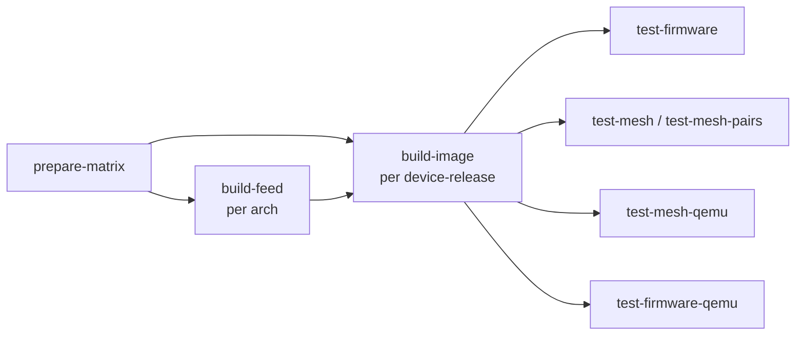

# lime-packages CI: firmware build pipeline

How the **fcefyn-testbed/lime-packages** fork builds per-device LibreMesh
images in GitHub Actions. Covers the matrix, the two-stage build, multi-
version OpenWrt support, the QEMU virtual path, and DTB patches.

Companion pages:

- [lime-packages CI: hardware tests](lime-packages-test-flow.md) - how
  the artifacts produced here are exercised on the lab and on QEMU,
  including the two-repo model (`lime-packages` workflow +
  `libremesh-tests` test suite).
- [Adding a device](lime-packages-add-device.md) - end-to-end checklist
  for onboarding a new board into the matrix.
- [Build firmware (manual)](../operar/build-firmware-manual.md) - quick
  `gh workflow run` recipes.

---

## 1. Pipeline overview



| Job             | Tool                                     | Output                                  |
|-----------------|------------------------------------------|-----------------------------------------|
| `prepare-matrix`| [tools/ci/prepare_matrix.sh][prep]       | All matrices for the rest of the run    |
| `build-feed`    | OpenWrt SDK (`openwrt/gh-action-sdk`)    | `.ipk` / `.apk` for `lime_packages`     |
| `build-image`   | OpenWrt ImageBuilder                     | Initramfs (FIT / multi-uimage / x86 disk) |
| `test-*`        | labgrid + pytest, QEMU + vwifi           | Per-device test results                 |

Each job is keyed on `<device, openwrt_release>`; matrices in
[targets.yml][tg] drive the entire pipeline.

[prep]: https://github.com/fcefyn-testbed/lime-packages/blob/master/tools/ci/prepare_matrix.sh
[tg]: https://github.com/fcefyn-testbed/lime-packages/blob/master/.github/ci/targets.yml

---

## 2. How developer changes become firmware

When a developer opens a pull request or pushes to a branch, the CI
**compiles the packages from that exact commit** and builds firmware
images that include those changes. The flow is:


This means:

- If you modify `packages/lime-system/`, the resulting firmware will
  contain **your modified `lime-system`**, not the upstream version.
- If you add a new package under `packages/`, it will be compiled and
  available (add it to `PACKAGES` in `targets.yml` to install it).
- Tests (`test-firmware`, `test-mesh`, `test-mesh-qemu`) exercise the
  firmware built from your PR, so failures indicate issues with your
  changes.

The artifact names include `GITHUB_SHA`, making each build traceable
to a specific commit.

---

## 3. Two-stage build

### `build-feed` (per arch, per release)

- Container: `ghcr.io/openwrt/sdk:<sdk_arch>` (e.g.
  `aarch64_cortex-a53-openwrt-24.10`).
- Action: `openwrt/gh-action-sdk@v9` mounts the **checked-out
  repository** (your PR code) as feed `lime_packages` and compiles
  every directory under `packages/` that has a `Makefile`. The full
  list is needed because no `lime-*` recipe defaults to `y/m`, so an
  empty `PACKAGES` produces an empty feed.
- Indexing:
  - **24.10.x (`PKG_FORMAT=ipk`)**: `ipkg-make-index.sh` builds
    `Packages` + `Packages.gz` with relative `Filename:` paths so the
    feed works when bind-mounted at `file:///feed/lime_packages` inside
    ImageBuilder.
  - **25.12.x (`PKG_FORMAT=apk`)**: `apk mkndx` (or `apk index` on older
    apk-tools builds) writes `packages.adb`. apk-tools requires absolute
    `file://` URLs, including the `.adb` filename.

### `build-image` (per device, per release)

- Container: `ghcr.io/openwrt/imagebuilder:<target>-v<release>`
  (e.g. `mediatek-filogic-v24.10.6`, `x86-64-v25.12.2`).
- Driver: [tools/ci/build_image.sh][bi] mounts the feed read-only (ipk)
  or rw (apk needs to regenerate `packages.adb`) and runs `make image
  PROFILE=... PACKAGES="..."`.
- Pre-flight: opkg/apk is asked to resolve `lime-system` against an
  empty offline root before `make image`. Hard-fails with a manifest
  diff if `make image` silently drops PACKAGES on a dep conflict.
- Manifest validation: the produced `*.manifest` must contain
  `lime-system`, `lime-proto-batadv`, `lime-proto-anygw` and
  `batctl-default`; otherwise the artifact is rejected as a vanilla
  OpenWrt build.

[bi]: https://github.com/fcefyn-testbed/lime-packages/blob/master/tools/ci/build_image.sh

---

## 4. Multi-version OpenWrt (24.10 + 25.12)

`openwrt_releases:` in `targets.yml` lists every release built per
target. The two formats coexist in the same matrix:

| Aspect            | 24.10.x (ipk)                | 25.12.x (apk)                  |
|-------------------|-------------------------------|--------------------------------|
| Package manager   | opkg-lede                     | apk-tools 3.x                  |
| Repo config file  | `repositories.conf`           | `repositories`                 |
| Local feed line   | `src/gz <name> file:///feed/lime_packages` | `file:///feed/lime_packages/packages.adb` |
| Index file        | `Packages` + `Packages.gz`    | `packages.adb`                 |
| Signature flag    | drop `option check_signature` | unset `CONFIG_SIGNATURE_CHECK` |
| make image flag   | (none)                        | `APK_FLAGS="--allow-untrusted ..."` |

`build_image.sh` branches on `PKG_FORMAT` (derived from
`OPENWRT_RELEASE`) for repo config, pre-flight, and `make image` flags.
Everything downstream (DTB patches, FIT/uimage repack, manifest check)
is identical between releases.

References:

- openwrt#18032 / openwrt#18048: file:// URL requirement for apk feeds.
- openwrt-action-sdk PRs adding apk + multi-arch support to v9.

---

## 5. Image formats

| `image_format`  | Used by                            | Artifact                                    |
|-----------------|------------------------------------|---------------------------------------------|
| `fit`           | mediatek-filogic, mediatek-mt7622  | `*-initramfs-libremesh.itb` (FIT)           |
| `multi-uimage`  | ath79 (LibreRouter v1)             | `*-initramfs-libremesh.uimage` (legacy IH_TYPE_MULTI) |
| `x86-combined`  | qemu_x86_64                        | `*-ext4-combined.img` (GRUB + kernel + ext4) |

`BUILD_INITRAMFS=1` repacks the ImageBuilder rootfs into a RAM-bootable
artifact (`kernel-bin` + DTB + CPIO ramdisk). Targets with
`BUILD_INITRAMFS=0` ship the squashfs-sysupgrade for IPK validation
only, and are filtered out of `test-firmware` in `prepare-matrix`.

For FIT, `mkits.sh` does not support a `bootargs` flag inside the
configurations node; we sed-inject `bootargs = "${FIT_BOOTARGS}";` into
the FIT config block. Required: U-Boot otherwise falls back to
`chosen/bootargs` (which has `root=/dev/fit0 ...`) and ignores the
initramfs.

---

## 6. DTB patches

Two optional, independent transforms are applied to the FIT-shipped DTB
when their gating env-vars are on. Both share a single dtc round-trip
(decompile -> python text edit -> recompile).

### `DTB_PATCH_NVMEM_MAC=1`

Workaround for [openwrt/openwrt#22858][nvmem]: when the OEM MAC lives
inside a UBI factory volume, `nvmem_cell_get()` returns
`-EPROBE_DEFER` perpetually and `mtk_eth_soc.probe` stalls forever
(no LAN/WAN/wifi). Implemented by [patch_dtb_local_mac.py][lmpatch]:
inject a deterministic `local-mac-address` into every `mac@` /
`port@` node that references `nvmem-cell-names = "mac-address"`.
The kernel's `of_get_mac_address()` checks DT properties before
falling back to NVMEM, so the deferred probe is unblocked.

### `DTB_FORCE_LEGACY_PARTITIONS=1`

Used by Belkin RT3200 layout-1.0 units. The 24.10 DTB defines a single
UBI partition starting at MTD offset 0x80000; the kernel attaches UBI
from there and overwrites BL31/FIP and the factory calibration region,
KOing the device. [patch_dtb_partitions.py][partpatch] rewrites the
SPI-NAND `partitions { ... }` block to the legacy 23.05 layout
(separate `bl2`, `fip`, `factory` and `ubi` MTDs, ubi starts at
0x300000). See [Belkin RT3200 DTB layout][belkin-doc] for the full
diagnosis.

[nvmem]: https://github.com/openwrt/openwrt/issues/22858
[lmpatch]: https://github.com/fcefyn-testbed/lime-packages/blob/master/tools/ci/patch_dtb_local_mac.py
[partpatch]: https://github.com/fcefyn-testbed/lime-packages/blob/master/tools/ci/patch_dtb_partitions.py
[belkin-doc]: lime-packages/belkin-rt3200-dtb.md

---

## 7. Caching

- **Cache path:** `feed-artifact/lime_packages/` (merged arch + `all`
  packages + index files).
- **Cache key:** `lime-feed-<n>-<arch>-<openwrt_release>-<feed_hash>`.
- **`feed_hash`:** sha256 over package sources (`Makefile`, `files/`,
  `patches/`, `src/` under `packages/`) plus `tools/ci/build_feed.sh`.
  Excludes `targets.yml` and the workflow YAML so workflow-only or
  per-target package list tweaks do not force a ~50 min SDK rebuild.
- **Restore keys:** prefix `lime-feed-<n>-<arch>-<openwrt_release>-` so
  a new feed hash can still restore the newest previous feed for that
  arch (partial reuse).

If the SDK action major version changes incompatibly, bump the
`lime-feed-vN-` prefix in the workflow to avoid restoring stale
binary caches.

---

## 8. QEMU virtual build

The `qemu_x86_64` matrix entry is built with `image_format:
x86-combined` and an extra src-git feed for `vwifi`:

```yaml
- device: qemu_x86_64
  imagebuilder: x86-64
  profile: generic
  arch: x86_64
  image_format: x86-combined
  packages: >-
    {{ packages_default }} kmod-mac80211-hwsim wpad-mesh-mbedtls vwifi
  extra_feeds:
    - "src-git|vwifi|https://github.com/fcefyn-testbed/vwifi_cli_package.git^<sha>"
  extra_packages:
    - "vwifi"
```

`build_image.sh` gunzips `*-ext4-combined.img.gz` (OpenWrt pads the
image past the gzip stream, so gunzip exits 2 with "trailing garbage
ignored"; treated as success). The result is an MBR-partitioned disk
image QEMU boots directly with `-drive if=virtio,format=raw`.

The vwifi packaging fork tracks `javierbrk/vwifi_cli_package` plus a
`PKG_MIRROR_HASH` so `feeds install` can pin the source. See
[QEMU vwifi notes][qemu-doc] for the multi-node mesh setup that
consumes this artifact.

[qemu-doc]: lime-packages/qemu-vwifi.md

---

## 9. File map

| Path                                          | Role                                  |
|-----------------------------------------------|---------------------------------------|
| `.github/workflows/build-firmware.yml`        | The CI workflow itself                |
| `.github/ci/targets.yml`                      | Matrix data (devices, releases, packages) |
| `tools/ci/prepare_matrix.sh`                  | Computes per-job matrices for the workflow |
| `tools/ci/build_feed.sh`                      | Calls `gh-action-sdk` and builds the local feed |
| `tools/ci/build_image.sh`                     | Wraps ImageBuilder, builds and validates each image |
| `tools/ci/patch_dtb_local_mac.py`             | DTB patcher: inject `local-mac-address` |
| `tools/ci/patch_dtb_partitions.py`            | DTB patcher: legacy SPI-NAND partitioning |
| `tools/ci/lab_stage_firmware.sh`              | Stage a single-node artifact on the labgrid TFTP server |
| `tools/ci/lab_stage_mesh.sh`                  | Stage mesh artifacts and run pytest (full mesh + walking-chain pairs) |
| `tools/ci/enable_kvm.sh`                      | Enable `/dev/kvm` for QEMU on GitHub-hosted runners |
| `tools/ci/build_summary.sh`                   | Render the workflow summary           |

To add a new board to this pipeline see the [add-device guide][add].

[add]: lime-packages-add-device.md
