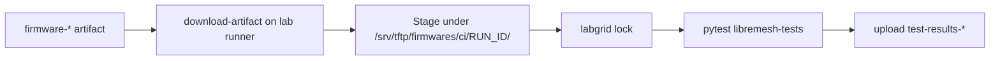

# lime-packages CI: hardware test stage

How **fcefyn-testbed/lime-packages** reuses built firmware artifacts on the **self-hosted** runner `testbed-fcefyn` to run **libremesh-tests** (`staging` branch) against physical DUTs after `build-image` succeeds.

Build pipeline overview: [lime-packages CI: firmware build](lime-packages-ci-flow.md).

`build-firmware.yml` is the **single orchestrator** of active CI in this project. The legacy daily / pull_requests workflows that lived in `fcefyn-testbed/libremesh-tests` were retired in May 2026; only `formal.yml` (Python lint) remains there.

---

## 1. When do tests run?

Three triggers fire `build-firmware.yml`. Hardware jobs are gated per trigger:

| Trigger | `test-firmware` (single-node, physical) | `test-mesh` (manual N=2/3, physical) | `test-mesh-pairs` (walking chain, physical) |
|---|---|---|---|
| `pull_request` | skipped | skipped | skipped |
| `workflow_dispatch` with `physical_single=true` | runs (per place × release) | runs only if `physical_mesh_count != 0` | skipped |
| `schedule` (cron 06:00 UTC) | runs (per place × release) | skipped | runs (3 sequential pairs) |

`workflow_dispatch` jobs are gated behind the GitHub `physical-lab` environment (required reviewers); the cron is unattended and does not require approval. All physical-lab-bound runs share the workflow-level concurrency group `physical-lab-shared`, so two lab-bound triggers never reserve the same place at once.

Fork PRs only get **build-feed** + **build-image** + the QEMU jobs on GitHub-hosted runners.

---

## 2. End-to-end flow

| Step | What happens |
|------|----------------|
| **Artifacts** | `build-image` uploads `firmware-<device>-<release>` per matrix device × release. |
| **Checkout** | `libremesh-tests` @ `staging`, `aparcar/openwrt-tests` @ `main` (for `labnet.yaml` / `OPENWRT_TESTS_DIR`). |
| **Staging** | Firmware copied to `/srv/tftp/firmwares/ci/<run_id>/<place>/<release>/` (single-node) or `…/mesh/<release>/` (manual mesh) or `…/mesh-pairs/<pair>/<release>/` (walking chain). Each parallel job gets its own staging dir so cleanup never races. |
| **Single-node** | Per place: lock `labgrid-fcefyn-<place>` directly, set **`LG_IMAGE`** to the staged file, run `pytest tests/test_libremesh.py`. |
| **Manual mesh** (`test-mesh`) | Maintainer-selected N=2 or N=3 nodes from `workflow_dispatch`. Stages every device the mesh shape needs, sets **`LG_MESH_PLACES`** + **`LG_IMAGE_MAP`** dynamically, runs `pytest tests/test_mesh.py`. |
| **Walking chain** (`test-mesh-pairs`) | Three sequential 2-node pairs (max-parallel: 1). Pair 1: belkin_rt3200_2 ↔ openwrt_one; Pair 2: openwrt_one ↔ bpi-r4; Pair 3: bpi-r4 ↔ belkin_rt3200_3. Covers every active lab device twice per day; excludes `belkin_rt3200_1` (in repair). |
| **Artifacts** | Console / JUnit uploaded as `test-results-<place>-<release>`, `test-results-mesh-<release>`, or `test-results-mesh-pairs-<pair>-<release>`. |

---

## 3. Why `LG_IMAGE` as an absolute path?

CI does **not** edit `configs/firmware-catalog.yaml` in libremesh-tests. Instead it exports **`LG_IMAGE`** (single-node) or **`LG_IMAGE_MAP`** (multi-node) pointing at files under `/srv/tftp/firmwares/ci/<run_id>/…`. That matches how developers run tests locally (see [libremesh-tests README](https://github.com/fcefyn-testbed/libremesh-tests/blob/staging/README.md)).

---

## 4. Labgrid reservation contract (single-node)

Every `test_targets_matrix` entry now carries an explicit **`place`** field expanded by `prepare-matrix` from `targets.yml`'s `test_places:` list. The hardware-test job locks `labgrid-fcefyn-<place>` directly — no more `labgrid-client reserve --shell device=…` discovery flow:

- **Lock:** `uv run labgrid-client -v -p labgrid-fcefyn-<place> lock`.
- **Unlock + power off:** in an `if: always()` step, `labgrid-client -p $LG_PLACE power off` + `labgrid-client -p $LG_PLACE unlock`. Calling the same commands without `-p` would fall back to labgrid's empty default and refuse to act ("pattern matches multiple places").
- **Teardown:** remove `/srv/tftp/firmwares/ci/<run_id>/<place>/<release>/`.

This makes the lock deterministic across devices that share a hardware profile: the three Belkin RT3200 units (`belkin_rt3200_1`/`_2`/`_3`) all run the `linksys_e8450` build artefact under per-place TFTP staging and per-place labgrid locks.

Environment for pytest: **`LG_PROXY=labgrid-fcefyn`**, **`LG_PLACE=labgrid-fcefyn-<place>`**, **`LG_ENV=targets/<device>.yaml`**, **`OPENWRT_TESTS_DIR`** pointing at the checked-out **openwrt-tests** tree.

---

## 5. Multi-node contract

Physical mesh tests (see `tests/conftest_mesh.py` in libremesh-tests) require:

- **`LG_MESH_PLACES`:** comma-separated place names (e.g. `labgrid-fcefyn-openwrt_one,labgrid-fcefyn-bananapi_bpi-r4`).
- **`LG_IMAGE_MAP`:** `place1=/abs/path1,place2=/abs/path2` (or **`LG_IMAGE`** for one image for all nodes).

VLAN 200 / switch configuration is handled by the mesh fixtures (`conftest_vlan` / lab host SSH) when not disabled with **`VLAN_SWITCH_DISABLED=1`**.

---

## 6. Debugging a failed run

1. Open the workflow run on GitHub → failed **test-firmware** or **test-mesh** job.
2. Download **`test-results-<device>`** or **`test-results-mesh`** — contains **`--lg-log`** console output and **`report.xml`** (JUnit).
3. On the lab host, confirm coordinator/exporter, TFTP path permissions under `/srv/tftp/firmwares/ci/`, and that no stale lock remains (`labgrid-client who`).

---

## 7. Runner prerequisites

The `testbed-fcefyn` labels must match a machine that already runs libremesh-tests workflows: **`uv`**, **`labgrid-client`** on PATH via `uv run`, write access to **`/srv/tftp/firmwares/`**, and reachability of **`LG_PROXY`**. See [CI runner](../configuracion/ci-runner.md) and [Running tests](../operar/lab-running-tests.md).
