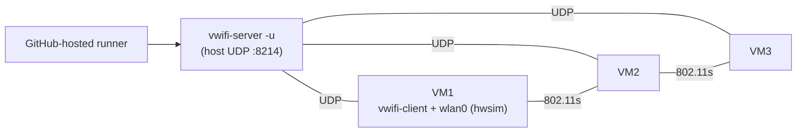

# QEMU + vwifi virtual mesh on CI

`test-firmware-qemu` and `test-mesh-qemu` exercise LibreMesh on
GitHub-hosted runners using `mac80211_hwsim` (virtual radios) bridged
across VMs by `vwifi-server`. Both jobs run on every PR and complete
in ~6-8 min end-to-end (TCG; ~2-3 min when KVM is available).

| Job                  | Purpose                                                              |
|----------------------|----------------------------------------------------------------------|
| `test-firmware-qemu` | One `qemu_x86_64` VM, runs `test_libremesh.py`, `test_base.py`, `test_lan.py`. |
| `test-mesh-qemu`     | Three VMs of the same image bridged through `vwifi-server`, runs `test_mesh.py`. |

## Why QEMU coverage exists

Physical lab tests give high-fidelity coverage but two limitations:

1. **Lab availability.** A bench reset, a stuck TFTP server or any of
   the network-fault modes the testbed has exposed in the past would
   fail every PR until somebody on campus power-cycled the bench. No
   automatic fallback.
2. **Mesh shape coverage.** The lab's two-node bench (openwrt_one +
   bpi-r4) leaves three-hop topologies untested.

The QEMU path fixes (1) by giving every PR a self-contained green/red
signal that does not depend on lab uptime, and (2) by making three-node
mesh tests a default part of the per-PR run. Lab tests stay as the
higher-fidelity layer (real radios, real flash, real boot path) but no
longer block the developer loop.

## Architecture



`vwifi-server` runs on the host and listens for connections from every
VM's `vwifi-client`. When VM1's `mac80211_hwsim` injects a frame onto
`wlan0`, the in-guest client forwards it over UDP to `vwifi-server`,
which broadcasts it to every other connected client. Each VM's
`mac80211_hwsim` re-injects the frame on its own `wlan0`. Net effect:
a soft-radio mesh that batman-adv cannot tell apart from a real one.

## Image content

The `firmware-qemu_x86_64-<release>.img` artifact carries:

- `kmod-mac80211-hwsim`: virtual radios. Comes from OpenWrt's official
  kmods feed; only needs to be in the per-target `packages:` list in
  `targets.yml`.
- `wpad-mesh-mbedtls`: 802.11s authentication.
- `vwifi-client`: forwarding daemon. Comes from
  [`fcefyn-testbed/vwifi_cli_package`][vwifi-fork] declared as
  `extra_feeds:` for `qemu_x86_64`. This is a fork of
  [`javierbrk/vwifi_cli_package`][vwifi-upstream] that adds the
  `PKG_MIRROR_HASH` required by OpenWrt 24.10+ SDK (without it
  `gh-action-sdk` aborts with "Package HASH check failed"). When
  upstream merges the same change, the `extra_feeds:` URL switches
  back.

`vwifi` is a per-arch C++ binary, so the SDK puts the IPK under
`bin/targets/<target>/<subtarget>/packages/`. The assemble step in the
workflow searches both `bin/packages/<arch>/<feed>/` and
`bin/targets/.../packages/`, then merges every declared
`extra_packages:` IPK into the unified `feed-artifact/lime_packages/`
so ImageBuilder can install them through the single
`lime_packages_local` opkg feed.

[vwifi-fork]: https://github.com/fcefyn-testbed/vwifi_cli_package
[vwifi-upstream]: https://github.com/javierbrk/vwifi_cli_package

## Pinned versions

Two upstream commits are pinned and have to be bumped together if
anything material changes in the in-guest <-> host wire protocol
between vwifi-client and vwifi-server (the shared C structs in
`csocket.h` are the contract):

| Component | Repo | Pin | Where |
|-----------|------|-----|-------|
| in-guest vwifi-client | `fcefyn-testbed/vwifi_cli_package` (fork of `javierbrk/`, adds `PKG_MIRROR_HASH`) | `838c44a0611f6de5d2404172a95fcc311c25e95f` | `extra_feeds:` of `qemu_x86_64` in `.github/ci/targets.yml` |
| host vwifi-server (CMake build) | `Raizo62/vwifi` | `4a9842e6` (release v7.0) | `cache-vwifi-server` and `test-mesh-qemu` build step in `.github/workflows/build-firmware.yml` |

Both wrap the same upstream daemon source (`Raizo62/vwifi@4a9842e6`),
so client and server always speak the same wire protocol. When
upstream `csocket.h` changes, both pins must move together.

## Local reproduction

```bash
# Host setup (one-time)
git clone https://github.com/Raizo62/vwifi
cd vwifi && git checkout 4a9842e6
cmake -B build && cmake --build build -j$(nproc)
sudo install -m 0755 build/vwifi-server /usr/local/bin/

# Build the CI image locally (drops to the same build_image.sh as CI)
cd ~/pi/lime-packages
ARCH=x86_64 \
DEVICE_NAME=qemu_x86_64 \
IMAGE_FORMAT=x86-combined \
BUILD_INITRAMFS=0 \
PACKAGES="<contents of packages from targets.yml> kmod-mac80211-hwsim wpad-mesh-mbedtls vwifi" \
tools/ci/build_image.sh x86-64 generic 24.10.6 ./feed-in ./out

# Single-node smoke
cd ~/pi/libremesh-tests
LG_ENV=targets/qemu_x86-64_libremesh.yaml \
  uv run pytest tests/test_libremesh.py --firmware ../lime-packages/out/firmware-qemu_x86_64.img

# Multi-node mesh (3 nodes)
vwifi-server -u &
LG_VIRTUAL_MESH=1 \
VIRTUAL_MESH_NODES=3 \
VIRTUAL_MESH_IMAGE=$(realpath ../lime-packages/out/firmware-qemu_x86_64.img) \
  uv run pytest tests/test_mesh.py
```

The local build needs the lime-* IPKs already present in
`feed-in/lime_packages/`. In CI this is the `build-feed` artifact;
locally it is whatever `tools/ci/build_feed.sh` produced last.

## Known issues

### `pytest_collection_modifyitems` opt-in

The hook in `tests/conftest.py` honours both `LG_MESH_PLACES` (lab
mesh) and `LG_VIRTUAL_MESH=1` (QEMU mesh). Without the second early
return, every mesh test gets skipped on the QEMU job:

```python
def pytest_collection_modifyitems(config, items):
    if os.environ.get("LG_MESH_PLACES", "").strip():
        return
    if os.environ.get("LG_VIRTUAL_MESH", "").strip() == "1":
        return
    skip_mesh = pytest.mark.skip(
        reason="Set LG_MESH_PLACES or LG_VIRTUAL_MESH=1 to run multi-node mesh tests",
    )
    for item in items:
        if "mesh" in item.keywords:
            item.add_marker(skip_mesh)
```

Lives in `fcefyn-testbed/libremesh-tests@staging`. Any future opt-in
mechanism needs the same early-return treatment.

### KVM on hosted runners

GitHub's hosted Linux runners default to no `/dev/kvm` exposed. The
[`enable_kvm.sh`][kvm] step writes a udev rule that grants the runner
user `rw` on `/dev/kvm` and runs `udevadm trigger --name-match=kvm` so
the rule applies to the existing device node. When that succeeds, QEMU
runs with KVM and `test-mesh-qemu` drops from ~6-8 min to ~2-3 min.

[kvm]: https://github.com/fcefyn-testbed/lime-packages/blob/master/tools/ci/enable_kvm.sh

### lime-packages#1180 (default channel 48 / 6 GHz)

LibreMesh's default `wifi config` writes `channel=48` to every radio.
`mac80211_hwsim` capabilities include 6 GHz, and `wpad-mesh-mbedtls`
refuses to bring up an 802.11s mesh on a non-DFS 6 GHz channel without
a proper regulatory database lookup. Worked around in CI by
`iw dev wlan0 mesh join LiMe freq 2437` and the equivalent path in
`virtual_mesh_launcher.launch_virtual_mesh()` (both override to channel
6 before bringing up the radios). Tracking
[libremesh/lime-packages#1180][lp1180].

[lp1180]: https://github.com/libremesh/lime-packages/issues/1180

### Boot timeout tuning

`virtual_mesh_launcher.launch_virtual_mesh()` defaults to
`VIRTUAL_MESH_BOOT_TIMEOUT=180s` per VM. Tight on TCG; if flakiness
shows up, the first knob to turn is `VIRTUAL_MESH_BOOT_TIMEOUT=300` in
the workflow step.

### Image size

The combined image is ~25 MB compressed (~75 MB raw), well below GHA's
artifact size limit but adding a noticeable upload step. If the
artifact pushes 200+ MB, consider `actions/upload-artifact`'s
`compression-level` or splitting the manifest sidecar.

## See also

- [CI: firmware build pipeline](../lime-packages-ci-flow.md)
- [CI: hardware test stage](../lime-packages-test-flow.md)
- [Adding a device](../lime-packages-add-device.md) - the `qemu_x86_64`
  target shape is documented as a reference example.
