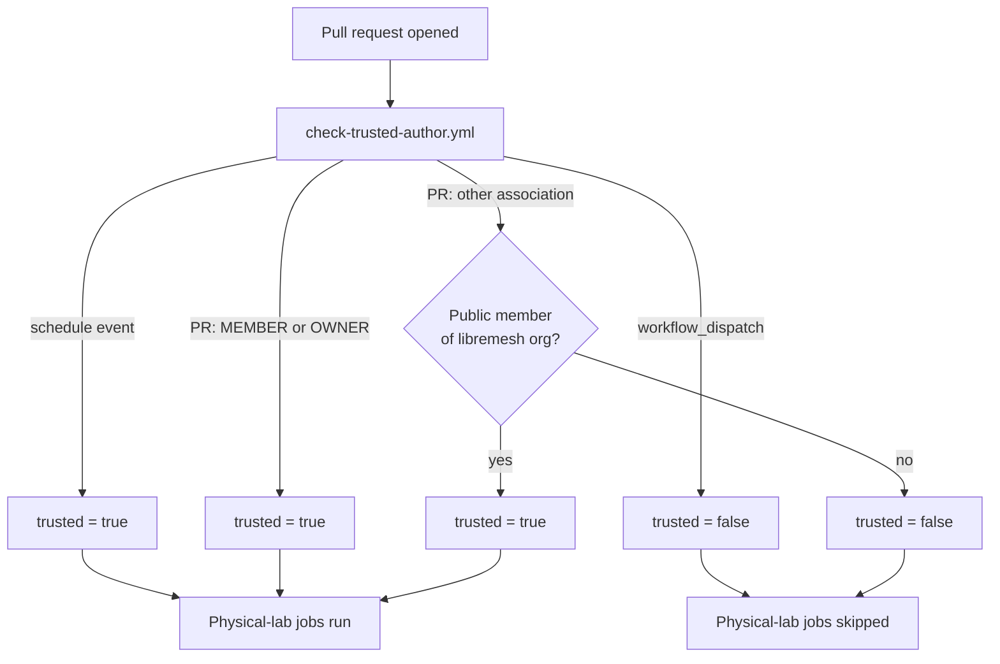

# Trusted-author gate for physical-lab CI jobs

lime-packages CI runs two classes of jobs: **virtual** (QEMU, GitHub-hosted, always safe)
and **physical** (flashes and tests real hardware in the FCEFyN lab rack).
Physical jobs are gated so that random pull requests from external contributors
cannot consume lab hardware or trigger firmware flashes without human review.

---

## 1. Why a gate?

The lab exporter publishes live hardware over WireGuard to the upstream
openwrt-tests coordinator. Any CI job that acquires a labgrid place can:

- Power-cycle a DUT via PDUDaemon
- Write firmware over TFTP and reboot
- Run test suites that hold the place for several minutes

Allowing this for every pull request from any contributor would make the lab
unavailable for legitimate work and could leave hardware in a bad state if a
PR contains a broken workflow.

---

## 2. Mechanism: `check-trusted-author.yml`

A reusable workflow (`.github/workflows/check-trusted-author.yml`) exposes a
single boolean output: `trusted`. It is called from `build-firmware.yml` before
any physical-lab job is dispatched.



### Trust rules

| Event | Condition | `trusted` |
|-------|-----------|-----------|
| `schedule` (daily cron) | — | `true` |
| `workflow_dispatch` | — | `false` (manual runs skip physical lab) |
| `pull_request` | `author_association` is `MEMBER` or `OWNER` of `fcefyn-testbed` | `true` |
| `pull_request` | Author is a public member of the `libremesh` GitHub org | `true` |
| `pull_request` | Any other contributor | `false` |

### workflow_dispatch and physical jobs

`workflow_dispatch` intentionally returns `trusted = false`. Physical hardware
jobs (single-node flash, mesh test) are available as explicit inputs to
`build-firmware.yml` (`physical_single`, `physical_mesh_count`) and run
unconditionally when triggered manually — they do not go through the trust gate.
The gate only prevents *unattended* physical runs on PRs.

---

## 3. Integration in `build-firmware.yml`

`build-firmware.yml` calls `check-trusted-author.yml` as the first job and
threads the output through subsequent jobs:

```yaml
jobs:
  check-trusted:
    uses: ./.github/workflows/check-trusted-author.yml

  test-firmware:
    needs: [prepare-matrix, check-trusted]
    if: needs.check-trusted.outputs.trusted == 'true'
    ...

  test-mesh:
    needs: [prepare-matrix, check-trusted]
    if: needs.check-trusted.outputs.trusted == 'true'
    ...
```

Virtual jobs (`build-firmware`, `test-qemu`, `prepare-matrix`) are unaffected
by the trust output and always run.

---

## 4. Becoming a trusted contributor

To have pull requests run physical-lab jobs unattended:

1. Become a **public member** of the [`fcefyn-testbed` GitHub org](https://github.com/fcefyn-testbed)
   (contact a maintainer: @francoriba, @ccasanueva7, @javierbrk), **or**
2. Become a **public member** of the [`libremesh` GitHub org](https://github.com/libremesh).

External contributors can still test their changes by asking a maintainer to
trigger a `workflow_dispatch` run with the physical options enabled.

---

## 5. Security considerations

- The gate uses `author_association` from the pull-request payload, which is
  set by GitHub and cannot be spoofed by the PR author.
- The org-membership check calls the GitHub REST API with the workflow's
  `GITHUB_TOKEN`; only *public* org membership is checked (no token scope
  needed beyond the default).
- `workflow_dispatch` physical runs require the dispatcher to have write
  access to the repository, so they are already implicitly trusted.

---

## See also

- `.github/workflows/check-trusted-author.yml` — reusable workflow source
- `.github/workflows/build-firmware.yml` — top-level CI orchestrator
- [lime-packages CI: build](../lime-packages-ci-flow.md) — overall build pipeline
