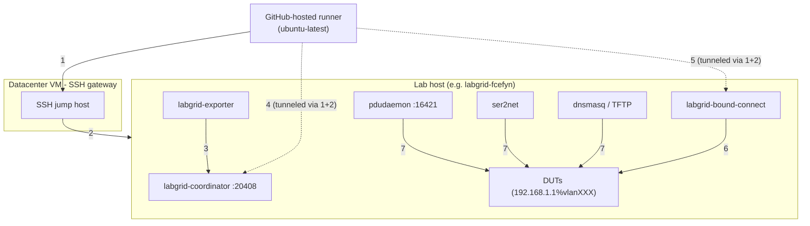
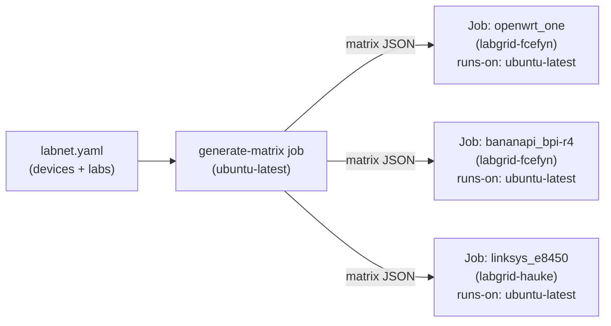
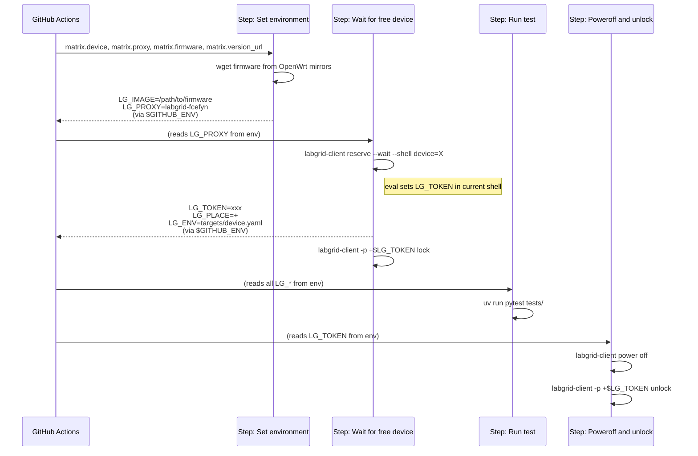
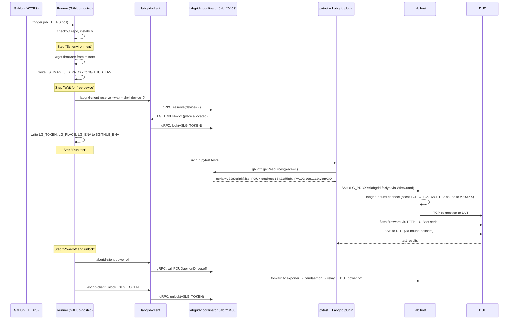

# openwrt-tests CI execution flow

How a CI run works end-to-end: from a GitHub Actions trigger to a firmware test on a physical DUT in a remote lab.

Companion to [openwrt-tests onboarding](openwrt-tests-onboarding.md) (infrastructure setup) and [lab architecture](lab-architecture.md) (VLAN and coordinator design).

---

## 1. Two independent planes

The flow combines two separate communication channels that should not be confused:

| Plane | Protocol | Purpose                                                                                                                      |
|-------|----------|------------------------------------------------------------------------------------------------------------------------------|
| **Control** | gRPC (port 20408) | Local coordinator on each lab manages places, reservations, locks. `labgrid-client` and the Labgrid pytest plugin reach it via `LG_PROXY` SSH tunnel. Since Labgrid 25.0 (May 2025); earlier versions used WebSocket/WAMP. |
| **Hardware access** | SSH over WireGuard | Runner reaches the lab host (via SSH gateway VM) to access physical resources (serial, power, DUT SSH). The coordinator is not involved for this. |

---

## 2. Components per location

### Datacenter VM (SSH gateway)

| Component | Role |
|-----------|------|
| SSH jump host (`labgrid-dev` user) | Entry point for CI runners and developers. Routes SSH to lab hosts over WireGuard. Does **not** run `labgrid-coordinator`. |
| WireGuard peers | One per lab host. Gives each lab a private IP reachable from the VM. |

### Each lab host (e.g. `labgrid-fcefyn`, `labgrid-aparcar`)

| Component | Role |
|-----------|------|
| `labgrid-coordinator` (port 20408) | gRPC server (loopback). Registers places from `places.yaml`, tracks locks and reservations. |
| `labgrid-exporter` | Registers local DUT resources (serial, power, network) with the local coordinator over gRPC (loopback). |
| `places.yaml` | Generated by Ansible from `labnet.yaml`. Lists places for this lab. |
| `exporter.yaml` | Declares the physical resources of each place: USB serial path, PDUDaemon port, DUT IP+VLAN interface. |
| `pdudaemon` | Controls DUT power via relay or PDU. Exposes an HTTP API on `localhost:16421`. |
| `ser2net` | Exposes USB serial ports as TCP sockets. Used by Labgrid `SerialDriver`. |
| `dnsmasq` | DHCP + TFTP server per VLAN. DUTs boot initramfs via TFTP. |
| `labgrid-bound-connect` | SSH proxy command (runs as `sudo`). Bridges a TCP connection to a DUT IP bound to a specific VLAN interface using `socat`. |
| WireGuard peer | SSH transport tunnel to the gateway VM. |



| # | Connection | Detail |
|---|---|---|
| 1 | Runner → SSH gateway | SSH to VM (ProxyJump entry point) |
| 2 | SSH gateway → lab host | SSH over WireGuard |
| 3 | Exporter → local coordinator | gRPC loopback :20408 (register resources) |
| 4 | Runner → local coordinator | gRPC tunneled through SSH (LG_PROXY port-forward to :20408) |
| 5 | Runner → bound-connect | SSH tunneled via gateway + WireGuard (LG_PROXY) |
| 6 | bound-connect → DUTs | socat TCP bound to correct VLAN interface |
| 7 | Local services → DUTs | pdudaemon (power), ser2net (serial), dnsmasq (DHCP/TFTP) |

All connections between CI runners and the lab host traverse a **WireGuard** tunnel via the SSH gateway VM.

---

## 3. Matrix strategy: one job per device

The `generate-matrix` job reads `labnet.yaml` and produces a JSON list of all devices across all labs. GitHub Actions expands it into **parallel jobs**, one per device.



Each job receives its own `matrix.device`, `matrix.proxy`, `matrix.target`, `matrix.firmware` values.

---

## 4. Environment variables and `$GITHUB_ENV`

Variables are passed between steps via `$GITHUB_ENV`: a **temporary file** the runner creates per job. Each `echo "VAR=val" >> $GITHUB_ENV` writes a line; the runner reads the file after each step and injects the variables into the next step's process environment.



| Variable | Set by | Used by | Value |
|----------|--------|---------|-------|
| `LG_IMAGE` | Step "Set environment" | Labgrid plugin (`!template $LG_IMAGE` in target YAML) | Local path to firmware file |
| `LG_PROXY` | Step "Set environment" | `labgrid-client`, Labgrid plugin | Lab proxy name (e.g. `labgrid-fcefyn`) |
| `LG_TOKEN` | Step "Wait for free device" via `eval` | `labgrid-client lock/unlock` | Reservation token from coordinator |
| `LG_PLACE` | Step "Wait for free device" | Labgrid plugin (`!template "$LG_PLACE"`) | `+` (active reservation) |
| `LG_ENV` | Step "Wait for free device" | Labgrid plugin | `targets/<device>.yaml` |
| `LG_COORDINATOR` | Not set (uses default) | `labgrid-client`, Labgrid plugin | `127.0.0.1:20408` (tunneled to the lab's local coordinator via `LG_PROXY`) |

### `!template` in target YAML

Target files (`targets/<device>.yaml`) use `!template` to expand environment variables at Labgrid load time:

```yaml
resources:
  RemotePlace:
    name: !template "$LG_PLACE"   # expands to "+"

images:
  root: !template $LG_IMAGE       # expands to /path/to/firmware
```

---

## 5. Full CI sequence



---

## 6. Role of `labgrid-bound-connect`

`labgrid-bound-connect` is a Python script installed on each **lab host** (not on the VM). It is invoked as an **SSH ProxyCommand** when the runner opens a connection to a DUT.

**Problem it solves:** all DUTs share the same IP (`192.168.1.1`), each on a different VLAN interface (`vlan100`, `vlan101`, ...). A normal TCP connect from the lab host would use the default route and miss the right VLAN. The script uses `socat` with `so-bindtodevice=vlanXXX` to force the connection out through the correct interface.

```
Runner (GitHub-hosted)
  └── SSH → gateway VM → lab host (via WireGuard)
              └── labgrid-bound-connect vlan101 192.168.1.1 22
                    └── socat STDIO TCP4:192.168.1.1:22,so-bindtodevice=vlan101
                          └── DUT on VLAN 101
```

The script runs under `sudo` (passwordless via `/etc/sudoers`). It is deployed by the Ansible playbook to `/usr/local/sbin/labgrid-bound-connect` on each lab host.

---

## 7. Summary: who calls what

| Action | Caller | Target | Protocol |
|--------|--------|--------|----------|
| Reserve place | `labgrid-client` (runner) | coordinator | gRPC |
| Lock place | `labgrid-client` (runner) | coordinator | gRPC |
| Get resources for place | Labgrid pytest plugin | coordinator | gRPC |
| SSH to DUT | Labgrid pytest plugin | lab host → DUT | SSH over WireGuard + bound-connect |
| Serial access | Labgrid pytest plugin | lab host ser2net | TCP over WireGuard |
| Power control | `labgrid-client` / plugin | coordinator → exporter → pdudaemon | gRPC → HTTP |
| Unlock place | `labgrid-client` (runner) | coordinator | gRPC |
| Register resources | `labgrid-exporter` (lab) | local coordinator | gRPC (loopback) |
