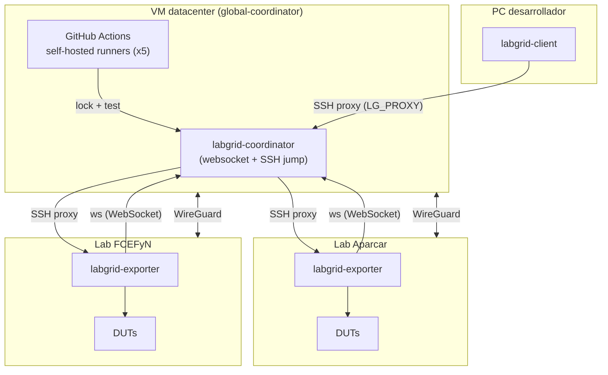
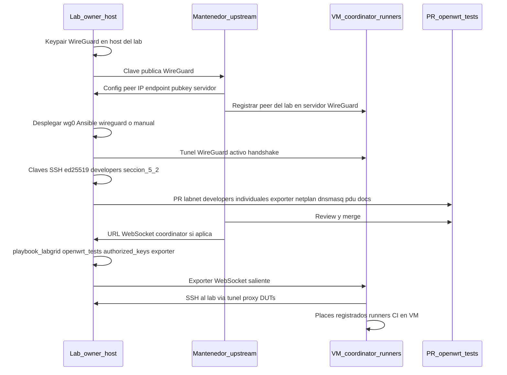

# Onboarding a openwrt-tests

Proceso para contribuir hardware de un lab local al ecosistema [openwrt-tests](https://github.com/openwrt/openwrt-tests). Cubre arquitectura, conexión del exporter, claves SSH, Ansible y la secuencia de pasos para integrar DUTs al coordinator de upstream.

---

## 1. Arquitectura del Global-Coordinator

El **global-coordinator** de openwrt-tests es una **VM en un datacenter** con IP pública, mantenida por Paul (aparcar). Todos los labs remotos se conectan a ella mediante **WireGuard**. Los **GitHub Actions self-hosted runners** también corren en esa VM y acceden a los labs a través del túnel WireGuard para ejecutar tests.



| Componente | Ubicación | Función |
|------------|-----------|---------|
| **Coordinator** | VM datacenter (IP pública) | Servicio central que registra places, coordina locks y actúa como jump host SSH. |
| **GitHub runners** | Misma VM | 5 self-hosted runners que ejecutan los workflows de CI sobre los DUTs remotos. |
| **WireGuard** | Entre cada lab y la VM | Túnel que permite al coordinator alcanzar los labs por SSH (proxy a DUTs). Configurado manualmente con el mantenedor. |
| **Exporter** | Host del lab | Proceso que publica los DUTs locales hacia el coordinator vía WebSocket. |
| **Place** | Configuración | Abstracción de un DUT: recursos (serial, power, SSH), estrategia de boot, firmware. |

!!! note "Latencia WireGuard"
    Si la conexión WireGuard entre el datacenter y el lab es mala (alta latencia), los tests pueden fallar por timeout. El mantenedor mencionó esto como un problema conocido con labs en Europa del Este.

---

## 2. Conexión del Exporter al Coordinator

El exporter inicia la conexión *hacia* el coordinator.

```bash
labgrid-exporter --coordinator ws://<coordinator_host>:<port> /etc/labgrid/exporter.yaml
```

En la práctica, el exporter corre como servicio systemd (`labgrid-exporter.service`) y el coordinator se define en la configuración o variables de entorno (`LG_COORDINATOR`).

**Lo que se requiere del mantenedor upstream:**

- URL del coordinator (host y puerto WebSocket).
- Clave pública SSH del coordinator para agregarla a `authorized_keys` del usuario `labgrid-dev` en el lab (ya incluida en el playbook de Ansible de openwrt-tests).

**Firewalls / NAT:** El lab debe poder conectar *hacia* el coordinator (websocket saliente). El coordinator luego usa SSH proxy a través del mismo canal para alcanzar los DUTs.

---

## 3. Acceso SSH y Proxy

Cuando un desarrollador o CI ejecuta `labgrid-client console` o `labgrid-client ssh`, el flujo es:

```
cliente → SSH al coordinator (jump host) → SSH al exporter → serial/SSH al DUT
```

El coordinator necesita poder conectar por SSH al host del lab. Esto se logra con la clave pública del coordinator en `authorized_keys` del usuario `labgrid-dev`.

### 3.1 Claves involucradas

| Clave | Dónde se configura | Propósito |
|-------|--------------------|-----------|
| Clave pública del **coordinator** | `~labgrid-dev/.ssh/authorized_keys` en el lab | Permite al coordinator conectar por SSH al lab (proxy a DUTs). Desplegada por Ansible. |
| Clave pública de cada **developer** | `labnet.yaml → developers.<github_user>.sshkey` | Permite al developer acceder a los DUTs del lab vía `LG_PROXY`. |
| Clave pública de **WireGuard** del lab | Intercambio manual con el mantenedor | Establece el túnel VPN entre el lab y el coordinator. |

La clave del coordinator ya está en el playbook de Ansible de openwrt-tests; se despliega automáticamente al ejecutar el playbook.

#### Claves de developer en `labnet.yaml`

Cada developer que quiere acceder remotamente a DUTs de un lab necesita:

1. Su **clave pública SSH personal** (ed25519) en la sección `developers:` del `labnet.yaml`.
2. Su **username de GitHub** como identificador.
3. Estar listado en `labs.<lab>.developers` del lab al que quiere acceder.

El playbook de Ansible de openwrt-tests itera sobre `labs.<lab>.developers`, busca la `sshkey` de cada uno en `developers:`, y la agrega a `~labgrid-dev/.ssh/authorized_keys` en el host del lab. Así cada developer puede hacer SSH como `labgrid-dev` para usar `labgrid-client`.

---

## 4. Ansible: Control Node y Managed Node

| Rol | En openwrt-tests upstream |
|-----|---------------------------|
| **Control Node** | Máquina del mantenedor (Paul/Aparcar) que ejecuta `ansible-playbook`. |
| **Managed Node** | El host del lab (la Lenovo en nuestro caso). |

Para que el mantenedor upstream aplique el playbook sobre el lab FCEFyN, necesita:

1. **SSH al host del lab** (acceso a `labgrid-dev` o al usuario del inventario).
2. **Clave pública de su control node** en `authorized_keys` del managed node.

Esto se coordina manualmente: el mantenedor proporciona su clave pública y el lab owner la agrega a `authorized_keys`, o bien el lab owner ejecuta el playbook localmente (si tiene acceso al inventario).

---

## 5. Contenido de una PR para Contribuir Hardware

Una PR a openwrt-tests para agregar un nuevo lab incluye:

| Archivo | Descripción |
|---------|-------------|
| `labnet.yaml` | Entrada del lab en `labs:`, devices, instances, developer SSH key. |
| `ansible/files/exporter/<lab>/exporter.yaml` | Configuración del exporter: places con recursos (serial, power, SSH target). |
| `ansible/files/exporter/<lab>/netplan.yaml` | Configuración de red del host (VLANs). |
| `ansible/files/exporter/<lab>/dnsmasq.conf` | DHCP/TFTP para las VLANs del lab. |
| `ansible/files/exporter/<lab>/pdudaemon.conf` | Configuración de PDUDaemon (power control). |
| `docs/labs/<lab>.md` | Documentación del lab: hardware, DUTs, maintainers. |

### 5.1 Developers en labnet.yaml

Cada developer se registra con su **username de GitHub** y su **clave pública SSH personal** (ed25519). Se recomienda incluir al mantenedor upstream (`aparcar`) para que pueda debuggear.

```yaml
labs:
  labgrid-fcefyn:
    developers:
      - francoriba     # username de GitHub
      - aparcar         # mantenedor upstream (debugging)

developers:
  francoriba:
    sshkey: ssh-ed25519 AAAA...  # clave personal del developer
```


```bash
ssh-keygen -t ed25519 -C "github_username" -f ~/.ssh/id_ed25519
cat ~/.ssh/id_ed25519.pub
```

La clave pública (salida de `cat`) se agrega a `labnet.yaml` en `developers.<github_user>.sshkey`. La clave privada permanece en la PC del developer.

Para acceder desde otra PC, copiar el par de claves (`id_ed25519` + `id_ed25519.pub`) a `~/.ssh/` de la nueva máquina con `chmod 600` en la privada. Una sola entrada en `labnet.yaml` sirve para todas las PCs del mismo developer.

!!! warning "No confundir con la clave del host"
    La clave del host de orquestación (`/etc/wireguard/public.key`, claves en `~labgrid-dev/.ssh/`) tiene otro propósito. En `labnet.yaml → developers` van únicamente claves **personales** de quienes operarán `labgrid-client` desde sus laptops.

---

## 6. Secuencia de Onboarding

Orden orientativo: primero el túnel **WireGuard** (la VM del coordinator necesita registrar el peer del lab; sin túnel no hay SSH de vuelta desde la VM). En paralelo se prepara la **PR** con inventario, exporter y claves **SSH personales** de developers ([5.2](#52-generar-clave-ssh-para-un-nuevo-developer)). Tras el merge, el **playbook_labgrid** de openwrt-tests despliega `authorized_keys` y servicios en el host.



### 6.1 Checklist

* Generar keypair WireGuard en el host del lab y enviar la clave pública al mantenedor (Matrix)
* Recibir del mantenedor la config WireGuard (IP asignada, endpoint, clave pública del servidor)
* Aplicar túnel en el host: role Ansible `wireguard` en `fcefyn_testbed_utils` o configuración manual de `wg0`. Ver [sección 9](#wireguard-ansible-fcefyn)
* Verificar túnel: `sudo wg show wg0` (handshake reciente)
* Por cada developer: generar clave ed25519 personal ([5.2](#52-generar-clave-ssh-para-un-nuevo-developer)) y listar `labs.<lab>.developers` + `developers.<github_user>.sshkey` en `labnet.yaml`
* Preparar archivos del lab: `exporter.yaml`, `netplan.yaml`, `dnsmasq.conf`, `pdudaemon.conf`
* Documentar el lab en `docs/labs/<lab>.md` (upstream)
* Abrir PR a openwrt-tests con los cambios anteriores
* Tras merge: aplicar `playbook_labgrid.yml` desde openwrt-tests en el host (o que el mantenedor lo haga): queda la clave SSH del coordinator en `~labgrid-dev/.ssh/authorized_keys` y el exporter configurado
* Confirmar `labgrid-exporter` apuntando al WebSocket del coordinator
* Verificar places: `labgrid-client places` (con `LG_PROXY` segun README upstream)

---

## 7. Coordinación con el Mantenedor

| Qué se necesita | Cómo obtenerlo |
|-----------------|----------------|
| Config WireGuard (IP, endpoint, peer key) | Enviar clave pública WireGuard al mantenedor vía; recibir los datos de vuelta. |
| URL del coordinator | Preguntar al mantenedor o ver documentación del proyecto. |
| Clave SSH del coordinator | Ya incluida en el playbook de Ansible; se despliega al aplicarlo. Alternativamente, el mantenedor la proporciona. |
| Acceso Ansible al lab | El lab owner proporciona acceso SSH al mantenedor (clave pública del control node de Ansible), o bien aplica el playbook localmente. |
| Configuración de VLANs | Definida por el lab owner según su hardware; los archivos van en la PR. |

---

## 8. Diferencias con libremesh-tests

| Aspecto | openwrt-tests (upstream) | libremesh-tests (fork) |
|---------|--------------------------|------------------------|
| Coordinator | Remoto (`global-coordinator`) | Local (en el mismo host del lab) |
| Control Node Ansible | Infraestructura de Aparcar | El propio lab (self-setup) |
| VLANs | Una por DUT (isolated, 192.168.1.1) | Compartida (VLAN 200, 10.13.x.x) |
| Tests multi-nodo | No soportado | Implementado en `conftest_mesh.py` |

Para detalles sobre el modo híbrido que permite usar el mismo lab para ambos proyectos, ver [hybrid-lab-proposal](hybrid-lab-proposal.md).

---

## 9. WireGuard en Ansible (fcefyn_testbed_utils) {: #wireguard-ansible-fcefyn }

Role en `fcefyn_testbed_utils` para levantar el túnel del host del lab hacia el **global-coordinator**. No sustituye el intercambio de claves con el mantenedor upstream: solo automatiza instalación, `wg0.conf` y `systemd` en Debian/Ubuntu.

| Elemento | Ubicacion |
|----------|-----------|
| Role | `ansible/roles/wireguard/` |
| Playbook que lo invoca | `ansible/playbook_testbed.yml` (comentarios y tag `wireguard`) |
| Variables (placeholders) | `ansible/roles/wireguard/defaults/main.yml` |
| Plantilla | `ansible/roles/wireguard/templates/wg0.conf.j2` |
| Servicio | `wg-quick@wg0` (habilitado y arrancado por el role) |

**Variables a completar** (valores reales los entrega el mantenedor tras enviar la clave pública del lab): `wireguard_address`, `wireguard_peer_public_key`, `wireguard_peer_endpoint`, `wireguard_peer_allowed_ips` (por defecto `10.0.0.0/24`), `wireguard_peer_keepalive`. La clave privada **no** va al repositorio: el role puede generarla en el host si no existe (`/etc/wireguard/private.key`) y muestra en salida de Ansible la clave pública para compartir.

**Ejecución orientativa** (desde el directorio `ansible/` del repo, con inventario adecuado):

```bash
ansible-playbook playbook_testbed.yml --tags wireguard -l <host_del_lab>
```

Para túnel manual o detalles del lado servidor, seguir lo acordado con el mantenedor upstream.

---
