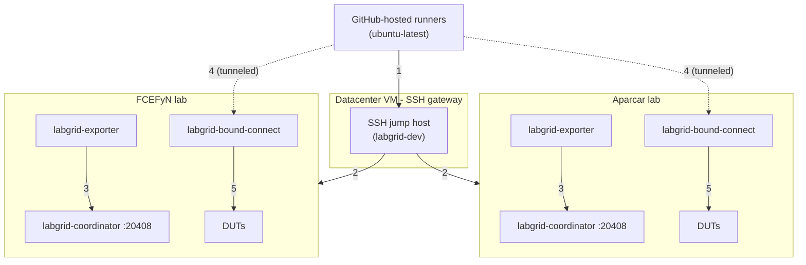
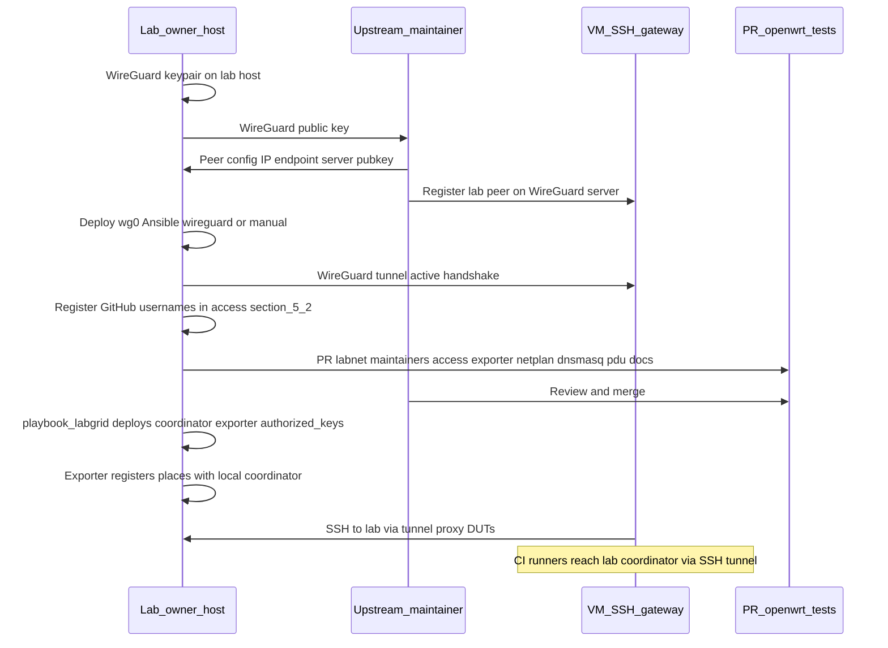

# Onboarding to openwrt-tests

Process for contributing hardware from a local lab to the [openwrt-tests](https://github.com/aparcar/openwrt-tests) ecosystem. Covers architecture, exporter connection, access management, Ansible, and the step sequence to integrate DUTs with the upstream SSH gateway and per-lab coordinator.

!!! info "Two contribution paths"
    This page focuses on the base openwrt-tests lab (Scenario A). For contributing a **libremesh-capable** lab (own self-hosted runner, managed switch with VLAN switching, multi-node mesh suite), see [Contributing a new lab](new-lab-contribution.md) which contrasts both paths.

---

## 1. Per-lab coordinator + SSH gateway {: #1-per-lab-coordinator-ssh-gateway }

Each lab runs its own `labgrid-coordinator` locally (loopback `127.0.0.1:20408`), deployed by the upstream Ansible playbook `playbook_labgrid.yml`. The datacenter **VM** (`global-coordinator` hostname) maintained by Paul (aparcar) acts as an **SSH gateway** - it does **not** run a `labgrid-coordinator` service. GitHub-hosted runners (`ubuntu-latest`) reach labs through this VM via **WireGuard**, and the `LG_PROXY` SSH tunnel forwards gRPC calls to the lab's local coordinator.



| # | Connection | Detail |
|---|---|---|
| 1 | Runners → SSH gateway | SSH to datacenter VM (ProxyJump entry point) |
| 2 | SSH gateway → lab hosts | SSH over WireGuard tunnel |
| 3 | Exporter → local coordinator | gRPC loopback :20408 (register resources) |
| 4 | Runners → bound-connect | SSH tunneled via gateway + WireGuard (LG_PROXY=labgrid-X) |
| 5 | bound-connect → DUTs | socat with so-bindtodevice on correct VLAN interface |

All connections between labs and the VM traverse a **WireGuard** tunnel (point-to-point VPN).

| Component | Location | Role |
|-----------|----------|------|
| **Coordinator** | Each lab host (loopback) | gRPC server (port 20408). Registers places (`places.yaml`), coordinates reservations and locks. Does **not** proxy SSH. |
| **SSH gateway** | Datacenter VM (public IP) | Jump host for CI runners and developers. Routes SSH to lab hosts over WireGuard. Does **not** run a `labgrid-coordinator`. |
| **GitHub runners** | GitHub-hosted (`ubuntu-latest`) | Execute CI workflow jobs; reach DUTs via SSH through the gateway. |
| **WireGuard** | Between each lab and the VM | SSH transport tunnel so runners can reach lab hosts. |
| **Exporter** | Lab host | Registers local DUT resources (serial, power, network) with the local coordinator over gRPC (loopback). |
| **`labgrid-bound-connect`** | Lab host | SSH ProxyCommand invoked by the runner. Uses `socat` with `so-bindtodevice` to connect to a DUT IP on the correct VLAN interface. |
| **Place** | Configuration | Abstraction of one DUT: resources (serial, power, SSH target), boot strategy, firmware. |

See [CI execution flow](openwrt-tests-ci-flow.md) for the full sequence of how a workflow job runs end-to-end.

!!! note "WireGuard latency"
    If the WireGuard link between the datacenter and the lab is poor (high latency), tests may fail on timeout. The maintainer cited this as a known issue with labs in Eastern Europe.

---

## 2. Exporter connection to the coordinator

The exporter connects to the coordinator on the **same host** (loopback).

```bash
labgrid-exporter /etc/labgrid/exporter.yaml
```

In practice the exporter runs as a systemd service (`labgrid-exporter.service`). No `LG_COORDINATOR` override is needed because both the coordinator and the exporter run on the same host - the default `127.0.0.1:20408` applies. Since Labgrid 25.0 (May 2025) the transport is **gRPC**; previous versions used WebSocket/WAMP via crossbar.

**What you need from the upstream maintainer:**

- SSH gateway address (host and port) for WireGuard tunnel setup.
- SSH gateway public key to add to `authorized_keys` for user `labgrid-dev` on the lab (already included in the openwrt-tests Ansible playbook).

**Firewalls / NAT:** The lab must allow **inbound SSH** (port 22) from the WireGuard interface so that CI runners (tunneling through the gateway VM) can reach the lab host. The coordinator and exporter communicate entirely over loopback.

---

## 3. SSH access and proxy

When a developer or CI runs `labgrid-client console` or `labgrid-client ssh`, the flow is:

```
client → SSH to gateway VM (jump host) → SSH to lab host → serial/SSH to DUT
```

The gateway VM must SSH to the lab host. That is done with the gateway's public key in `authorized_keys` for user `labgrid-dev`.

### 3.1 Keys involved

| Key | Where it is configured | Purpose |
|-----|------------------------|---------|
| **Gateway VM** public key | `~labgrid-dev/.ssh/authorized_keys` on the lab | Lets CI runners (via the gateway) SSH to the lab for proxy access to DUTs. Deployed by Ansible. |
| Each **developer** public key | Fetched from `https://github.com/<username>.keys` at Ansible deploy time; users listed in `labnet.yaml` `maintainers` + `access` | Lets the developer reach lab DUTs via `LG_PROXY`. |
| Lab **WireGuard** public key | Manual exchange with maintainer | Establishes SSH transport tunnel between lab and gateway VM. |

The gateway key is already in the openwrt-tests Ansible playbook; it deploys when you run the playbook.

#### Developer access in `labnet.yaml`

Each developer who needs remote DUT access needs:

1. At least one **SSH public key** (ed25519) registered on their **GitHub profile** (Settings > SSH and GPG keys).
2. Their **GitHub username** listed in `access:` for the target lab in `labnet.yaml`.

The openwrt-tests Ansible playbook iterates the union of `maintainers` + `access` for each lab, fetches SSH keys from `https://github.com/<username>.keys`, and appends them to `~labgrid-dev/.ssh/authorized_keys` on the lab host. Each developer can then SSH as `labgrid-dev` to use `labgrid-client`. Key rotation on GitHub takes effect on the next Ansible run.

---

## 4. Ansible: control node and managed node

| Role | In upstream openwrt-tests |
|------|---------------------------|
| **Control node** | Maintainer machine (Paul/Aparcar) that runs `ansible-playbook`. |
| **Managed node** | The lab host (the Lenovo in our case). |

For the upstream maintainer to apply the playbook to the FCEFyN lab:

1. **SSH to the lab host** (access as `labgrid-dev` or inventory user).
2. **Control node public key** in `authorized_keys` on the managed node.

This is coordinated manually: the maintainer shares their public key and the lab owner adds it to `authorized_keys`, or the lab owner runs the playbook locally (if they have inventory access).

---

## 5. PR contents to contribute hardware

A PR to openwrt-tests to add a new lab includes:

| File | Description |
|------|-------------|
| `labnet.yaml` | Lab entry under `labs:`, devices, instances, `maintainers`, `access` (GitHub usernames). |
| `ansible/files/exporter/<lab>/exporter.yaml` | Exporter config: places with resources (serial, power, SSH target). |
| `ansible/files/exporter/<lab>/netplan.yaml` | Host network config (VLANs). |
| `ansible/files/exporter/<lab>/dnsmasq.conf` | DHCP/TFTP for lab VLANs. |
| `ansible/files/exporter/<lab>/pdudaemon.conf` | PDUDaemon config (power control). |
| `docs/labs/<lab>.md` | Lab documentation: hardware, DUTs, maintainers. |

### 5.1 Access lists in labnet.yaml

Each lab defines two lists of GitHub usernames (without `@` prefix):

- **`maintainers:`** - notified via `@username` mentions in healthcheck issues.
- **`access:`** - SSH access to the lab host (keys fetched from GitHub).

Include the upstream maintainer (`aparcar`) in `access:` so they can debug.

```yaml
labs:
  labgrid-fcefyn:
    maintainers:
      - francoriba
      - ccasanueva7
      - javierbrk
    access:
      - francoriba
      - aparcar         # upstream maintainer (debugging)
```

No `sshkey` field is needed. Ansible fetches keys from `https://github.com/<username>.keys` at deploy time.

### 5.2 Register GitHub username for a new developer {: #52-register-github-username }

1. Ensure the developer has at least one ed25519 SSH key on their GitHub profile (**Settings > SSH and GPG keys**).
2. Add their GitHub username to `access:` in the target lab entry in `labnet.yaml`.
3. Open a PR to openwrt-tests.

To use multiple PCs, add all SSH keys to the GitHub profile. One `labnet.yaml` entry covers all keys for the same developer. Key rotation on GitHub takes effect on the next Ansible run.

!!! warning "Do not confuse with host keys"
    Orchestration host keys (`/etc/wireguard/public.key`, keys in `~labgrid-dev/.ssh/`) serve other purposes. `labnet.yaml` `access:` lists only contain **GitHub usernames** of people who will run `labgrid-client` from their machines.

---

## 6. Onboarding sequence

Suggested order: first the **WireGuard** tunnel (the coordinator VM must register the lab peer; without the tunnel there is no return SSH from the VM). In parallel prepare the **PR** with inventory, exporter, and `access` usernames ([5.2](#52-register-github-username)). After merge, the openwrt-tests **playbook_labgrid** fetches SSH keys from GitHub and deploys `authorized_keys` and services on the host.



### 6.1 Checklist

* ~~Generate WireGuard keypair on the lab host and send the public key to the maintainer (Matrix)~~ **Done**
* ~~Receive WireGuard config from the maintainer (assigned IP, endpoint, server public key)~~ **Done** - IP `10.0.0.10/24`, endpoint `195.37.88.188:51820`
* ~~Apply tunnel on the host: Ansible role `wireguard` in `fcefyn_testbed_utils`~~ **Done** - see [section 9](#wireguard-ansible-fcefyn)
* ~~Verify tunnel: `sudo wg show wg0` (recent handshake)~~ **Done**
* Per developer: ensure ed25519 key is on their GitHub profile and add GitHub username to `labs.<lab>.access` in `labnet.yaml` ([5.2](#52-register-github-username))
* Prepare lab files: `exporter.yaml`, `netplan.yaml`, `dnsmasq.conf`, `pdudaemon.conf`
* Document the lab in `docs/labs/<lab>.md` (upstream)
* Open PR to openwrt-tests with the above
* After merge: run `playbook_labgrid.yml` from openwrt-tests on the host (or have the maintainer run it): coordinator SSH key ends up in `~labgrid-dev/.ssh/authorized_keys` and exporter is configured
* Confirm `labgrid-exporter` and `labgrid-coordinator` are running on the lab host (`systemctl status labgrid-exporter labgrid-coordinator`)
* Verify places: `labgrid-client places` (with `LG_PROXY` per upstream README)

---

## 7. Maintainer coordination

| What you need | How to get it |
|---------------|---------------|
| WireGuard config (IP, endpoint, peer key) | Send lab WireGuard public key to the maintainer; receive data back. |
| Gateway VM SSH key | Already in Ansible playbook; deploys when applied. Alternatively the maintainer provides it. |
| Ansible access to lab | Lab owner gives SSH to the maintainer (Ansible control node public key), or runs the playbook locally. |
| VLAN configuration | Defined by the lab owner for their hardware; files go in the PR. |

---

## 8. Differences from libremesh-tests

| Aspect | openwrt-tests (upstream) | libremesh-tests (fork) |
|--------|--------------------------|------------------------|
| Coordinator | Per-lab (loopback on each lab host) | Same per-lab coordinator |
| CI runner | aparcar runners (datacenter VM) | Self-hosted runner per lab (e.g. `testbed-fcefyn`) |
| Ansible control node | Aparcar infrastructure | The lab itself (self-setup) |
| Managed switch | Optional | Required |
| VLANs | Dynamic per test (isolated default, 192.168.1.x) | Dynamic per test (mesh VLAN 200, 10.13.x.x for multi-node) |
| Multi-node tests | Not supported | Implemented in `conftest_mesh.py` |

Both projects use the **same Labgrid inventory** ([Lab architecture](lab-architecture.md)): each test locks DUTs via Labgrid and sets the VLAN it needs at runtime.

For a full side-by-side contribution walkthrough (which steps are shared, which are Scenario-B-only), see [Contributing a new lab](new-lab-contribution.md).

---

## 9. WireGuard in Ansible (fcefyn_testbed_utils) {: #wireguard-ansible-fcefyn }

Role in `fcefyn_testbed_utils` to bring up the lab host tunnel toward the **SSH gateway VM** (`global-coordinator` hostname). It does not replace key exchange with the upstream maintainer: it only automates install, `wg0.conf`, and systemd on Debian/Ubuntu.

| Item | Location |
|------|----------|
| Role | `ansible/roles/wireguard/` |
| Playbook that uses it | `ansible/playbook_testbed.yml` (comments and tag `wireguard`) |
| Variables | `ansible/roles/wireguard/defaults/main.yml` |
| Template | `ansible/roles/wireguard/templates/wg0.conf.j2` |
| Service | `wg-quick@wg0` (enabled and started by the role) |

Variables in `defaults/main.yml` hold the coordinator peer values (public key, endpoint, assigned IP `10.0.0.10/24`). The **private** key does not go in the repo: the role generates it on the host if missing (`/etc/wireguard/private.key`) and prints the public key in Ansible output to share with the maintainer.

**Run** (from `ansible/` directory):

```bash
ansible-playbook playbook_testbed.yml --tags wireguard -K
```

---
