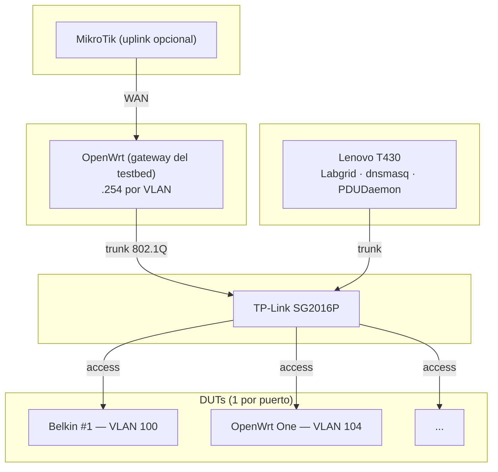

# Documentación – Lab FCEFyN

Banco de pruebas HIL (Hardware-in-the-Loop) para OpenWrt y LibreMesh.

---

## Guía por rol

| Rol | Empezar por | Luego |
|-----|-------------|-------|
| **Administrador del lab** | [Manual de operación](operar/SOM.md) | [Rack cheatsheets](operar/rack-cheatsheets.md), [Agregar un DUT](operar/adding-dut-guide.md) |
| **Revisor (tesis/propuesta)** | [Propuesta lab híbrido](diseno/hybrid-lab-proposal.md) | [Tracking](diseno/hybrid-lab-tracking.md), [CI](diseno/ci-use-cases-proposal.md) |
| **Desarrollador (tests)** | [Enfoque de testing](tests/libremesh-testing-approach.md) | [Manual de operación](operar/SOM.md) para ejecutar |

---

## Secciones

- **[Operar el lab](operar/SOM.md)** -- Procedimientos diarios, cambio de modos, power cycle, troubleshooting.
- **[Configuración](configuracion/host-config.md)** -- Detalle de cada componente: host, switch, gateway, DUTs, TFTP, Arduino, Ansible.
- **[Tests y desarrollo](tests/libremesh-testing-approach.md)** -- Enfoque de testing, proxy SSH, catálogo de firmware CI, troubleshooting Labgrid.
- **[Diseño y propuestas](diseno/hybrid-lab-proposal.md)** -- Propuestas técnicas, tracking de fases, CI, virtual mesh.

---

## Arquitectura

**Host:** orquesta tests, alimentación, SSH a DUTs. dnsmasq DHCP+TFTP en cada VLAN.
**Switch:** VLAN por DUT (100--108) o compartida (200 mesh).
**Gateway:** OpenWrt trunk al switch; enruta VLANs e internet. DHCP lo provee el host. Detalle: [gateway](configuracion/gateway.md).
