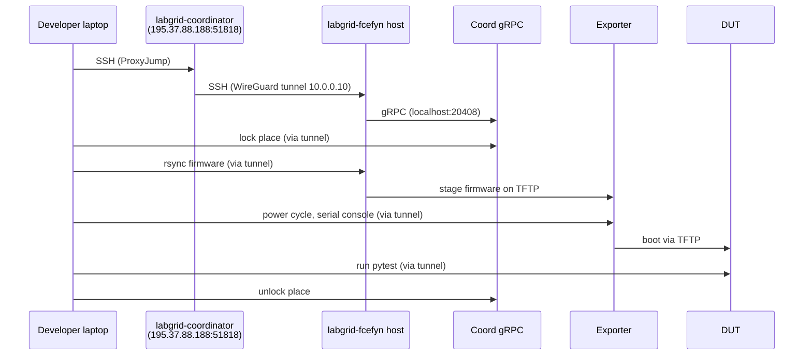
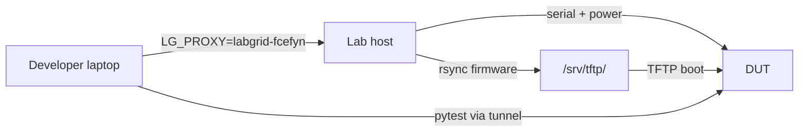

# Developer remote access to the testbed

End-to-end guide for external developers who want to run tests on FCEFyN lab hardware from their own machine. Covers SSH key registration, local configuration, and test execution with both OpenWrt vanilla and LibreMesh firmware.

**Prerequisites:** Linux machine, Python 3.12+, [uv](https://docs.astral.sh/uv/), git. The [libremesh-tests](https://github.com/fcefyn-testbed/libremesh-tests) repo cloned locally.

---

## 1. How remote access works

The developer never needs VPN. SSH jumps through the upstream **openwrt-tests coordinator** (public endpoint) to reach the lab host. From the lab host, labgrid tunnels all traffic (coordinator gRPC, exporter, serial, SSH to DUTs) through the same SSH session.



| Component | Where | What |
|-----------|-------|------|
| `labgrid-coordinator` | Upstream VM (public IP, port 51818) | SSH jump host to every lab (`ProxyJump`) |
| Coordinator gRPC | Lab host (localhost:20408) | Manages place reservations (lock/unlock) |
| Exporter | Lab host | Publishes DUTs (serial, power, TFTP, SSH) |
| `LG_PROXY` | Developer env var | Tells labgrid-client to tunnel through SSH to the lab host alias |
| `labgrid-dev` | Host user | Unprivileged account for developers on the lab host and on the coord |
| `labnet.yaml` | [openwrt-tests](https://github.com/aparcar/openwrt-tests/blob/main/labnet.yaml) | Developer SSH keys and lab device inventory (shared registry) |

ZeroTier is **not** required for developer access. It is used only by lab admins (see [ZeroTier (admin-only)](zerotier-remote-access.md)).

---

## 2. Register the developer SSH key

### 2.1 Generate key (if needed)

```bash
ssh-keygen -t ed25519 -f ~/.ssh/id_ed25519 -C "your@email" -N ""
cat ~/.ssh/id_ed25519.pub
```

### 2.2 Add public key to labnet.yaml

In [aparcar/openwrt-tests](https://github.com/aparcar/openwrt-tests) (`labnet.yaml` at repo root), open a branch and edit:

```yaml
# labnet.yaml - add under developers:
developers:
  your_username:
    sshkey: ssh-ed25519 AAAAC3Nza... your@email

# labnet.yaml - add your username to the lab's developer list:
labs:
  labgrid-fcefyn:
    developers:
      - your_username
```

Submit a PR with this change. A maintainer merges it.

### 2.3 Deploy the key to the lab host

After the PR is merged, a lab admin runs the Ansible playbook on the lab host to copy the key to `/home/labgrid-dev/.ssh/authorized_keys`:

```bash
cd openwrt-tests
ansible-playbook -i ansible/inventory.ini ansible/playbook_labgrid.yml --limit labgrid-fcefyn -K
```

Alternative (manual, without Ansible):

```bash
ssh admin_user@<HOST_IP>
echo "ssh-ed25519 AAAAC3Nza... your@email" | sudo tee -a /home/labgrid-dev/.ssh/authorized_keys
sudo chown labgrid-dev:labgrid-dev /home/labgrid-dev/.ssh/authorized_keys
sudo chmod 600 /home/labgrid-dev/.ssh/authorized_keys
```

### 2.4 Register the key on the upstream coordinator

The upstream [playbook_labgrid.yml](https://github.com/aparcar/openwrt-tests/blob/main/ansible/playbook_labgrid.yml) deploys keys to the `[labs]` Ansible group only, not to `[coordinator]`. The developer key therefore must be added manually to `~labgrid-dev/.ssh/authorized_keys` on `labgrid-coordinator` by the upstream maintainer.

After step 2.2 is merged, open an issue or ping the upstream maintainer ([@aparcar](https://github.com/aparcar)) with the public key fingerprint and username (same as in `labnet.yaml`). Without this, step 3.2 below fails with `Permission denied (publickey)` on the first hop.

---

## 3. Configure the developer machine

### 3.1 SSH config

Add the two blocks below to `~/.ssh/config` on the developer laptop. The first reaches the upstream coordinator; the second tells SSH to jump through it for any `labgrid-*` lab host (except the coordinator itself, to avoid a proxy loop):

```
Host labgrid-coordinator
    User labgrid-dev
    HostName 195.37.88.188
    Port 51818
    IdentityFile ~/.ssh/id_ed25519

Host labgrid-* !labgrid-coordinator
    User labgrid-dev
    ProxyJump labgrid-coordinator
    IdentityFile ~/.ssh/id_ed25519
```

Notes:

- The coordinator endpoint (IP and port) is maintained by the upstream project. Current value is `195.37.88.188:51818`; the upstream maintainer may move it. If the connection is refused, ask upstream for the current endpoint.
- The `!labgrid-coordinator` negation in the wildcard prevents the coord from inheriting a `ProxyJump` to itself (infinite loop, manifests as banner-exchange timeouts).
- The lab alias (`labgrid-fcefyn`) is resolved to its WireGuard IP by `/etc/hosts` on the coordinator. No `HostName` is needed in the second block.

### 3.2 Verify SSH access

Three-step smoke test (run in order):

```bash
nc -zv -w 5 195.37.88.188 51818                 # TCP reachable
ssh -o ConnectTimeout=8 labgrid-coordinator whoami   # hop 1 → labgrid-dev
ssh -o ConnectTimeout=15 labgrid-fcefyn whoami       # hop 2 → labgrid-dev
```

If hop 1 fails with `Permission denied (publickey)`: the key was not registered on the coordinator (see step 2.4).
If hop 1 passes and hop 2 fails with `Could not resolve hostname labgrid-fcefyn`: add `HostName 10.0.0.10` (the lab's WireGuard IP) to a specific `Host labgrid-fcefyn` block above the wildcard.

### 3.3 Clone and install dependencies

```bash
cd ~/pi   # or wherever
git clone https://github.com/fcefyn-testbed/libremesh-tests.git
cd libremesh-tests
```

`uv` resolves dependencies from `pyproject.toml` automatically on first `uv run`. This installs the correct labgrid fork (`aparcar/staging`) with testbed-specific patches (e.g. `TFTPProvider.external_ip`).

### 3.4 Download firmware

`LG_IMAGE` must point to a **local file** on the developer machine. Labgrid rsync's it to the lab host automatically.

Download from the lab host (as admin user, since `labgrid-dev` may not have read access to all paths):

```bash
mkdir -p ~/firmwares

# OpenWrt vanilla
scp admin_user@<HOST_IP>:/srv/tftp/firmwares/bananapi_bpi-r4/openwrt/openwrt-24.10.5-mediatek-filogic-bananapi_bpi-r4-initramfs-recovery.itb ~/firmwares/

# LibreMesh
scp admin_user@<HOST_IP>:/srv/tftp/firmwares/bananapi_bpi-r4/libremesh/lime-24.10.5-mediatek-filogic-bananapi_bpi-r4-initramfs-recovery.itb ~/firmwares/
```

Firmware naming convention: [TFTP - naming convention](../configuracion/tftp-server.md#31-firmware-naming-convention).

---

## 4. Run tests

### 4.1 OpenWrt vanilla (single-node)



```bash
cd ~/pi/libremesh-tests

export LG_PROXY=labgrid-fcefyn
export LG_PLACE=labgrid-fcefyn-bananapi_bpi-r4
export LG_ENV=targets/bananapi_bpi-r4.yaml
export LG_IMAGE=$HOME/firmwares/openwrt-24.10.5-mediatek-filogic-bananapi_bpi-r4-initramfs-recovery.itb

uv run labgrid-client lock
uv run pytest tests/test_base.py -v --log-cli-level=INFO
uv run labgrid-client unlock
```

### 4.2 LibreMesh (single-node)

Same flow, different firmware:

```bash
export LG_IMAGE=$HOME/firmwares/lime-24.10.5-mediatek-filogic-bananapi_bpi-r4-initramfs-recovery.itb

uv run labgrid-client lock
uv run pytest tests/test_libremesh.py -v --log-cli-level=INFO
uv run labgrid-client unlock
```

### 4.3 LibreMesh mesh (multi-node)

Mesh tests boot N DUTs in parallel on VLAN 200 and assert connectivity (batman-adv, babeld). Two pieces require remote tunnelling that the test suite handles automatically:

- **VLAN switching**: `conftest_vlan.py` invokes `switch-vlan` via SSH to `LG_PROXY` (the lab host owns the switch credentials in `/etc/switch.conf`). No local `dut-config.yaml` nor `labgrid-switch-abstraction` install is required on the laptop.
- **SSH to mesh DUTs**: `SSHProxy` in `conftest_mesh.py` wraps `sudo labgrid-bound-connect vlan200 ... 22` inside `ssh ${LG_PROXY}` so the bound-connect runs on the host (which has the `vlan200` interface and `sudo NOPASSWD` for `labgrid-dev`). See [SSH access to DUTs - Remote developer](dut-ssh-access.md#remote-developer-lg_proxy).

```bash
export LG_PROXY=labgrid-fcefyn
export LG_MESH_PLACES="labgrid-fcefyn-openwrt_one,labgrid-fcefyn-librerouter_1"
export LG_IMAGE_MAP="labgrid-fcefyn-openwrt_one=$HOME/firmwares/lime-24.10.5-mediatek-filogic-openwrt_one-initramfs.itb,labgrid-fcefyn-librerouter_1=$HOME/firmwares/lime-24.10.5-ath79-generic-librerouter_librerouter-v1-initramfs-kernel.bin"

uv run pytest tests/test_mesh.py -v --log-cli-level=INFO
```

The local `Host dut-*` SSH aliases in `~/.ssh/config` (section 3.1) target isolated VLANs and **cannot reach DUTs while they are on VLAN 200**. For interactive SSH to a node during a mesh test, use the nested `ProxyCommand` from [SSH access to DUTs - Remote developer](dut-ssh-access.md#remote-developer-lg_proxy).

### 4.4 Available places

List all devices in the lab:

```bash
export LG_PROXY=labgrid-fcefyn
uv run labgrid-client places
```

| Place | Device | Target YAML |
|-------|--------|-------------|
| `labgrid-fcefyn-belkin_rt3200_1` | Belkin RT3200 / Linksys E8450 | `targets/linksys_e8450.yaml` |
| `labgrid-fcefyn-belkin_rt3200_2` | Belkin RT3200 / Linksys E8450 | `targets/linksys_e8450.yaml` |
| `labgrid-fcefyn-belkin_rt3200_3` | Belkin RT3200 / Linksys E8450 | `targets/linksys_e8450.yaml` |
| `labgrid-fcefyn-bananapi_bpi-r4` | BananaPi BPi-R4 | `targets/bananapi_bpi-r4.yaml` |
| `labgrid-fcefyn-openwrt_one` | OpenWrt One | `targets/openwrt_one.yaml` |
| `labgrid-fcefyn-librerouter_1` | LibreRouter v1 | `targets/librerouter_librerouter-v1.yaml` |

### 4.5 Other labgrid-client commands

```bash
# Power cycle a DUT
uv run labgrid-client power cycle

# Interactive serial console
uv run labgrid-client console

# Boot to shell and get console
uv run labgrid-client --state shell console
```

Always unlock when done: `uv run labgrid-client unlock`.

---

## 5. Troubleshooting

| Problem | Cause | Fix |
|---------|-------|-----|
| `Connection timed out during banner exchange` / `UNKNOWN port 65535` on `ssh labgrid-coordinator` | `Host labgrid-*` wildcard is matching the coord and adding a `ProxyJump` to itself | Add `!labgrid-coordinator` to the wildcard pattern (section 3.1) |
| `Connection refused` on port 51818 | Upstream moved the coord endpoint | Ask upstream maintainer for the current IP/port |
| `Permission denied (publickey)` on hop 1 (coord) | Key not registered on the coordinator | Register the key on `labgrid-coordinator` (section 2.4) |
| `Permission denied (publickey,password)` on hop 2 (lab host) | Key not deployed on lab host | Run Ansible playbook or add key manually (section 2.3) |
| `Could not resolve hostname labgrid-fcefyn` inside the ProxyJump | Coordinator's `/etc/hosts` does not have the alias | Add an explicit `HostName 10.0.0.10` block for `labgrid-fcefyn` (section 3.1) |
| `no such identity: ...id_ed25519_fcefyn_lab` | Wrong `IdentityFile` in SSH config | Point to the developer's own private key (section 3.1) |
| `RemoteTFTPProviderAttributes has no attribute external_ip` | Wrong labgrid version (PyPI instead of fork) | Run from `libremesh-tests/` dir with `uv run` (section 3.3) |
| `Local file ... not found` | `LG_IMAGE` path does not exist locally | Download firmware from host first (section 3.4) |
| `Wrong Image Type for bootm command` | Firmware file is a Git LFS pointer (tiny file) | Download the real binary from the host, not the repo (section 3.4) |
| `TIMEOUT ... root@LiMe-d68d45` | Shell prompt regex does not match LibreMesh hostname | Update `prompt` in target YAML: `[\w()-]+` instead of `[\w()]+` |

---

## 6. Reference

- [Running tests](lab-running-tests.md) - host-side test execution and multi-node tests
- [SSH access to DUTs](dut-ssh-access.md) - VLAN lifecycle and mesh SSH IPs
- [TFTP / dnsmasq](../configuracion/tftp-server.md) - firmware layout and naming convention
- [Host configuration](../configuracion/host-config.md) - full host setup including SSH keys (section 3.6)
- [openwrt-tests README](https://github.com/aparcar/openwrt-tests#remote-access) - upstream remote access documentation (same `labgrid-coordinator` / `ProxyJump` pattern)
- [ZeroTier (admin-only)](zerotier-remote-access.md) - VPN for lab admins, not needed by developers
