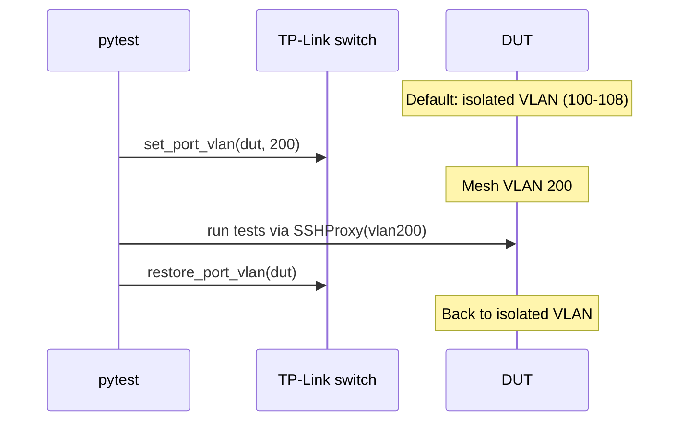
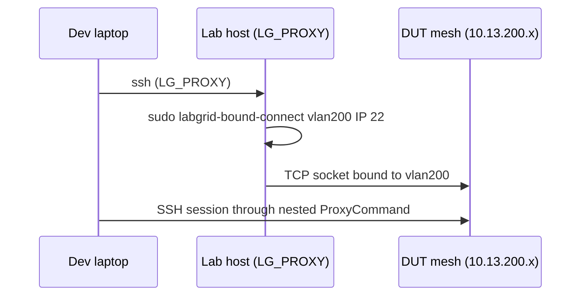

# SSH access to DUTs

How `ssh dut-X` reaches each DUT through its isolated VLAN, and how to connect manually when a DUT is on mesh VLAN 200.

---

## Static ProxyCommand

Each DUT SSH alias in `~/.ssh/config` uses a static `ProxyCommand` that binds to the DUT's **isolated VLAN interface** via `labgrid-bound-connect`:

```
Host dut-belkin-1
    User root
    ProxyCommand sudo labgrid-bound-connect vlan100 192.168.1.1 22
```

`labgrid-bound-connect` uses `socat` with `SO_BINDTODEVICE` to force traffic through the correct VLAN interface. Since all DUTs share `192.168.1.1` on their isolated VLAN, binding to the interface is what distinguishes them.

The full SSH config template is in `configs/templates/ssh_config_fcefyn`.

---

## VLAN lifecycle during tests



- **openwrt-tests**: VLANs never change. DUTs always on isolated VLANs.
- **libremesh-tests**: `conftest_vlan.py` moves ports to VLAN 200 at test start and **always restores** on teardown (even with `LG_MESH_KEEP_POWERED=1`, which only skips power-off).
- **Tests use their own SSH path** (`SSHProxy` with hardcoded `vlan200`), not the `~/.ssh/config` aliases.
- **SSH transport retry**: `SSHProxy` automatically retries up to 3 times on exit code 255 (TCP/SSH transport errors). These are common during batman-adv/babeld convergence right after boot.
- **IP watchdog**: After boot, a background script on each DUT re-applies the fixed mesh SSH IP every 3 seconds for 300 seconds, targeting `br-lan` when UP. This survives network restarts triggered by OpenWrt init scripts or batman-adv configuration.

---

## Manual access to mesh VLAN 200

If a test crashes before VLAN teardown, a DUT may be stuck on VLAN 200. From the **lab host** (where `vlan200` and `sudo NOPASSWD` for `labgrid-bound-connect` exist):

```bash
sudo labgrid-bound-connect vlan200 <mesh_ssh_ip> 22
```

There are three addresses worth distinguishing during mesh tests:

- `192.168.1.1`: the default OpenWrt LAN IP. This is what isolated single-node access uses through `vlan100`-`vlan108`.
- `10.13.200.x`: the per-DUT mesh SSH/control IP. It is a stable secondary address added on `br-lan` so the host can reach each DUT uniquely while multiple nodes share VLAN 200.
- `10.13.x.x` excluding `10.13.200.x`: the real LibreMesh address on `br-lan`. This is the address mesh assertions should use for ping, ARP, and routing checks.

### Remote developer (LG_PROXY) {: #remote-developer-lg_proxy }

From a developer laptop, the `vlan200` interface lives on the lab host, not on the laptop. The bound-connect must therefore run **on the host** via SSH. The test suite handles this automatically (see `SSHProxy._build_ssh_cmd` in `conftest_mesh.py`); for manual SSH from a laptop:

```bash
ssh -o ProxyCommand="ssh ${LG_PROXY:-labgrid-fcefyn} sudo /usr/local/sbin/labgrid-bound-connect vlan200 <mesh_ssh_ip> 22" \
    root@<mesh_ssh_ip>
```



Pre-requisites on the host (already in place for `labgrid-dev` per [host-config 3.4](../configuracion/host-config.md#34-sudoers)): SSH user must have `sudo NOPASSWD` for `/usr/local/sbin/labgrid-bound-connect`. No local `dut-config.yaml` nor `labgrid-switch-abstraction` install is required on the laptop.

Per-DUT isolated VLAN and mesh SSH IP table: [Rack cheatsheets - all DUTs](rack-cheatsheets.md#quick-reference-all-duts).

To restore all ports to isolated VLANs after a crash:

```bash
switch-vlan --restore-all
```
